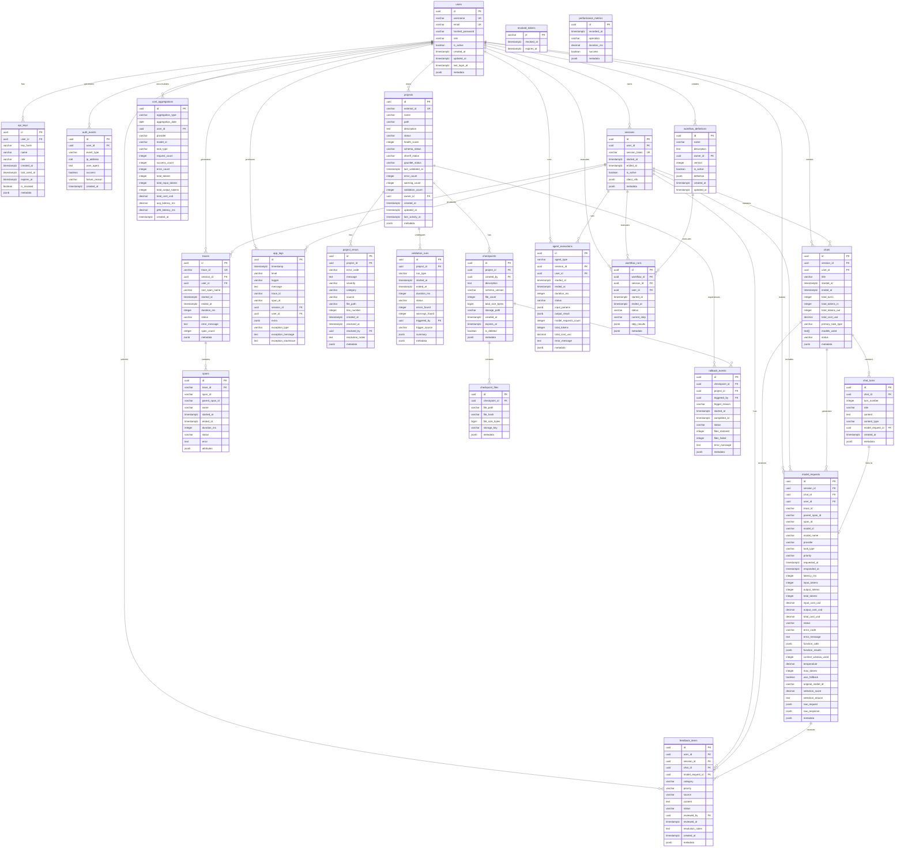

```mermaid

erDiagram
    %% ==========================================
    %% USER & AUTHENTICATION DOMAIN
    %% ==========================================
    
    users {
        uuid id PK
        varchar username UK
        varchar email UK
        varchar hashed_password
        varchar role
        boolean is_active
        timestamptz created_at
        timestamptz updated_at
        timestamptz last_login_at
        jsonb metadata
    }
    
    api_keys {
        uuid id PK
        uuid user_id FK
        varchar key_hash
        varchar name
        varchar role
        timestamptz created_at
        timestamptz last_used_at
        timestamptz expires_at
        boolean is_revoked
        jsonb metadata
    }
    
    revoked_tokens {
        varchar jti PK
        timestamptz revoked_at
        timestamptz expires_at
    }
    
    auth_events {
        uuid id PK
        uuid user_id FK
        varchar event_type
        inet ip_address
        text user_agent
        boolean success
        varchar failure_reason
        timestamptz created_at
    }

    %% ==========================================
    %% SESSION & CONVERSATION DOMAIN
    %% ==========================================
    
    sessions {
        uuid id PK
        uuid user_id FK
        varchar session_token UK
        timestamptz started_at
        timestamptz ended_at
        boolean is_active
        jsonb client_info
        jsonb metadata
    }
    
    chats {
        uuid id PK
        uuid session_id FK
        uuid user_id FK
        varchar title
        timestamptz started_at
        timestamptz ended_at
        integer total_turns
        integer total_tokens_in
        integer total_tokens_out
        decimal total_cost_usd
        varchar primary_task_type
        text[] models_used
        varchar status
        jsonb metadata
    }
    
    chat_turns {
        uuid id PK
        uuid chat_id FK
        integer turn_number
        varchar role
        text content
        varchar content_type
        uuid model_request_id FK
        timestamptz created_at
        jsonb metadata
    }

    %% ==========================================
    %% LLM MODEL USAGE & COST DOMAIN
    %% ==========================================
    
    model_requests {
        uuid id PK
        uuid session_id FK
        uuid chat_id FK
        uuid user_id FK
        varchar trace_id
        varchar parent_span_id
        varchar span_id
        varchar model_id
        varchar model_name
        varchar provider
        varchar task_type
        varchar priority
        timestamptz requested_at
        timestamptz responded_at
        integer latency_ms
        integer input_tokens
        integer output_tokens
        integer total_tokens
        decimal input_cost_usd
        decimal output_cost_usd
        decimal total_cost_usd
        varchar status
        varchar error_code
        text error_message
        jsonb function_calls
        jsonb function_results
        integer context_window_used
        decimal temperature
        integer max_tokens
        boolean was_fallback
        varchar original_model_id
        decimal selection_score
        text selection_reason
        jsonb raw_request
        jsonb raw_response
        jsonb metadata
    }
    
    cost_aggregations {
        uuid id PK
        varchar aggregation_type
        date aggregation_date
        uuid user_id FK
        varchar provider
        varchar model_id
        varchar task_type
        integer request_count
        integer success_count
        integer error_count
        integer total_tokens
        integer total_input_tokens
        integer total_output_tokens
        decimal total_cost_usd
        decimal avg_latency_ms
        decimal p95_latency_ms
        timestamptz created_at
    }

    %% ==========================================
    %% OBSERVABILITY & TRACING DOMAIN
    %% ==========================================
    
    traces {
        uuid id PK
        varchar trace_id UK
        uuid session_id FK
        uuid user_id FK
        varchar root_span_name
        timestamptz started_at
        timestamptz ended_at
        integer duration_ms
        varchar status
        text error_message
        integer span_count
        jsonb metadata
    }
    
    spans {
        uuid id PK
        varchar trace_id FK
        varchar span_id
        varchar parent_span_id
        varchar name
        timestamptz started_at
        timestamptz ended_at
        integer duration_ms
        varchar status
        text error
        jsonb attributes
    }
    
    app_logs {
        uuid id PK
        timestamptz timestamp
        varchar level
        varchar logger
        text message
        varchar trace_id
        varchar span_id
        uuid session_id FK
        uuid user_id FK
        jsonb extra
        varchar exception_type
        text exception_message
        text exception_stacktrace
    }
    
    performance_metrics {
        uuid id PK
        timestamptz recorded_at
        varchar operation
        decimal duration_ms
        boolean success
        jsonb metadata
    }

    %% ==========================================
    %% PROJECT & VALIDATION DOMAIN
    %% ==========================================
    
    projects {
        uuid id PK
        varchar external_id UK
        varchar name
        varchar path
        text description
        varchar status
        integer health_score
        varchar schema_status
        varchar sheriff_status
        varchar gauntlet_status
        timestamptz last_validated_at
        integer error_count
        integer warning_count
        integer validation_count
        uuid owner_id FK
        timestamptz created_at
        timestamptz updated_at
        timestamptz last_activity_at
        jsonb metadata
    }
    
    project_errors {
        uuid id PK
        uuid project_id FK
        varchar error_code
        text message
        varchar severity
        varchar category
        varchar source
        varchar file_path
        integer line_number
        timestamptz created_at
        timestamptz resolved_at
        uuid resolved_by FK
        text resolution_notes
        jsonb metadata
    }
    
    validation_runs {
        uuid id PK
        uuid project_id FK
        varchar run_type
        timestamptz started_at
        timestamptz ended_at
        integer duration_ms
        varchar status
        integer errors_found
        integer warnings_found
        uuid triggered_by FK
        varchar trigger_source
        jsonb summary
        jsonb metadata
    }

    %% ==========================================
    %% FEEDBACK DOMAIN
    %% ==========================================
    
    feedback_items {
        uuid id PK
        uuid user_id FK
        uuid session_id FK
        uuid chat_id FK
        uuid model_request_id FK
        varchar category
        varchar priority
        varchar source
        text content
        varchar status
        uuid reviewed_by FK
        timestamptz reviewed_at
        text resolution_notes
        timestamptz created_at
        jsonb metadata
    }

    %% ==========================================
    %% CHECKPOINT & ROLLBACK DOMAIN
    %% ==========================================
    
    checkpoints {
        uuid id PK
        uuid project_id FK
        uuid created_by FK
        text description
        varchar schema_version
        integer file_count
        bigint total_size_bytes
        varchar storage_path
        timestamptz created_at
        timestamptz expires_at
        boolean is_deleted
        jsonb metadata
    }
    
    checkpoint_files {
        uuid id PK
        uuid checkpoint_id FK
        varchar file_path
        varchar file_hash
        bigint file_size_bytes
        varchar storage_key
        jsonb metadata
    }
    
    rollback_events {
        uuid id PK
        uuid checkpoint_id FK
        uuid project_id FK
        uuid triggered_by FK
        varchar trigger_reason
        timestamptz started_at
        timestamptz completed_at
        varchar status
        integer files_restored
        integer files_failed
        text error_message
        jsonb metadata
    }

    %% ==========================================
    %% AGENT & WORKFLOW DOMAIN
    %% ==========================================
    
    agent_executions {
        uuid id PK
        varchar agent_type
        uuid session_id FK
        uuid user_id FK
        timestamptz started_at
        timestamptz ended_at
        integer duration_ms
        varchar status
        jsonb input_params
        jsonb output_result
        integer model_requests_count
        integer total_tokens
        decimal total_cost_usd
        text error_message
        jsonb metadata
    }
    
    workflow_definitions {
        uuid id PK
        varchar name
        text description
        uuid owner_id FK
        integer version
        boolean is_active
        jsonb definition
        timestamptz created_at
        timestamptz updated_at
    }
    
    workflow_runs {
        uuid id PK
        uuid workflow_id FK
        uuid session_id FK
        uuid user_id FK
        timestamptz started_at
        timestamptz ended_at
        varchar status
        varchar current_step
        jsonb step_results
        jsonb metadata
    }

    %% ==========================================
    %% RELATIONSHIPS
    %% ==========================================
    
    users ||--o{ api_keys : "has"
    users ||--o{ auth_events : "generates"
    users ||--o{ sessions : "owns"
    users ||--o{ chats : "creates"
    users ||--o{ model_requests : "makes"
    users ||--o{ cost_aggregations : "accumulates"
    users ||--o{ traces : "generates"
    users ||--o{ app_logs : "produces"
    users ||--o{ projects : "owns"
    users ||--o{ feedback_items : "submits"
    users ||--o{ agent_executions : "runs"
    users ||--o{ workflow_definitions : "creates"
    users ||--o{ workflow_runs : "executes"
    
    sessions ||--o{ chats : "contains"
    sessions ||--o{ model_requests : "includes"
    sessions ||--o{ traces : "generates"
    sessions ||--o{ app_logs : "produces"
    sessions ||--o{ feedback_items : "has"
    sessions ||--o{ agent_executions : "runs"
    sessions ||--o{ workflow_runs : "executes"
    
    chats ||--o{ chat_turns : "contains"
    chats ||--o{ model_requests : "generates"
    chats ||--o{ feedback_items : "receives"
    
    chat_turns ||--o| model_requests : "links to"
    
    traces ||--o{ spans : "contains"
    
    projects ||--o{ project_errors : "has"
    projects ||--o{ validation_runs : "undergoes"
    projects ||--o{ checkpoints : "has"
    projects ||--o{ rollback_events : "experiences"
    
    checkpoints ||--o{ checkpoint_files : "contains"
    checkpoints ||--o{ rollback_events : "triggers"
    
    workflow_definitions ||--o{ workflow_runs : "executes"
    
    model_requests ||--o{ feedback_items : "receives"
    
```