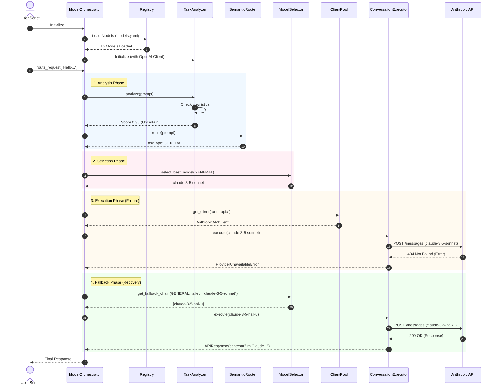

```mermaid

sequenceDiagram
    autonumber
    actor User as User Script
    participant Orch as ModelOrchestrator
    participant Reg as Registry
    participant Analyzer as TaskAnalyzer
    participant Router as SemanticRouter
    participant Selector as ModelSelector
    participant Pool as ClientPool
    participant Exec as ConversationExecutor
    participant Ant as Anthropic API

    User->>Orch: Initialize
    Orch->>Reg: Load Models (models.yaml)
    Reg-->>Orch: 15 Models Loaded
    Orch->>Analyzer: Initialize (with OpenAI Client)

    User->>Orch: route_request("Hello...")
    
    rect rgb(240, 248, 255)
        note right of Orch: 1. Analysis Phase
        Orch->>Analyzer: analyze(prompt)
        Analyzer->>Analyzer: Check Heuristics
        Analyzer-->>Orch: Score 0.30 (Uncertain)
        Orch->>Router: route(prompt)
        Router-->>Orch: TaskType: GENERAL
    end

    rect rgb(255, 240, 245)
        note right of Orch: 2. Selection Phase
        Orch->>Selector: select_best_model(GENERAL)
        Selector-->>Orch: claude-3-5-sonnet
    end

    rect rgb(255, 250, 240)
        note right of Orch: 3. Execution Phase (Failure)
        Orch->>Pool: get_client("anthropic")
        Pool-->>Orch: AnthropicAPIClient
        Orch->>Exec: execute(claude-3-5-sonnet)
        Exec->>Ant: POST /messages (claude-3-5-sonnet)
        Ant-->>Exec: 404 Not Found (Error)
        Exec-->>Orch: ProviderUnavailableError
    end

    rect rgb(240, 255, 240)
        note right of Orch: 4. Fallback Phase (Recovery)
        Orch->>Selector: get_fallback_chain(GENERAL, failed="claude-3-5-sonnet")
        Selector-->>Orch: [claude-3-5-haiku]
        Orch->>Exec: execute(claude-3-5-haiku)
        Exec->>Ant: POST /messages (claude-3-5-haiku)
        Ant-->>Exec: 200 OK (Response)
        Exec-->>Orch: APIResponse(content="I'm Claude...")
    end

    Orch-->>User: Final Response
    
    
```