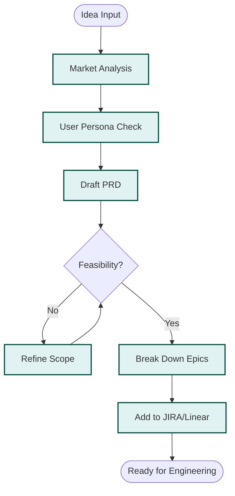

# Product Agent Workflow

```mermaid
flowchart TD
    classDef step fill:#e0f2f1,stroke:#004d40,stroke-width:2px;
    
    Start([Idea Input]) --> Analyze[Market Analysis]:::step
    
    Analyze --> User[User Persona Check]:::step
    
    User --> Spec[Draft PRD]:::step
    
    Spec --> Review{Feasibility?}
    
    Review -- No --> Refine[Refine Scope]:::step
    Refine --> Review
    
    Review -- Yes --> Tickets[Break Down Epics]:::step
    
    Tickets --> Backlog[Add to JIRA/Linear]:::step
    
    Backlog --> Done([Ready for Engineering])
```
