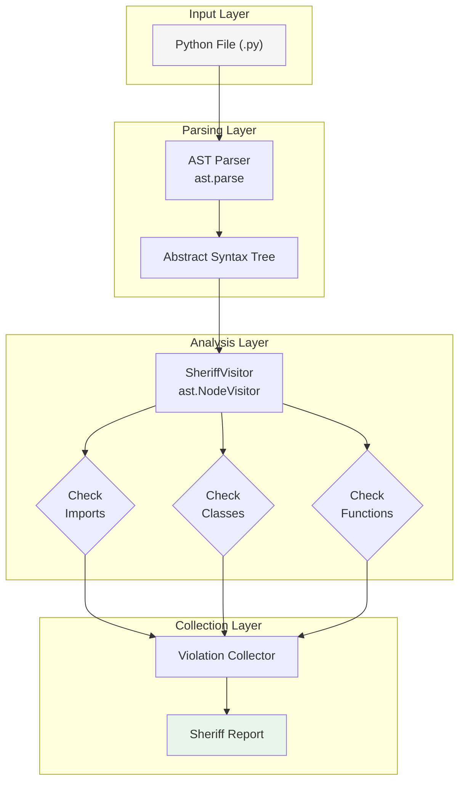
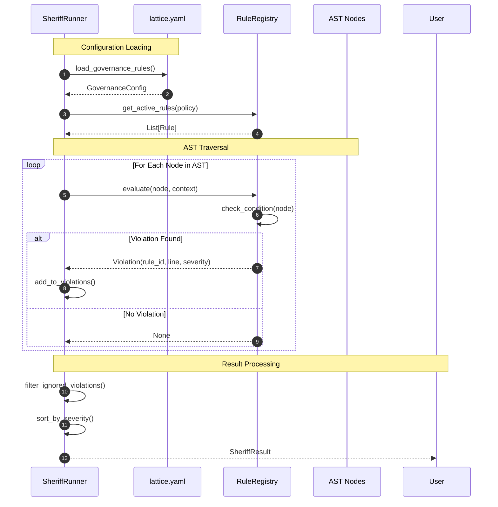
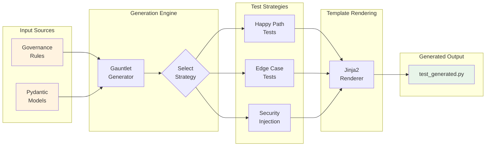
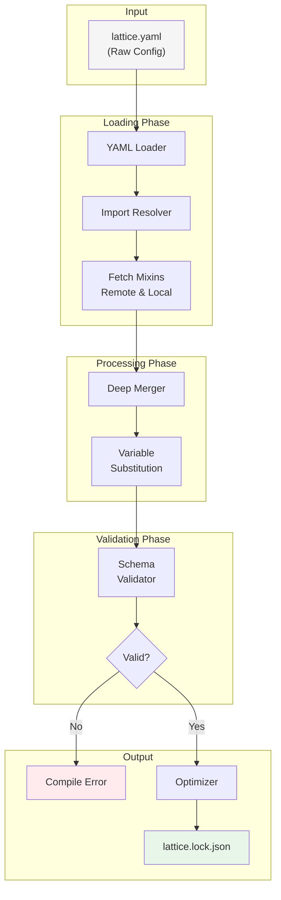
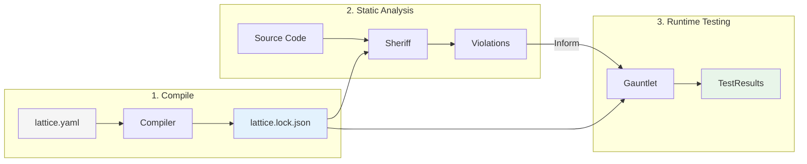

# Governance System - Comprehensive Diagram Documentation

Detailed Mermaid.js diagrams documenting the Governance subsystem including Sheriff (static analysis), Gauntlet (runtime testing), and the Compiler (configuration processing).

---

## Table of Contents

1. [Sheriff AST Analysis Pipeline](#1-sheriff-ast-analysis-pipeline)
2. [Sheriff Rule Evaluation Flow](#2-sheriff-rule-evaluation-flow)
3. [Gauntlet Test Generation](#3-gauntlet-test-generation)
4. [Gauntlet Execution Loop](#4-gauntlet-execution-loop)
5. [Compiler Processing Pipeline](#5-compiler-processing-pipeline)

---

## 1. Sheriff AST Analysis Pipeline

**Purpose**: Shows how Sheriff parses Python files into Abstract Syntax Trees and analyzes them for rule violations.

**Diagram Type**: Flowchart (Top-Down)



### Node Descriptions

| Node | Description | Implementation |
|------|-------------|----------------|
| **Python File** | Source code input | Any `.py` file in target path |
| **AST Parser** | Python's built-in parser | `ast.parse(content, filename)` |
| **Abstract Syntax Tree** | Parsed code structure | Tree of AST nodes |
| **SheriffVisitor** | Custom AST visitor | Extends `ast.NodeVisitor` |
| **Check Imports** | Import validation | Forbidden imports, import order |
| **Check Classes** | Class validation | Naming conventions, type hints |
| **Check Functions** | Function validation | Type hints, complexity, docstrings |
| **Violation Collector** | Aggregates violations | List of Violation objects |
| **Sheriff Report** | Final output | JSON/dict with violations and metrics |

### Validation Rules

| Rule Category | Checks Performed | Severity |
|---------------|------------------|----------|
| **Imports** | Forbidden imports, circular imports | ERROR |
| **Type Hints** | Function signatures, return types | WARNING/ERROR |
| **Naming** | PEP8 compliance, conventions | WARNING |
| **Complexity** | Cyclomatic complexity thresholds | WARNING |
| **Documentation** | Docstring presence, format | WARNING |

### Related Source Files

- [`src/sheriff/sheriff.py`](../../src/sheriff/sheriff.py) - Main validation entry points (lines 60-291)
- [`src/sheriff/ast_visitor.py`](../../src/sheriff/ast_visitor.py) - SheriffVisitor class
- [`src/sheriff/rules.py`](../../src/sheriff/rules.py) - Violation dataclass and rule definitions
- [`src/sheriff/config.py`](../../src/sheriff/config.py) - SheriffConfig with rule settings

---

## 2. Sheriff Rule Evaluation Flow

**Purpose**: Illustrates how Sheriff loads rules from configuration and evaluates them against AST nodes.

**Diagram Type**: Sequence Diagram



### Node Descriptions

| Node | Description | Data Flow |
|------|-------------|-----------|
| **SheriffRunner** | Orchestrates validation | Controls flow, aggregates results |
| **lattice.yaml** | Configuration source | Provides governance rules |
| **RuleRegistry** | Rule definitions | Maps rule IDs to evaluation logic |
| **AST Nodes** | Code structure | Import, Class, Function, etc. nodes |
| **User** | Output recipient | Receives SheriffResult |

### Rule Evaluation Context

```python
@dataclass
class EvaluationContext:
    filename: str
    content: str
    config: SheriffConfig
    current_class: str | None
    current_function: str | None
```

### Related Source Files

- [`src/sheriff/sheriff.py`](../../src/sheriff/sheriff.py) - `run_sheriff()`, `validate_file_with_audit()`
- [`src/sheriff/ast_visitor.py`](../../src/sheriff/ast_visitor.py) - `visit_*()` methods
- [`src/sheriff/rules.py`](../../src/sheriff/rules.py) - Rule definitions
- [`src/sheriff/config.py`](../../src/sheriff/config.py) - SheriffConfig, ViolationSeverity

---

## 3. Gauntlet Test Generation

**Purpose**: Shows how Gauntlet generates pytest test suites from governance rules and Pydantic models.

**Diagram Type**: Flowchart (Left-Right)



### Node Descriptions

| Node | Description | Output |
|------|-------------|--------|
| **Governance Rules** | Rules from lattice.yaml | Contracts to test |
| **Pydantic Models** | Data models from codebase | Schemas to validate |
| **Gauntlet Generator** | Core generation engine | Test specifications |
| **Happy Path Tests** | Valid input scenarios | Positive test cases |
| **Edge Case Tests** | Boundary conditions | Negative test cases |
| **Security Injection** | Security-focused tests | SQL injection, XSS, etc. |
| **Jinja2 Renderer** | Template engine | Renders Python test code |
| **test_generated.py** | Output test file | Executable pytest suite |

### Test Generation Strategies

| Strategy | Description | Example Tests |
|----------|-------------|---------------|
| **Happy Path** | Valid inputs, expected outputs | Create user with valid email |
| **Edge Cases** | Boundary values, empty inputs | Empty string, max length |
| **Security** | Injection attacks, malicious input | SQL injection, script tags |
| **Type Coercion** | Type validation | String where int expected |
| **Required Fields** | Missing required data | Omit required parameters |

### Related Source Files

- [`src/gauntlet/generator.py`](../../src/gauntlet/generator.py) - GauntletGenerator class
- [`src/gauntlet/parser.py`](../../src/gauntlet/parser.py) - Rule parser
- [`src/gauntlet/templates/`](../../src/gauntlet/templates/) - Jinja2 templates
- [`src/gauntlet/strategies/`](../../src/gauntlet/strategies/) - Test generation strategies

---

## 4. Gauntlet Execution Loop

**Purpose**: Documents the test execution lifecycle including discovery, running, and auto-fix retry.

**Diagram Type**: State Diagram

```mermaid
stateDiagram-v2
    [*] --> Discovery: Start Test Run

    Discovery --> Collection: Find Tests
    note right of Discovery: Scan test_*.py files

    Collection --> Execution: pytest.main()

    state Execution {
        [*] --> Setup: Fixture Setup
        Setup --> RunTest: Execute Test
        RunTest --> Teardown: Cleanup
        Teardown --> StoreResult: Record Outcome

        StoreResult --> [*]
    }

    Execution --> Analysis: Aggregate Results

    Analysis --> Success: All Tests Pass
    Analysis --> Failure: Failures > 0

    Success --> [*]: Exit Code 0

    Failure --> AutoFixCheck{Auto-Fix<br/>Enabled?}

    AutoFixCheck --> CodeGen: Yes
    note right of CodeGen: AI-assisted fix

    CodeGen --> Execution: Retry

    AutoFixCheck --> [*]: No (Exit Code 1)
```

### State Descriptions

| State | Description | Actions |
|-------|-------------|---------|
| **Discovery** | Find test files | Glob for `test_*.py` patterns |
| **Collection** | Load test cases | Import and collect test functions |
| **Setup** | Prepare test environment | Run fixtures, create resources |
| **RunTest** | Execute test case | Assert conditions, capture output |
| **Teardown** | Cleanup | Destroy fixtures, reset state |
| **StoreResult** | Record outcome | Pass/Fail with duration |
| **Analysis** | Aggregate results | Count passes, failures, errors |
| **CodeGen** | Auto-fix attempt | AI generates fix for failure |

### Execution Metrics

```python
@dataclass
class GauntletResult:
    total_tests: int
    passed: int
    failed: int
    errors: int
    skipped: int
    duration: float
    coverage: float | None
```

### Related Source Files

- [`src/gauntlet/validator.py`](../../src/gauntlet/validator.py) - Policy validation
- [`src/gauntlet/runner.py`](../../src/gauntlet/runner.py) - Test execution
- [`src/gauntlet/plugin.py`](../../src/gauntlet/plugin.py) - Pytest plugin

---

## 5. Compiler Processing Pipeline

**Purpose**: Shows the compilation process from raw lattice.yaml to optimized lattice.lock.json.

**Diagram Type**: Flowchart (Top-Down)



### Node Descriptions

| Node | Description | Transformation |
|------|-------------|----------------|
| **lattice.yaml** | Raw configuration | Human-readable YAML |
| **YAML Loader** | Parse YAML | YAML → Python dict |
| **Import Resolver** | Handle `$import` directives | Resolve file paths |
| **Fetch Mixins** | Load referenced configs | Merge external YAML/JSON |
| **Deep Merger** | Combine configurations | Override priority resolution |
| **Variable Substitution** | Replace `${VAR}` placeholders | Environment variable injection |
| **Schema Validator** | Validate structure | Check against JSON Schema |
| **Optimizer** | Minimize output | Remove redundancy, minify |
| **lattice.lock.json** | Final output | Deterministic, optimized |

### Compilation Modes

| Mode | Description | Output |
|------|-------------|--------|
| **STANDARD** | Direct conversion | Full JSON with comments |
| **NORMALIZED** | Flatten structure | TOON-efficient format |
| **MINIFIED** | Compact output | Smallest file size |
| **PRETTY** | Human-readable | Indented, formatted JSON |

### Configuration Inheritance

```yaml
# lattice.yaml
$import:
  - ./security.yaml      # Local mixin
  - https://example.com/defaults.yaml  # Remote mixin

governance:
  sheriff:
    enforce_type_hints: true  # Override mixin default
```

### Related Source Files

- [`src/compiler/core.py`](../../src/compiler/core.py) - LatticeCompiler class (120+ lines)
- [`src/compiler/formats.py`](../../src/compiler/formats.py) - Format detection
- [`src/compiler/normalizer.py`](../../src/compiler/normalizer.py) - Table normalization
- [`src/validator/schema.py`](../../src/validator/schema.py) - Schema validation

---

## Governance Flow Integration

The three governance components work together in sequence:



### Integration Points

| From | To | Data |
|------|------|------|
| Compiler | Sheriff | Compiled governance rules |
| Compiler | Gauntlet | Test generation config |
| Sheriff | Gauntlet | Violation context |
| Sheriff | Dashboard | Validation results |
| Gauntlet | Dashboard | Test execution results |

---

## Summary

| Diagram | Type | Purpose | Key Insight |
|---------|------|---------|-------------|
| AST Analysis | Flowchart | Code parsing pipeline | Visitor pattern |
| Rule Evaluation | Sequence | Dynamic rule checking | Loop + alt structure |
| Test Generation | Flowchart | Code generation | Multi-strategy approach |
| Execution Loop | State | Test lifecycle | Auto-fix retry |
| Compiler Pipeline | Flowchart | Config processing | Multi-phase transformation |

---

## Usage

These diagrams render in GitHub, GitLab, VS Code (Mermaid extension), Obsidian, and [mermaid.live](https://mermaid.live).
