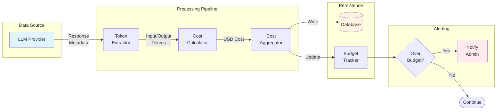

# Model Orchestrator - Comprehensive Diagram Documentation

Detailed Mermaid.js diagrams documenting the Model Orchestrator subsystem, including request routing, model selection, fallback strategies, consensus voting, and cost tracking.

---

## Table of Contents

1. [Request Routing Sequence](#1-request-routing-sequence)
2. [Class Architecture](#2-class-architecture)
3. [Model Selection Logic](#3-model-selection-logic)
4. [Provider Fallback Strategy](#4-provider-fallback-strategy)
5. [Consensus Engine Voting](#5-consensus-engine-voting)
6. [Request Routing Pipeline](#6-request-routing-pipeline)
7. [Chain Execution Flow](#7-chain-execution-flow)
8. [Context Window Management](#8-context-window-management)
9. [Cost Tracking Data Flow](#9-cost-tracking-data-flow)

---

## 1. Request Routing Sequence

**Purpose**: Illustrates the complete request flow from user input through CLI to LLM provider response.

**Diagram Type**: Sequence Diagram


### Node Descriptions

| Node | Description | Responsibility |
|------|-------------|----------------|
| **User** | End user interacting with CLI | Initiates requests via `lattice ask` |
| **CLI** | Command-line interface entry point | Parses commands, invokes orchestrator |
| **ModelOrchestrator** | Central coordination hub | Routes requests, manages lifecycle |
| **TaskAnalyzer** | Prompt analysis engine | Determines task type and complexity |
| **ModelSelector** | Model selection algorithm | Chooses optimal model based on requirements |
| **ModelRegistry** | Model metadata store | Provides model capabilities and configs |
| **ClientPool** | Provider client manager | Manages connections to LLM providers |
| **ConversationExecutor** | Request executor | Handles API calls and response processing |
| **LLM Provider** | External AI service | OpenAI, Anthropic, Google, etc. |

### Related Source Files

- [`src/orchestrator/core.py`](../../src/orchestrator/core.py) - ModelOrchestrator class
- [`src/orchestrator/analysis/analyzer.py`](../../src/orchestrator/analysis/analyzer.py) - TaskAnalyzer
- [`src/orchestrator/selection.py`](../../src/orchestrator/selection.py) - ModelSelector
- [`src/orchestrator/registry.py`](../../src/orchestrator/registry.py) - ModelRegistry
- [`src/orchestrator/execution.py`](../../src/orchestrator/execution.py) - ClientPool, ConversationExecutor
- [`src/cli/commands/ask.py`](../../src/cli/commands/ask.py) - CLI ask command

---

## 2. Class Architecture

**Purpose**: Shows the class structure and relationships within the Orchestrator module.

**Diagram Type**: UML Class Diagram


### Class Descriptions

| Class | Purpose | Key Methods |
|-------|---------|-------------|
| **ModelOrchestrator** | Central coordinator for all orchestration | `route_request()`, `shutdown()` |
| **ModelRegistry** | Stores model metadata and capabilities | `get_model()`, `list_models()` |
| **TaskAnalyzer** | Analyzes prompts to determine requirements | `analyze_async()` |
| **ModelSelector** | Selects optimal model using scoring | `select_best_model()`, `get_fallback_chain()` |
| **ClientPool** | Manages provider client connections | `get_client()`, `close_all()` |
| **ConversationExecutor** | Executes requests with function calling | `execute()` |
| **CostTracker** | Tracks token usage and costs | `track_usage()`, `get_total_cost()` |
| **FunctionCallHandler** | Handles tool/function invocations | `register_function()`, `handle_call()` |

### Related Source Files

- [`src/orchestrator/core.py`](../../src/orchestrator/core.py) - ModelOrchestrator (lines 22-296)
- [`src/orchestrator/registry.py`](../../src/orchestrator/registry.py) - ModelRegistry (360 lines)
- [`src/orchestrator/analysis/analyzer.py`](../../src/orchestrator/analysis/analyzer.py) - TaskAnalyzer
- [`src/orchestrator/selection.py`](../../src/orchestrator/selection.py) - ModelSelector
- [`src/orchestrator/execution.py`](../../src/orchestrator/execution.py) - ClientPool, ConversationExecutor
- [`src/orchestrator/cost/tracker.py`](../../src/orchestrator/cost/tracker.py) - CostTracker
- [`src/orchestrator/function_calling.py`](../../src/orchestrator/function_calling.py) - FunctionCallHandler

---

## 3. Model Selection Logic

**Purpose**: Documents the algorithm for selecting the optimal model based on task requirements.

**Diagram Type**: Flowchart


### Node Descriptions

| Node | Description | Logic |
|------|-------------|-------|
| **Filter by Capability** | First-pass filter | Removes models lacking required capabilities (code, vision, etc.) |
| **Filter by Context Window** | Size filter | Ensures model can handle prompt length |
| **Relax Constraints** | Fallback logic | Reduces requirements if no candidates found |
| **Apply Cost Weight** | Cost scoring | Lower cost = higher score (configurable weight) |
| **Apply Latency Weight** | Speed scoring | Lower latency = higher score |
| **Apply Quality Weight** | Quality scoring | Higher benchmark scores = higher score |
| **Calculate Final Score** | Aggregation | Weighted sum of all factors |
| **Select Top Model** | Final selection | Returns highest-scoring model ID |

### Related Source Files

- [`src/orchestrator/selection.py`](../../src/orchestrator/selection.py) - ModelSelector.select_best_model()
- [`src/orchestrator/scoring.py`](../../src/orchestrator/scoring.py) - ModelScorer with weight configuration
- [`src/orchestrator/types.py`](../../src/orchestrator/types.py) - TaskRequirements dataclass

---

## 4. Provider Fallback Strategy

**Purpose**: Shows the multi-provider fallback mechanism when primary providers fail.

**Diagram Type**: Sequence Diagram


### Node Descriptions

| Node | Description | Error Handling |
|------|-------------|----------------|
| **ModelOrchestrator** | Fallback coordinator | Maintains fallback chain, logs failures |
| **Primary Provider** | First-choice model | Usually highest quality (GPT-4, Claude 3.5) |
| **Fallback 1** | Second-choice model | Alternative provider or model |
| **Fallback 2** | Third-choice model | Often local/self-hosted (Ollama) |

### Failure Scenarios

| Scenario | Trigger | Recovery |
|----------|---------|----------|
| Timeout | Request exceeds timeout threshold | Try next provider |
| Rate Limit (429) | Provider quota exceeded | Try next provider |
| Server Error (5xx) | Provider internal error | Try next provider |
| Auth Error (401/403) | Invalid credentials | Skip provider, log warning |
| All Failed | No providers available | Raise ProviderExhaustedError |

### Related Source Files

- [`src/orchestrator/core.py`](../../src/orchestrator/core.py) - `_handle_fallback()` method (lines 168-265)
- [`src/orchestrator/selection.py`](../../src/orchestrator/selection.py) - `get_fallback_chain()`
- [`src/orchestrator/providers/__init__.py`](../../src/orchestrator/providers/__init__.py) - ProviderAvailability

---

## 5. Consensus Engine Voting

**Purpose**: Illustrates multi-model consensus voting for high-stakes decisions.

**Diagram Type**: Sequence Diagram


### Node Descriptions

| Node | Description | Role |
|------|-------------|------|
| **Client** | Consensus requester | Initiates consensus request with strategy |
| **ConsensusEngine** | Vote coordinator | Collects, tallies, and determines winner |
| **Model A/B/C** | Voting models | Provide independent responses |

### Consensus Strategies

| Strategy | Description | Use Case |
|----------|-------------|----------|
| `majority` | Most common response wins | General consensus |
| `unanimous` | All must agree | High-stakes decisions |
| `weighted` | Votes weighted by model quality | Quality-sensitive tasks |
| `synthesis` | AI synthesizes best parts | Creative tasks |

### Related Source Files

- [`src/consensus/engine.py`](../../src/consensus/engine.py) - ConsensusEngine class
- [`src/consensus/types.py`](../../src/consensus/types.py) - ConsensusRequest, ConsensusStrategy

---

## 6. Request Routing Pipeline

**Purpose**: Shows the complete request processing pipeline with decision points.

**Diagram Type**: Flowchart


### Node Descriptions

| Node | Description | Output |
|------|-------------|--------|
| **Task Analyzer** | Analyzes prompt complexity | TaskRequirements |
| **Create Subtasks** | Breaks complex tasks | List of subtasks |
| **Semantic Router** | Routes by task semantics | Routing decision |
| **Model Selector** | Chooses optimal model | Model ID |
| **Check Quota** | Validates usage limits | Pass/Fail |
| **Execute Request** | Calls LLM API | Raw response |
| **Track Cost** | Records usage metrics | Cost record |

### Related Source Files

- [`src/orchestrator/analysis/analyzer.py`](../../src/orchestrator/analysis/analyzer.py) - TaskAnalyzer
- [`src/orchestrator/analysis/semantic_router.py`](../../src/orchestrator/analysis/semantic_router.py) - SemanticRouter
- [`src/orchestrator/selection.py`](../../src/orchestrator/selection.py) - ModelSelector
- [`src/orchestrator/cost/tracker.py`](../../src/orchestrator/cost/tracker.py) - CostTracker

---

## 7. Chain Execution Flow

**Purpose**: Illustrates multi-step chain execution with parallel branches.

**Diagram Type**: Flowchart (LR)


### Node Descriptions

| Node | Description | Context Update |
|------|-------------|----------------|
| **Step 1: Research** | Initial research phase | Adds research findings |
| **Step 2: Draft** | Content drafting | Adds draft content |
| **Step 3A: Review** | Quality review (parallel) | Adds review notes |
| **Step 3B: Format** | Formatting (parallel) | Adds formatted content |
| **Join** | Merge parallel results | Combines all outputs |

### Related Source Files

- [`src/orchestrator/chains/`](../../src/orchestrator/chains/) - Chain execution module
- [`src/agents/prompt_architect/orchestrator.py`](../../src/agents/prompt_architect/orchestrator.py) - Pipeline orchestration

---

## 8. Context Window Management

**Purpose**: Shows state machine for managing conversation context and overflow.

**Diagram Type**: State Diagram


### State Descriptions

| State | Description | Transition |
|-------|-------------|------------|
| **NewConversation** | Fresh conversation started | → Active on first message |
| **CheckLength** | Token count validation | → Fit or Overflow |
| **Fit** | Context within limits | → WaitUser |
| **Overflow** | Context exceeds limits | → Strategy selection |
| **SlidingWindow** | Remove oldest messages | Keeps last N messages |
| **Summarization** | Compress older messages | AI-generated summary |
| **VectorStore** | Offload to vector DB | Semantic retrieval |

### Related Source Files

- [`src/orchestrator/context/`](../../src/orchestrator/context/) - Context management module
- [`src/database/vector/`](../../src/database/vector/) - Vector storage integration

---

## 9. Cost Tracking Data Flow

**Purpose**: Documents the cost tracking and budget monitoring pipeline.

**Diagram Type**: Data Flow Diagram



### Node Descriptions

| Node | Description | Data Flow |
|------|-------------|-----------|
| **LLM Provider** | External AI service | Provides response with usage metadata |
| **Token Extractor** | Parses response | Extracts input/output token counts |
| **Cost Calculator** | Computes costs | Applies per-token pricing |
| **Cost Aggregator** | Accumulates costs | Maintains running totals |
| **Database** | Persistent storage | Stores CostRecord entries |
| **Budget Tracker** | Monitors limits | Tracks against configured budgets |
| **Notify Admin** | Alert mechanism | Sends notifications on overage |

### Cost Tracking Schema

```python
@dataclass
class CostRecord:
    id: str
    project_id: str
    model_id: str
    input_tokens: int
    output_tokens: int
    cost_usd: float
    timestamp: datetime
```

### Related Source Files

- [`src/orchestrator/cost/tracker.py`](../../src/orchestrator/cost/tracker.py) - CostTracker class
- [`src/orchestrator/cost/calculator.py`](../../src/orchestrator/cost/calculator.py) - Cost calculation logic
- [`src/database/models/cost.py`](../../src/database/models/cost.py) - CostRecord model
- [`src/admin/services.py`](../../src/admin/services.py) - Budget alerting

---

## Summary

| Diagram | Type | Purpose | Key Components |
|---------|------|---------|----------------|
| Request Routing Sequence | Sequence | End-to-end request flow | 9 participants |
| Class Architecture | Class | Module structure | 8 classes |
| Model Selection Logic | Flowchart | Selection algorithm | 3-weight scoring |
| Provider Fallback | Sequence | Error recovery | 3-provider chain |
| Consensus Voting | Sequence | Multi-model agreement | Parallel voting |
| Routing Pipeline | Flowchart | Decision pipeline | 8 decision points |
| Chain Execution | Flowchart | Multi-step workflows | Parallel branches |
| Context Management | State | Token overflow handling | 3 strategies |
| Cost Tracking | Data Flow | Usage monitoring | Budget alerts |

---

## Usage

These diagrams render in GitHub, GitLab, VS Code (Mermaid extension), Obsidian, and [mermaid.live](https://mermaid.live).
