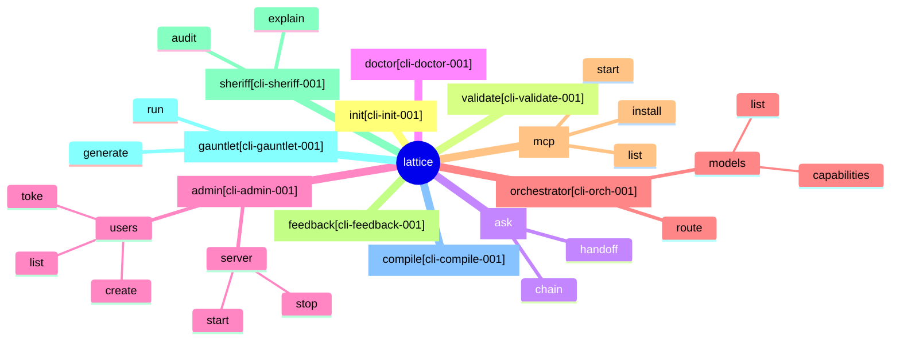
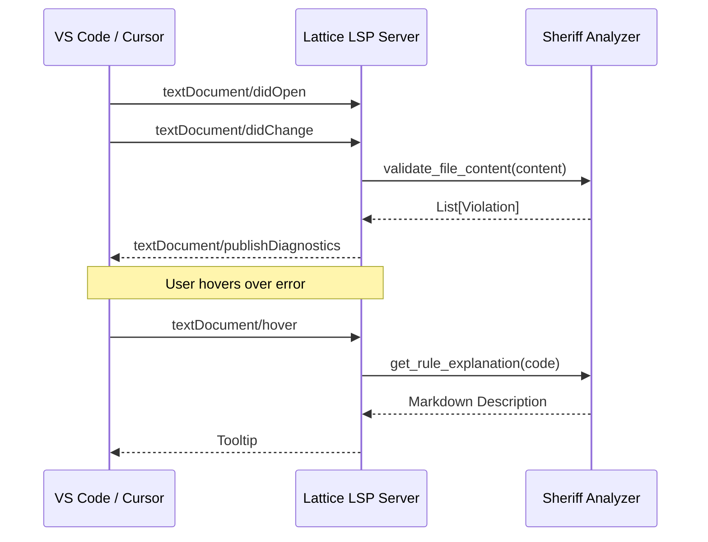
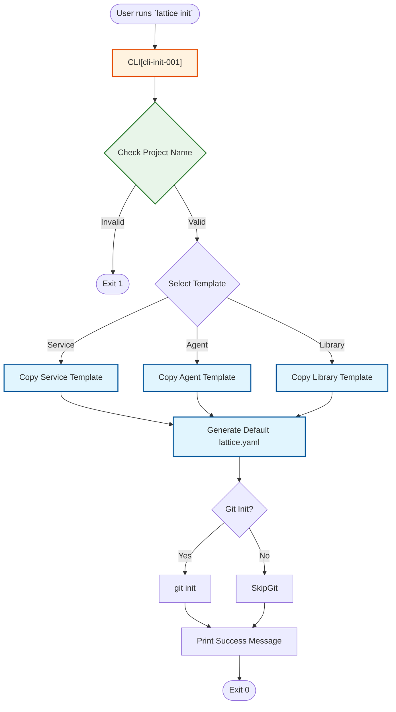
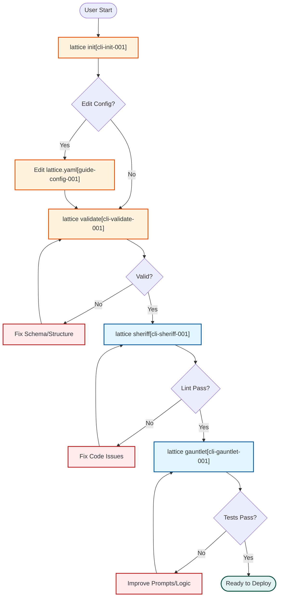
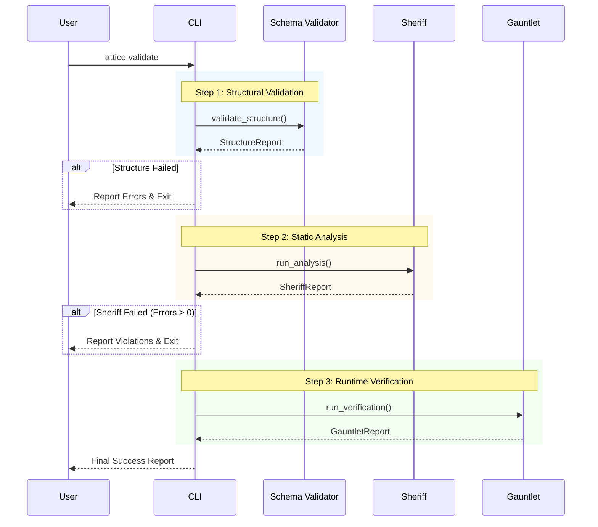
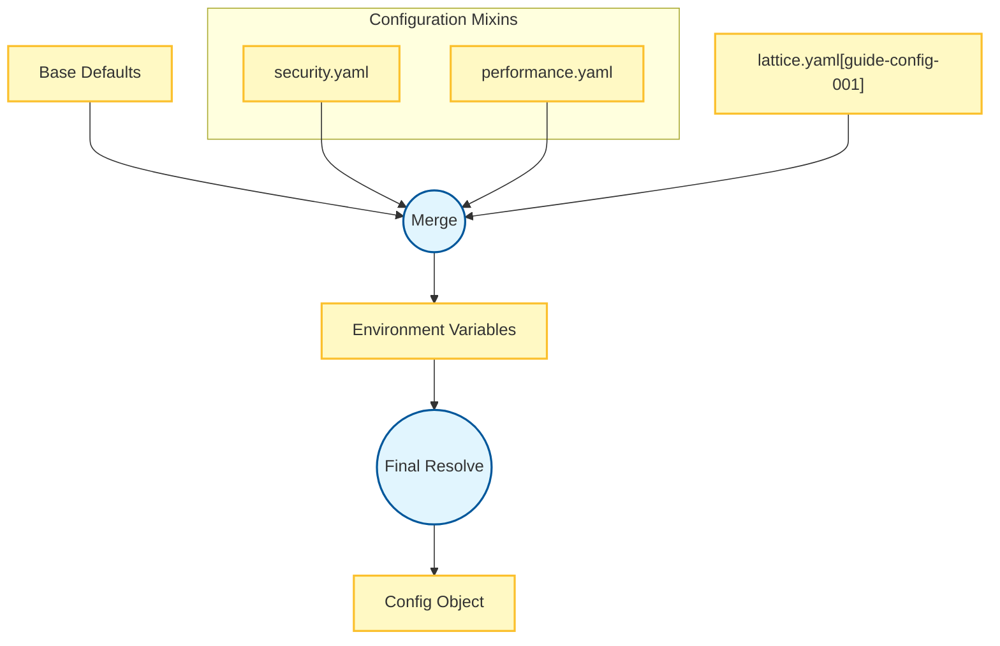
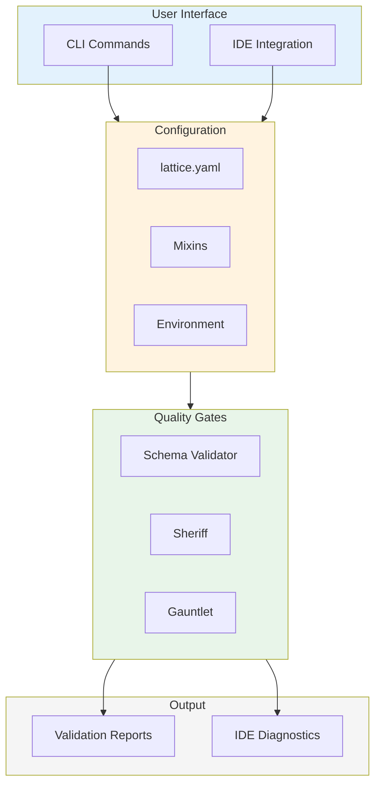

# Workflow System - Comprehensive Diagram Documentation

Detailed Mermaid.js diagrams documenting the Workflow subsystem including CLI commands, IDE integration, project initialization, user flows, and configuration management.

---

## Table of Contents

1. [CLI Command Hierarchy](#1-cli-command-hierarchy)
2. [IDE Integration Flow](#2-ide-integration-flow)
3. [Project Initialization Flow](#3-project-initialization-flow)
4. [High-Level User Flow](#4-high-level-user-flow)
5. [Governance Validation Flow](#5-governance-validation-flow)
6. [Configuration Inheritance Flow](#6-configuration-inheritance-flow)

---

## 1. CLI Command Hierarchy

**Purpose**: Mind map showing the complete CLI command structure with all subcommands organized by functional area.

**Diagram Type**: Mind Map



### Command Descriptions

| Command | Purpose | Category |
|---------|---------|----------|
| **init** | Initialize new Lattice project | Setup |
| **validate** | Validate configuration and code | Quality |
| **ask** | Interactive AI assistance | AI |
| **doctor** | Diagnose system issues | Maintenance |
| **admin** | Administration operations | Admin |
| **orchestrator** | Model routing control | AI |
| **mcp** | MCP server management | Integration |
| **feedback** | Submit feedback | Support |
| **sheriff** | Static code analysis | Quality |
| **gauntlet** | Test generation and execution | Testing |
| **compile** | Configuration compilation | Build |

### Command Groups

| Group | Commands | Purpose |
|-------|----------|---------|
| **Setup** | init | Project bootstrapping |
| **Quality** | validate, sheriff, gauntlet | Code quality assurance |
| **AI** | ask, orchestrator | AI-powered features |
| **Admin** | admin, doctor | System management |
| **Build** | compile | Configuration processing |

### Related Source Files

- [`src/cli/main.py`](../../src/cli/main.py) - CLI entry point
- [`src/cli/commands/`](../../src/cli/commands/) - Command implementations
- [`src/cli/commands/init.py`](../../src/cli/commands/init.py) - Init command
- [`src/cli/commands/validate.py`](../../src/cli/commands/validate.py) - Validate command
- [`src/cli/commands/sheriff.py`](../../src/cli/commands/sheriff.py) - Sheriff command
- [`src/cli/commands/gauntlet.py`](../../src/cli/commands/gauntlet.py) - Gauntlet command

---

## 2. IDE Integration Flow

**Purpose**: Sequence diagram showing the Language Server Protocol (LSP) integration with IDEs for real-time code validation.

**Diagram Type**: Sequence Diagram



### Node Descriptions

| Node | Description | Protocol |
|------|-------------|----------|
| **VS Code / Cursor** | IDE with LSP client | LSP over stdio/socket |
| **Lattice LSP Server** | Language server implementation | LSP 3.17 |
| **Sheriff Analyzer** | Static analysis engine | Python API |

### LSP Events

| Event | Direction | Purpose |
|-------|-----------|---------|
| **didOpen** | Client → Server | File opened in editor |
| **didChange** | Client → Server | File content changed |
| **publishDiagnostics** | Server → Client | Report violations |
| **hover** | Client → Server | Request hover info |

### Diagnostic Severity Mapping

| Sheriff Severity | LSP Severity | Display |
|------------------|--------------|---------|
| ERROR | Error (1) | Red squiggle |
| WARNING | Warning (2) | Yellow squiggle |
| INFO | Information (3) | Blue squiggle |
| HINT | Hint (4) | Subtle indicator |

### Related Source Files

- [`src/lsp/server.py`](../../src/lsp/server.py) - LSP server implementation
- [`src/lsp/handlers.py`](../../src/lsp/handlers.py) - LSP request handlers
- [`src/sheriff/sheriff.py`](../../src/sheriff/sheriff.py) - Sheriff validation (lines 1-291)
- [`editors/vscode/`](../../editors/vscode/) - VS Code extension

---

## 3. Project Initialization Flow

**Purpose**: Flowchart showing the complete project initialization process from CLI invocation through template selection and configuration generation.

**Diagram Type**: Flowchart (Top-Down)



### Node Descriptions

| Node | Description | Output |
|------|-------------|--------|
| **CLI** | Command-line interface entry | Parsed arguments |
| **Check Project Name** | Validate naming conventions | Pass/fail |
| **Select Template** | Choose project type | Template selection |
| **Copy Template** | Copy template files | Project structure |
| **Generate Config** | Create lattice.yaml | Configuration file |
| **Git Init** | Initialize repository | .git directory |
| **Finalize** | Display success | User feedback |

### Project Templates

| Template | Use Case | Files Generated |
|----------|----------|-----------------|
| **Service** | Backend API service | FastAPI scaffold |
| **Agent** | AI agent project | Agent base classes |
| **Library** | Reusable library | Package structure |

### Generated Configuration

```yaml
# lattice.yaml (generated)
name: my-project
version: 0.1.0
type: service  # or agent, library

governance:
  sheriff:
    enabled: true
    rules: default
  gauntlet:
    enabled: true
```

### Related Source Files

- [`src/cli/commands/init.py`](../../src/cli/commands/init.py) - Init command implementation
- [`src/templates/`](../../src/templates/) - Project templates
- [`src/templates/service/`](../../src/templates/service/) - Service template
- [`src/templates/agent/`](../../src/templates/agent/) - Agent template
- [`src/templates/library/`](../../src/templates/library/) - Library template

---

## 4. High-Level User Flow

**Purpose**: Flowchart showing the complete user journey from project initialization through validation, analysis, testing, and deployment readiness.

**Diagram Type**: Flowchart (Top-Down)



### Node Descriptions

| Node | Description | Success Criteria |
|------|-------------|------------------|
| **lattice init** | Project initialization | Files created |
| **Edit Config** | Configuration customization | Valid YAML |
| **lattice validate** | Schema validation | Zero errors |
| **lattice sheriff** | Static analysis | No violations |
| **lattice gauntlet** | Test execution | All tests pass |
| **Ready to Deploy** | Deployment readiness | All gates passed |

### Quality Gates

| Gate | Tool | Blocking |
|------|------|----------|
| **Schema Validation** | Validator | Yes |
| **Static Analysis** | Sheriff | Yes (errors only) |
| **Runtime Tests** | Gauntlet | Yes |

### User Actions at Each Stage

| Stage | User Action | Next Step |
|-------|-------------|-----------|
| **Init** | Run command | Configure |
| **Config** | Edit YAML | Validate |
| **Fix Schema** | Correct structure | Re-validate |
| **Fix Code** | Address violations | Re-lint |
| **Improve** | Refine implementation | Re-test |

### Related Source Files

- [`src/cli/commands/init.py`](../../src/cli/commands/init.py) - Init command
- [`src/cli/commands/validate.py`](../../src/cli/commands/validate.py) - Validate command
- [`src/cli/commands/sheriff.py`](../../src/cli/commands/sheriff.py) - Sheriff command
- [`src/cli/commands/gauntlet.py`](../../src/cli/commands/gauntlet.py) - Gauntlet command

---

## 5. Governance Validation Flow

**Purpose**: Sequence diagram showing the three-step governance validation process: structural validation, static analysis, and runtime verification.

**Diagram Type**: Sequence Diagram



### Node Descriptions

| Node | Description | Output |
|------|-------------|--------|
| **User** | Developer running validation | Command input |
| **CLI** | Command-line interface | Orchestrates validation |
| **Schema Validator** | YAML/JSON schema checker | StructureReport |
| **Sheriff** | AST-based static analyzer | SheriffReport |
| **Gauntlet** | Runtime test runner | GauntletReport |

### Validation Steps

| Step | Validator | Focus | Exit Condition |
|------|-----------|-------|----------------|
| **1** | Schema Validator | Structure, types | Invalid schema |
| **2** | Sheriff | Code quality, style | Error violations |
| **3** | Gauntlet | Runtime behavior | Test failures |

### Report Structures

```python
@dataclass
class StructureReport:
    valid: bool
    errors: list[SchemaError]
    warnings: list[SchemaWarning]

@dataclass
class SheriffReport:
    violations: list[Violation]
    metrics: CodeMetrics
    passed: bool

@dataclass
class GauntletReport:
    tests_run: int
    passed: int
    failed: int
    coverage: float
```

### Related Source Files

- [`src/cli/commands/validate.py`](../../src/cli/commands/validate.py) - Validate command
- [`src/validator/schema.py`](../../src/validator/schema.py) - Schema validation
- [`src/sheriff/sheriff.py`](../../src/sheriff/sheriff.py) - Sheriff analysis (lines 1-291)
- [`src/gauntlet/runner.py`](../../src/gauntlet/runner.py) - Test execution

---

## 6. Configuration Inheritance Flow

**Purpose**: Graph showing how configuration values are merged from base defaults, mixins, local config, and environment variables.

**Diagram Type**: Flowchart (Top-Down)



### Node Descriptions

| Node | Description | Priority |
|------|-------------|----------|
| **Base Defaults** | Framework defaults | Lowest |
| **Security Mixin** | Security-focused presets | Low |
| **Performance Mixin** | Performance presets | Low |
| **lattice.yaml** | Project configuration | Medium |
| **Environment Variables** | Runtime overrides | Highest |
| **Config Object** | Final merged config | Result |

### Merge Priority (Lowest to Highest)

1. **Base Defaults** - Built-in framework defaults
2. **Mixins** - Shared configuration presets
3. **Local Config** - Project-specific settings
4. **Environment Variables** - Runtime overrides

### Configuration Sources

| Source | Format | Location |
|--------|--------|----------|
| **Base Defaults** | Python dict | `src/config/defaults.py` |
| **Mixins** | YAML | `mixins/*.yaml` |
| **Local Config** | YAML | `./lattice.yaml` |
| **Env Vars** | Key=Value | System environment |

### Example Inheritance

```yaml
# mixins/security.yaml
governance:
  sheriff:
    security_rules: strict

# lattice.yaml
$import:
  - mixins/security.yaml

governance:
  sheriff:
    enabled: true  # Merged with mixin

# Environment override
# LATTICE_GOVERNANCE_SHERIFF_ENABLED=false
```

### Related Source Files

- [`src/config/loader.py`](../../src/config/loader.py) - Configuration loading
- [`src/config/merger.py`](../../src/config/merger.py) - Deep merge logic
- [`src/config/defaults.py`](../../src/config/defaults.py) - Default values
- [`src/config/env.py`](../../src/config/env.py) - Environment variable handling

---

## Workflow System Integration

The workflow components integrate to provide a seamless development experience:



### Integration Points

| From | To | Mechanism |
|------|-----|-----------|
| CLI/IDE | Config | File loading |
| Config | Quality | Parsed settings |
| Quality | Output | Validation results |
| IDE | Sheriff | LSP protocol |

---

## Summary

| Diagram | Type | Purpose | Key Insight |
|---------|------|---------|-------------|
| CLI Hierarchy | Mind Map | Command structure | Organized by function |
| IDE Integration | Sequence | LSP communication | Real-time validation |
| Project Init | Flowchart | Bootstrap process | Template-based setup |
| User Flow | Flowchart | Development journey | Quality-gated progression |
| Governance Validation | Sequence | Validation pipeline | Three-step verification |
| Config Inheritance | Graph | Config merging | Priority-based override |

---

## Usage

These diagrams render in GitHub, GitLab, VS Code (Mermaid extension), Obsidian, and [mermaid.live](https://mermaid.live).
