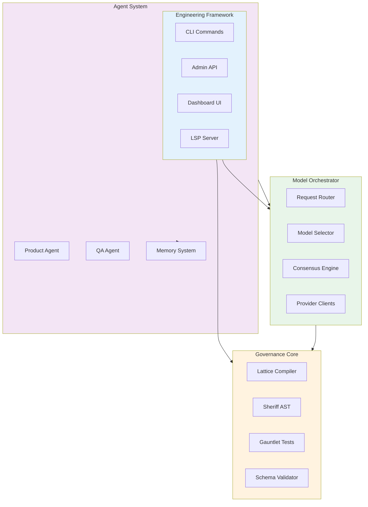
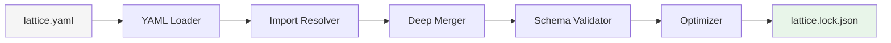
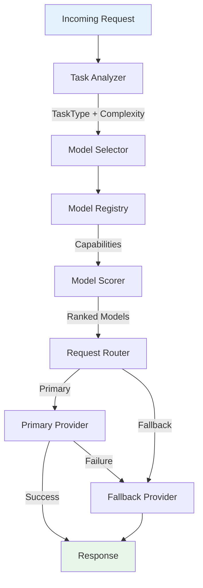
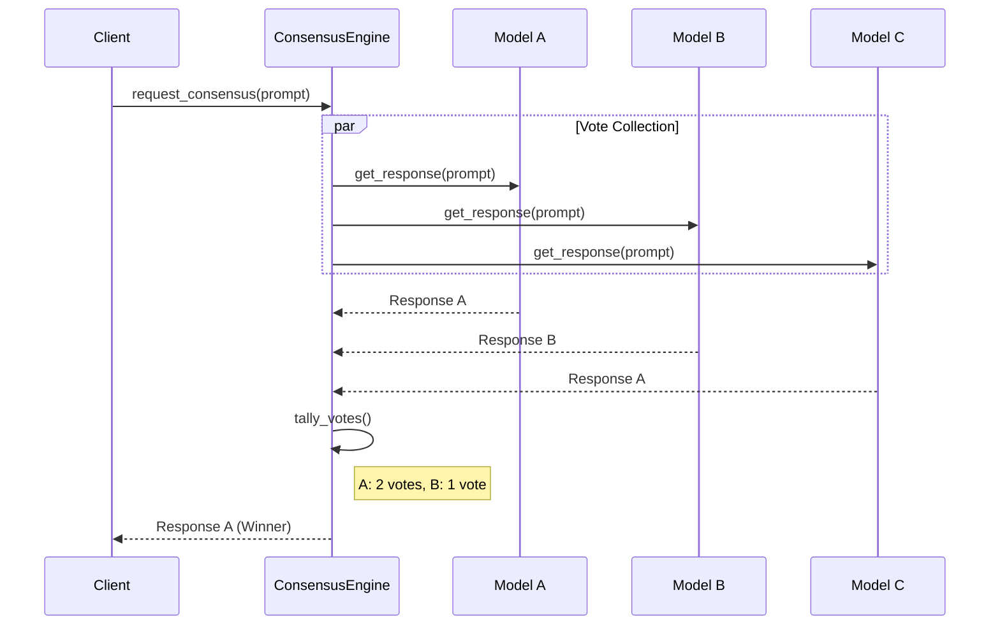
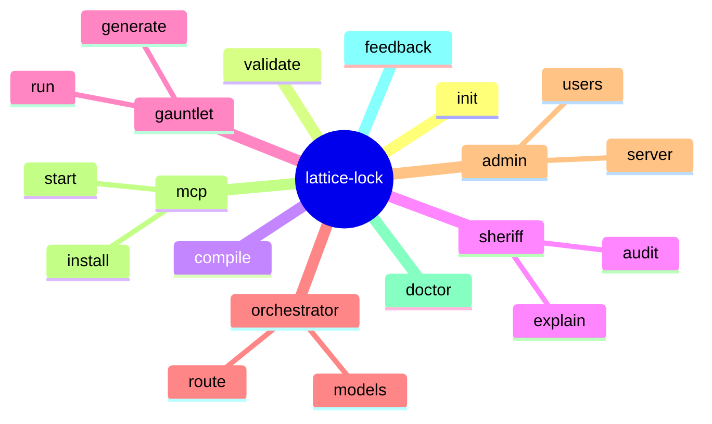
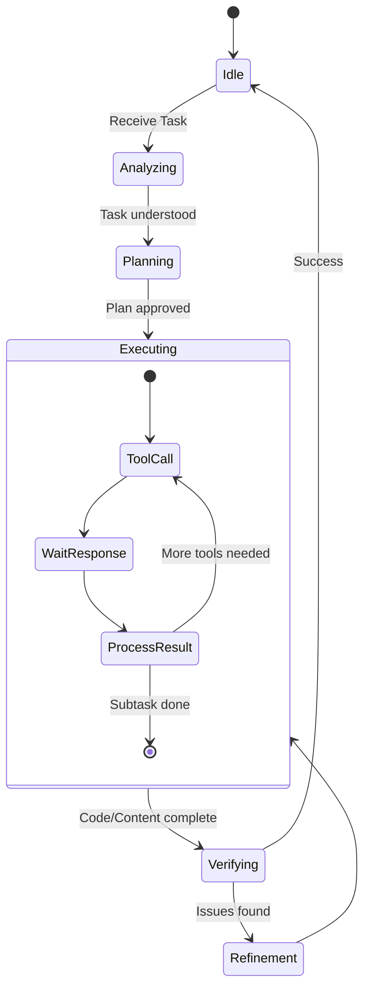
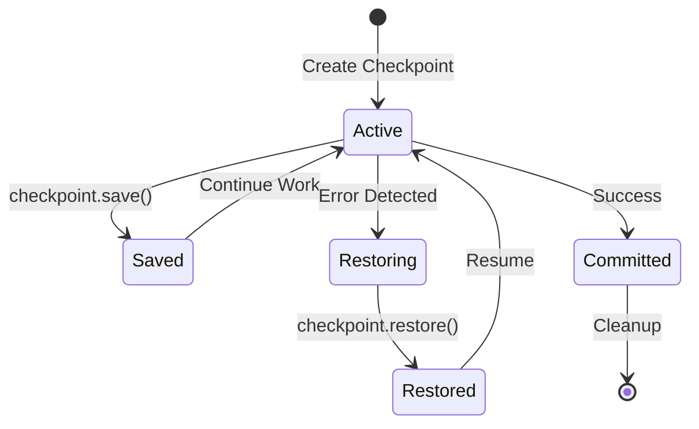

# Lattice-Lock Framework Specification

**Version:** 2.0.0 | **Last Updated:** 2026-01-06 | **Author:** Kevin Lappe

---

## 01. Overview

Lattice-Lock is a **governance-first framework for AI-assisted software development** that provides deterministic, policy-enforced code generation and agent orchestration through three integrated layers:

1. **Governance Core** — Schema-driven code generation with compile-time enforcement (Sheriff + Gauntlet)
2. **Model Orchestrator** — Intelligent routing of AI tasks across multiple providers with consensus support
3. **Engineering Framework** — Standardized tooling for repo scaffolding, CI/CD, validation, and admin operations

The framework transforms code generation from probabilistic synthesis into constrained assembly, guaranteeing structural compliance and semantic correctness through pre-compilation enforcement.

### Target Audience

- Internal engineers building AI-powered applications
- DevOps/Platform teams integrating agent workflows into CI/CD
- Orchestration administrators managing multi-agent systems
- LLM agent developers creating new agent definitions

### Implementation Status

| Layer | Status | Location |
|-------|--------|----------|
| Governance Core | **Implemented** | `src/lattice_lock/sheriff/`, `src/lattice_lock/gauntlet/`, `src/lattice_lock/compiler/` |
| Model Orchestrator | **Implemented** | `src/lattice_lock/orchestrator/` |
| Engineering Framework | **Implemented** | `src/lattice_lock/cli/`, `src/lattice_lock/admin/` |
| Agent System | **Implemented** | `src/lattice_lock/agents/` |
| Dashboard | **Implemented** | `src/lattice_lock/dashboard/` |

---

## 02. Architecture

### High-Level Architecture



### Layer Responsibilities

| Layer | Purpose | Key Guarantee |
|-------|---------|---------------|
| **Governance Core** | Eliminate interface/style/semantic drift via schema-first generation | 100% structural, >99% semantic compliance |
| **Model Orchestrator** | Route AI tasks across providers with cost optimization | Local-first, automatic fallback, cost-aware |
| **Engineering Framework** | Standardize project setup, CI/CD, and operations | <30 min to first CI validation |
| **Agent System** | Multi-agent collaboration with memory and handoff | Checkpoint-based continuity |

### Layer Contracts

| Provider | Consumer | Contract |
|----------|----------|----------|
| Governance Core | Model Orchestrator | Generated types, validation rules, forbidden imports |
| Governance Core | Engineering Framework | Sheriff CLI, Gauntlet tests, schema validation |
| Model Orchestrator | Engineering Framework | `ModelOrchestrator` class, CLI, cost/performance APIs |
| Model Orchestrator | Agent System | Request routing, consensus voting |
| Engineering Framework | End Users | Scaffolding CLI, CI templates, admin API, dashboard |

---

## 03. Component Specifications

### 3.1 Governance Core

#### Lattice Schema (`lattice.yaml`)

The **Single Source of Truth** for all type definitions, interfaces, and constraints.

```yaml
version: v2.1                    # Semantic versioning
generated_module: types_v2       # Output module name

config:
  forbidden_imports: [requests, psycopg2, sqlite3, float]
  orm_engine: sqlmodel

governance:
  sheriff:
    enabled: true
    enforce_type_hints: true
    max_complexity: 10
  gauntlet:
    enabled: true
    coverage_threshold: 80

entities:
  EntityName:
    description: "..."
    persistence: table
    fields:
      id: { type: uuid, primary_key: true }
      price: { type: decimal, gt: 0, scale: 8 }
      status: { enum: [pending, filled, cancelled], default: pending }

interfaces:
  IServiceName:
    file: src/services/service.py
    scaffold: repository_pattern
    depends_on: []
    methods:
      method_name:
        params: { param: EntityType }
        returns: ResultType
        ensures: ["result.value > 0"]  # Semantic post-conditions
```

**Invariants:** Use semantic versioning • Define entities before referencing • No forbidden imports • Include `ensures` for critical logic

#### Lattice Compiler (`src/lattice_lock/compiler/`)



| Output | Purpose | Location |
|--------|---------|----------|
| Pydantic Models | API contracts, validation | `src/shared/types_vX.py` |
| SQLModel ORM | Database schema | `src/shared/models_vX.py` |
| Alembic Migrations | Database versioning | `migrations/` |
| Pytest Contracts | Semantic validation | `tests/test_contracts_vX.py` |
| Lock File | Deterministic config | `lattice.lock.json` |

**Guarantees:** Deterministic • Version-aware • Backward compatible

**Source:** [`src/lattice_lock/compiler/core.py`](../../../src/lattice_lock/compiler/core.py)

#### Sheriff (AST Enforcement)

Static analysis engine using Python AST traversal to enforce governance rules.

| Rule | Description | Severity |
|------|-------------|----------|
| Import Discipline | MUST import from generated types module | ERROR |
| Forbidden Imports | MUST NOT use libraries in forbidden list | ERROR |
| Type Hints | MUST have return type hints on all functions | WARNING/ERROR |
| Version Compliance | MUST use current lattice version | ERROR |
| Complexity | Cyclomatic complexity below threshold | WARNING |
| Docstrings | Public API must have docstrings | WARNING |

**Escape Hatch:** `# lattice:ignore` bypasses specific rules (audit logged)

**Source:** [`src/lattice_lock/sheriff/sheriff.py`](../../../src/lattice_lock/sheriff/sheriff.py)

#### The Gauntlet (Semantic Testing)

Auto-generates pytest contracts from `ensures` clauses:
- Post-condition validation
- Boundary tests
- Invariant preservation tests
- Security injection tests

**Execution:** ~8s typical runtime

**Source:** [`src/lattice_lock/gauntlet/`](../../../src/lattice_lock/gauntlet/)

---

### 3.2 Model Orchestrator

#### Multi-Provider Support

| Provider | Models | Cost | Strengths |
|----------|--------|------|-----------|
| Local/Ollama | 20+ | Free | Privacy, offline, zero cost |
| OpenAI | 11+ | Paid | GPT-4o, O1 reasoning, vision |
| Anthropic | 7+ | Paid | Claude Opus 4.5, advanced reasoning |
| Google | 6+ | Paid | Gemini 2.5 Pro, 1M+ context |
| xAI Grok | 5+ | Paid | Extended context, vision |
| Azure | 4+ | Paid | Enterprise compliance |
| AWS Bedrock | 8+ | Paid | AWS managed service |

#### Task Classification & Routing



| Task Type | Primary Local | Primary Cloud | Criteria |
|-----------|---------------|---------------|----------|
| CODE_GENERATION | codellama:34b | claude-sonnet-4 | accuracy > speed |
| CODE_REVIEW | deepseek-r1:70b | claude-opus-4.5 | depth > speed |
| DEBUGGING | deepseek-r1:70b | o1-pro | reasoning depth |
| REASONING | deepseek-r1:70b | o1-pro | chain-of-thought |
| VISION | llama-3.2-90b | gpt-4o | multimodal |
| QUICK_RESPONSE | llama3.1:8b | gpt-4o-mini | speed > accuracy |

#### Scoring Algorithm

```
Score = (Task Affinity × 0.40) + (Performance × 0.30) +
        (Accuracy × 0.20) + (Cost Efficiency × 0.10)
```

#### Interaction Patterns

| Pattern | Use Case | Implementation |
|---------|----------|----------------|
| Single Model | Default routing | `route_request()` |
| Chain of Thought | Fast draft → quality refine | `ChainExecutor` |
| Parallel Consensus | Critical decisions (multiple models vote) | `ConsensusEngine` |
| Hierarchical | Multi-agent workflows | Agent orchestration |

#### Consensus Engine



#### API Usage

```python
from lattice_lock.orchestrator import ModelOrchestrator
from lattice_lock.orchestrator.types import TaskType

orchestrator = ModelOrchestrator()
response = await orchestrator.route_request(
    prompt="Implement a REST API endpoint",
    task_type=TaskType.CODE_GENERATION
)
```

**CLI:** `lattice-lock orchestrator route|analyze|list|cost`

**Source:** [`src/lattice_lock/orchestrator/core.py`](../../../src/lattice_lock/orchestrator/core.py)

---

### 3.3 Engineering Framework

#### CLI Commands



#### Scaffolding CLI

```bash
lattice-lock init <project-name> [--template agent|service|library]
```

**Generated Structure:**

```
project-name/
├── lattice.yaml
├── src/
│   ├── shared/           # Generated types (DO NOT EDIT)
│   └── services/
├── tests/
│   └── test_contracts.py
├── .github/workflows/lattice-lock.yml
└── README.md
```

#### CI/CD Integration (GitHub Actions)

```yaml
jobs:
  validate:
    steps:
      - run: lattice-lock compile
      - run: lattice-lock sheriff src/
      - run: lattice-lock gauntlet
      - run: lattice-lock test-orchestrator
```

#### Admin API

| Endpoint | Method | Purpose |
|----------|--------|---------|
| `/api/v1/projects` | GET | List projects |
| `/api/v1/projects/{id}/status` | GET | Health status |
| `/api/v1/projects/{id}/rollback` | POST | Trigger rollback |
| `/api/v1/auth/login` | POST | JWT authentication |
| `/api/v1/auth/refresh` | POST | Token refresh |

**Source:** [`src/lattice_lock/admin/api.py`](../../../src/lattice_lock/admin/api.py)

#### Dashboard

Real-time monitoring dashboard with WebSocket support for live updates.

**Features:**
- Project status monitoring
- Validation results visualization
- Cost tracking and analytics
- Agent activity monitoring

**Source:** [`src/lattice_lock/dashboard/`](../../../src/lattice_lock/dashboard/)

---

### 3.4 Agent System

#### Agent Architecture



#### Agent Roles

| Agent | Responsibility | Integration |
|-------|----------------|-------------|
| **Product Agent** | PRD creation, market analysis | Backlog systems (JIRA/Linear) |
| **Engineering Agent** | Code implementation, testing | Sheriff, Gauntlet |
| **QA Agent** | Quality verification, testing | Playwright, pytest |
| **Prompt Architect** | 4-stage pipeline orchestration | All agents |

#### Handoff Protocol

Agents can transfer task ownership with full context preservation via checkpoints.

**Source:** [`src/lattice_lock/agents/`](../../../src/lattice_lock/agents/)

---

## 04. Error Handling & Recovery

### Error Handling Matrix

| Error Type | Handling | Recovery |
|------------|----------|----------|
| Schema Validation | Block deployment | Fix lattice.yaml |
| Sheriff Violation | Block deployment | Fix code or escape hatch |
| Gauntlet Failure | Block deployment | Fix implementation |
| Provider Timeout | Auto-fallback | Next provider in chain |
| Provider Exhausted | Error boundary | Return error with context |
| Runtime Error | Log + alert | Auto-rollback via checkpoint |

### Rollback System



**Source:** [`src/lattice_lock/rollback/checkpoint.py`](../../../src/lattice_lock/rollback/checkpoint.py)

---

## 05. Versioning Strategy

### Semantic Versioning (MAJOR.MINOR.PATCH)

| Increment | When | Migration Required |
|-----------|------|-------------------|
| **MAJOR** | Breaking schema/API changes, architectural redesigns | Yes |
| **MINOR** | New backward-compatible features | No |
| **PATCH** | Bug fixes, security patches, docs | No |

### Dual Versioning

1. **Framework Version** — Overall system (`version.txt`)
2. **Schema Version** — Individual `lattice.yaml` files

```yaml
version: v2.1
generated_module: types_v2  # Major version in module name
```

### Compatibility Matrix

| Framework | Schema v1 | Schema v2 | Schema v3 |
|-----------|-----------|-----------|-----------|
| v1.x | ✅ | ❌ | ❌ |
| v2.x | ⚠️ Deprecated | ✅ | ❌ |
| v3.x | ❌ | ✅ | ✅ |

---

## 06. Technical Requirements

### Infrastructure

- Python 3.10+
- Ollama (local models)
- Docker
- PostgreSQL (optional)

### Security

- HashiCorp Vault / AWS Secrets Manager
- Never log secrets
- OAuth2/JWT for admin
- Audit logging

### Non-Functional Guardrails

- MUST NOT require non-standard Git workflows
- MUST NOT hard-code provider secrets
- MUST support headless and offline operation
- MUST NOT break existing CI on upgrade

---

## 07. Related Documentation

### Architecture Diagrams

| Document | Diagrams | Focus |
|----------|----------|-------|
| [CORE_ARCHITECTURE_DIAGRAMS.md](../../architecture/CORE_ARCHITECTURE_DIAGRAMS.md) | 7 | System structure, deployment |
| [ORCHESTRATOR_DIAGRAMS.md](../../architecture/ORCHESTRATOR_DIAGRAMS.md) | 9 | Model routing, consensus |
| [GOVERNANCE_DIAGRAMS.md](../../architecture/GOVERNANCE_DIAGRAMS.md) | 5 | Sheriff, Gauntlet, Compiler |
| [AGENT_DIAGRAMS.md](../../architecture/AGENT_DIAGRAMS.md) | 6 | Lifecycle, communication |
| [WORKFLOW_DIAGRAMS.md](../../architecture/WORKFLOW_DIAGRAMS.md) | 6 | CLI, IDE, validation |
| [SEQUENCE_DIAGRAMS.md](../../architecture/SEQUENCE_DIAGRAMS.md) | 10 | Detailed sequences |
| [DIAGRAM_INDEX.md](../../architecture/DIAGRAM_INDEX.md) | - | Master index |

### Quick Reference

- [CLAUDE.md](../../CLAUDE.md) — Quick commands and patterns
- [contributing.md](../../contributing.md) — Code style and contribution guide

---

## 08. Glossary

| Term | Definition |
|------|------------|
| **Constrained Assembly** | Code as filling logic within pre-defined typed modules |
| **Governance Cage** | Generated artifacts that constrain agent behavior |
| **Interface Drift** | Agents inventing non-existent APIs/structures |
| **Semantic Drift** | Code that compiles but violates business invariants |
| **Sheriff** | AST-based enforcer for imports and type hints |
| **The Gauntlet** | Auto-generated pytest suite for semantic contracts |
| **Schema ROI** | Ratio of generated code lines to schema definition lines |
| **Consensus** | Multi-model voting for critical decisions |
| **Checkpoint** | Saved state for rollback and handoff |

---

## 09. Document Governance

This specification **supersedes** all previous documentation (WARP.md, standalone PRDs, context docs) for architectural decisions.

**Retained documents:**

- `agent_specifications/agent_instructions_file_format_v2_1.md` — Normative agent spec
- `directory/repository_structure_standards.md` — Normative structure spec
- `developer_documentation/*` — How-to guides (must align with this spec)

All new documentation MUST reference this specification as authoritative.

---

_This document is the authoritative specification for the Lattice-Lock Framework._
