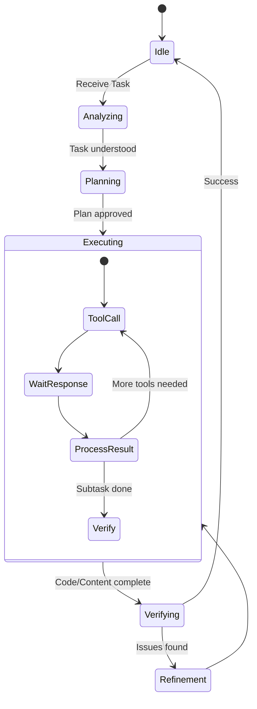
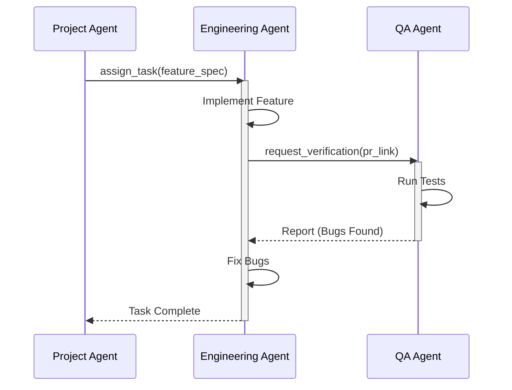
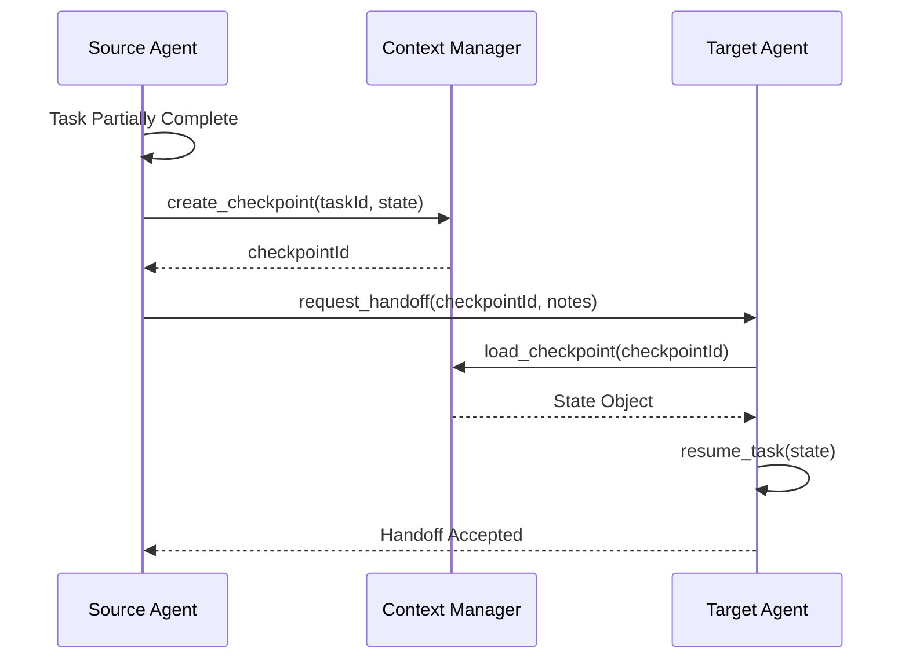
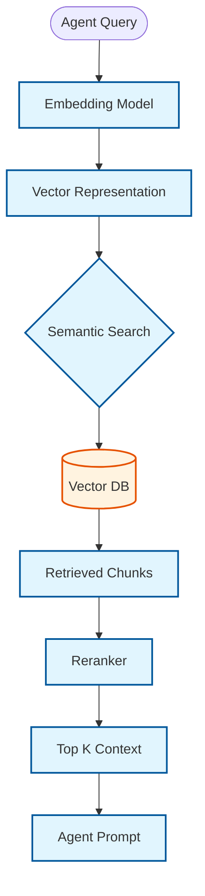
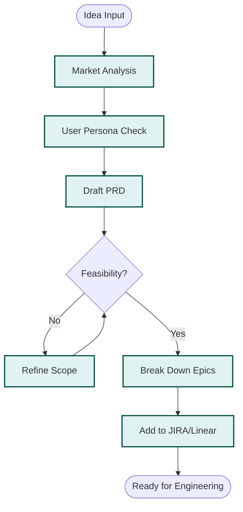
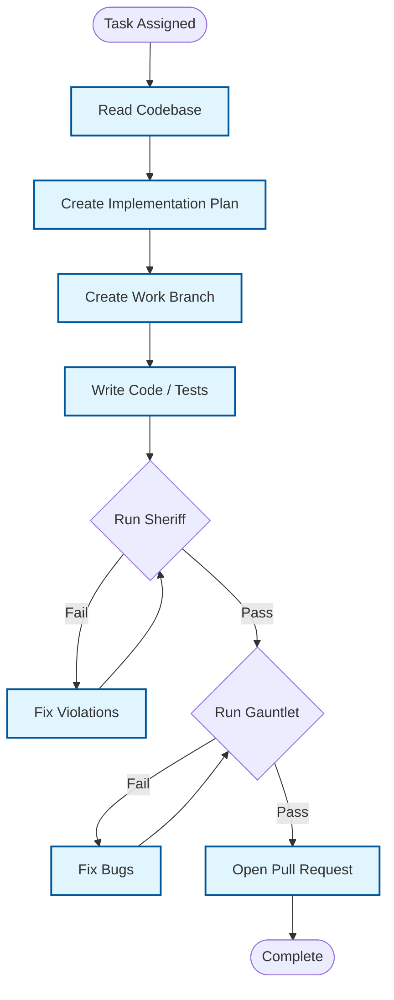
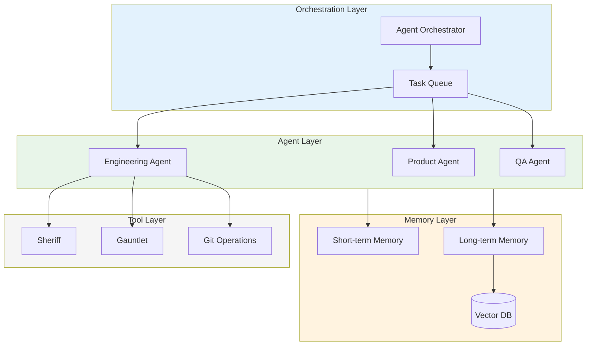

# Agent System - Comprehensive Diagram Documentation

Detailed Mermaid.js diagrams documenting the Agent subsystem including lifecycle management, inter-agent communication, memory architecture, and specialized agent workflows.

---

## Table of Contents

1. [Agent Lifecycle](#1-agent-lifecycle)
2. [Inter-Agent Communication](#2-inter-agent-communication)
3. [Handoff Protocol](#3-handoff-protocol)
4. [Memory Retrieval Flow](#4-memory-retrieval-flow)
5. [Product Agent Workflow](#5-product-agent-workflow)
6. [Engineering Agent Workflow](#6-engineering-agent-workflow)

---

## 1. Agent Lifecycle

**Purpose**: State machine showing the complete lifecycle of an agent from idle through task execution, verification, and potential refinement loops.

**Diagram Type**: State Diagram



### State Descriptions

| State | Description | Transitions |
|-------|-------------|-------------|
| **Idle** | Agent awaiting new tasks | → Analyzing (on task receipt) |
| **Analyzing** | Understanding task requirements | → Planning (task understood) |
| **Planning** | Creating execution plan | → Executing (plan approved) |
| **Executing** | Active task execution | → Verifying (work complete) |
| **ToolCall** | Invoking external tools | → WaitResponse |
| **WaitResponse** | Awaiting tool response | → ProcessResult |
| **ProcessResult** | Evaluating tool output | → ToolCall / Verify |
| **Verifying** | Validating completed work | → Idle / Refinement |
| **Refinement** | Addressing issues | → Executing |

### Execution Substates

| Substate | Purpose | Duration |
|----------|---------|----------|
| **ToolCall** | Invoke tool with parameters | ~100ms |
| **WaitResponse** | Await external response | Variable |
| **ProcessResult** | Parse and evaluate result | ~50ms |
| **Verify** | Check subtask completion | ~200ms |

### Related Source Files

- [`src/agents/base.py`](../../src/agents/base.py) - Base agent class with lifecycle methods
- [`src/agents/executor.py`](../../src/agents/executor.py) - Task execution engine
- [`src/agents/state.py`](../../src/agents/state.py) - Agent state management
- [`src/agents/tools/`](../../src/agents/tools/) - Tool implementations

---

## 2. Inter-Agent Communication

**Purpose**: Sequence diagram showing how multiple specialized agents collaborate on a feature, from assignment through verification and completion.

**Diagram Type**: Sequence Diagram



### Agent Roles

| Agent | Responsibility | Inputs | Outputs |
|-------|---------------|--------|---------|
| **Project Agent** | Task coordination and assignment | Requirements, priorities | Task assignments |
| **Engineering Agent** | Code implementation | Feature specs | Pull requests |
| **QA Agent** | Quality verification | PR links | Bug reports |

### Communication Patterns

| Pattern | Description | Use Case |
|---------|-------------|----------|
| **assign_task** | Delegate work to specialist | PM → Engineering |
| **request_verification** | Request quality check | Engineering → QA |
| **Report** | Return findings | QA → Engineering |
| **Task Complete** | Signal completion | Engineering → PM |

### Message Payloads

```python
# Task assignment payload
@dataclass
class TaskAssignment:
    task_id: str
    feature_spec: FeatureSpec
    priority: Priority
    deadline: datetime | None

# Verification request
@dataclass
class VerificationRequest:
    pr_link: str
    test_scope: list[str]
    blocking: bool
```

### Related Source Files

- [`src/agents/project/`](../../src/agents/project/) - Project management agent
- [`src/agents/engineering/`](../../src/agents/engineering/) - Engineering implementation agent
- [`src/agents/qa/`](../../src/agents/qa/) - Quality assurance agent
- [`src/agents/messaging/`](../../src/agents/messaging/) - Inter-agent messaging

---

## 3. Handoff Protocol

**Purpose**: Sequence diagram showing how agents transfer task ownership with full context preservation via checkpoints.

**Diagram Type**: Sequence Diagram



### Node Descriptions

| Node | Description | Responsibility |
|------|-------------|----------------|
| **Source Agent** | Agent initiating handoff | Create checkpoint, request transfer |
| **Context Manager** | State persistence service | Store and retrieve checkpoints |
| **Target Agent** | Agent receiving task | Load checkpoint, resume work |

### Handoff Steps

| Step | Action | Data |
|------|--------|------|
| 1 | Partial completion detected | Task progress metrics |
| 2 | Create checkpoint | Task ID, current state |
| 3 | Request handoff | Checkpoint ID, handoff notes |
| 4 | Load checkpoint | Full state object |
| 5 | Resume task | Restored context |
| 6 | Confirm handoff | Acceptance signal |

### Checkpoint Data Structure

```python
@dataclass
class Checkpoint:
    checkpoint_id: str
    task_id: str
    agent_id: str
    state: dict[str, Any]
    progress: float  # 0.0 - 1.0
    notes: str
    created_at: datetime
    metadata: dict[str, Any]
```

### Related Source Files

- [`src/rollback/checkpoint.py`](../../src/rollback/checkpoint.py) - Checkpoint management (lines 1-127)
- [`src/agents/handoff/`](../../src/agents/handoff/) - Handoff protocol implementation
- [`src/agents/context/`](../../src/agents/context/) - Context manager service

---

## 4. Memory Retrieval Flow

**Purpose**: Flowchart showing the RAG (Retrieval-Augmented Generation) pipeline for agent memory, from query through semantic search to context injection.

**Diagram Type**: Flowchart (Top-Down)



### Node Descriptions

| Node | Description | Technology |
|------|-------------|------------|
| **Agent Query** | Natural language query | User/agent input |
| **Embedding Model** | Text to vector conversion | OpenAI ada-002 / local model |
| **Vector Representation** | Dense embedding | 1536-dimensional vector |
| **Semantic Search** | Similarity matching | Cosine similarity / ANN |
| **Vector DB** | Vector storage | Pinecone / Weaviate / Chroma |
| **Retrieved Chunks** | Matching documents | Text chunks with scores |
| **Reranker** | Result refinement | Cross-encoder model |
| **Top K Context** | Final context | Highest relevance chunks |
| **Agent Prompt** | Augmented prompt | Query + context |

### Retrieval Parameters

| Parameter | Description | Typical Value |
|-----------|-------------|---------------|
| **k** | Initial retrieval count | 20-50 |
| **top_k** | Final context count | 3-10 |
| **chunk_size** | Document chunk size | 500-1000 tokens |
| **overlap** | Chunk overlap | 50-100 tokens |
| **threshold** | Similarity threshold | 0.7-0.8 |

### Memory Types

| Type | Storage | Retrieval |
|------|---------|-----------|
| **Short-term** | In-memory | Direct access |
| **Long-term** | Vector DB | Semantic search |
| **Episodic** | Structured DB | Key-based lookup |
| **Procedural** | Code/docs | Pattern matching |

### Related Source Files

- [`src/agents/memory/`](../../src/agents/memory/) - Memory subsystem
- [`src/agents/memory/retriever.py`](../../src/agents/memory/retriever.py) - RAG retrieval
- [`src/agents/memory/embeddings.py`](../../src/agents/memory/embeddings.py) - Embedding generation
- [`src/agents/memory/reranker.py`](../../src/agents/memory/reranker.py) - Result reranking

---

## 5. Product Agent Workflow

**Purpose**: Flowchart showing the Product Agent's workflow from idea input through market analysis, PRD creation, and backlog management.

**Diagram Type**: Flowchart (Top-Down)



### Node Descriptions

| Node | Description | Output |
|------|-------------|--------|
| **Idea Input** | Raw product concept | Unstructured idea |
| **Market Analysis** | Competitive research | Market positioning |
| **User Persona Check** | Target user validation | Persona alignment |
| **Draft PRD** | Product requirements doc | Structured spec |
| **Feasibility?** | Technical/business review | Go/no-go decision |
| **Refine Scope** | Scope adjustment | Revised requirements |
| **Break Down Epics** | Work decomposition | Epic/story structure |
| **Add to JIRA/Linear** | Backlog integration | Tracked tickets |
| **Ready for Engineering** | Handoff point | Prioritized backlog |

### PRD Template Structure

```markdown
## Product Requirements Document

### Overview
- Problem Statement
- Target Users
- Success Metrics

### Requirements
- Functional Requirements
- Non-Functional Requirements
- Constraints

### Scope
- In Scope
- Out of Scope
- Future Considerations
```

### Related Source Files

- [`src/agents/product/`](../../src/agents/product/) - Product agent implementation
- [`src/agents/product/analyzer.py`](../../src/agents/product/analyzer.py) - Market analysis
- [`src/agents/product/prd_generator.py`](../../src/agents/product/prd_generator.py) - PRD creation
- [`src/agents/integrations/jira.py`](../../src/agents/integrations/jira.py) - JIRA integration

---

## 6. Engineering Agent Workflow

**Purpose**: Flowchart showing the Engineering Agent's development workflow including code writing, Sheriff validation, and Gauntlet testing.

**Diagram Type**: Flowchart (Top-Down)



### Node Descriptions

| Node | Description | Tools |
|------|-------------|-------|
| **Task Assigned** | Receive work from PM | Task assignment system |
| **Read Codebase** | Understand existing code | Code search, AST analysis |
| **Create Implementation Plan** | Design approach | Planning templates |
| **Create Work Branch** | Git branch setup | Git operations |
| **Write Code / Tests** | Implementation | Code generation |
| **Run Sheriff** | Static analysis | Sheriff linter |
| **Fix Violations** | Address lint issues | Code editing |
| **Run Gauntlet** | Test execution | Pytest, Gauntlet |
| **Fix Bugs** | Debug failures | Debugging tools |
| **Open Pull Request** | Submit for review | GitHub/GitLab API |

### Quality Gates

| Gate | Tool | Pass Criteria |
|------|------|---------------|
| **Static Analysis** | Sheriff | Zero errors, warnings < threshold |
| **Unit Tests** | Pytest | 100% pass, coverage > 80% |
| **Integration Tests** | Gauntlet | All scenarios pass |
| **Code Review** | PR Review | Approval from maintainer |

### Related Source Files

- [`src/agents/engineering/`](../../src/agents/engineering/) - Engineering agent
- [`src/agents/engineering/planner.py`](../../src/agents/engineering/planner.py) - Implementation planning
- [`src/agents/engineering/coder.py`](../../src/agents/engineering/coder.py) - Code generation
- [`src/sheriff/sheriff.py`](../../src/sheriff/sheriff.py) - Static analysis (lines 1-291)
- [`src/gauntlet/runner.py`](../../src/gauntlet/runner.py) - Test execution

---

## Agent System Integration

The agent system components work together in a coordinated multi-agent architecture:



### Integration Points

| From | To | Protocol |
|------|-----|----------|
| Orchestrator | Agents | Task assignment |
| Agents | Memory | Read/write operations |
| Engineering | Tools | Tool invocation |
| Agents | Agents | Inter-agent messaging |

---

## Summary

| Diagram | Type | Purpose | Key Insight |
|---------|------|---------|-------------|
| Agent Lifecycle | State | Execution states | Refinement loop |
| Inter-Agent Communication | Sequence | Agent collaboration | Role-based specialization |
| Handoff Protocol | Sequence | Task transfer | Checkpoint-based continuity |
| Memory Retrieval | Flowchart | RAG pipeline | Semantic search + reranking |
| Product Agent | Flowchart | Product workflow | Feasibility-gated process |
| Engineering Agent | Flowchart | Dev workflow | Quality-gated development |

---

## Usage

These diagrams render in GitHub, GitLab, VS Code (Mermaid extension), Obsidian, and [mermaid.live](https://mermaid.live).
