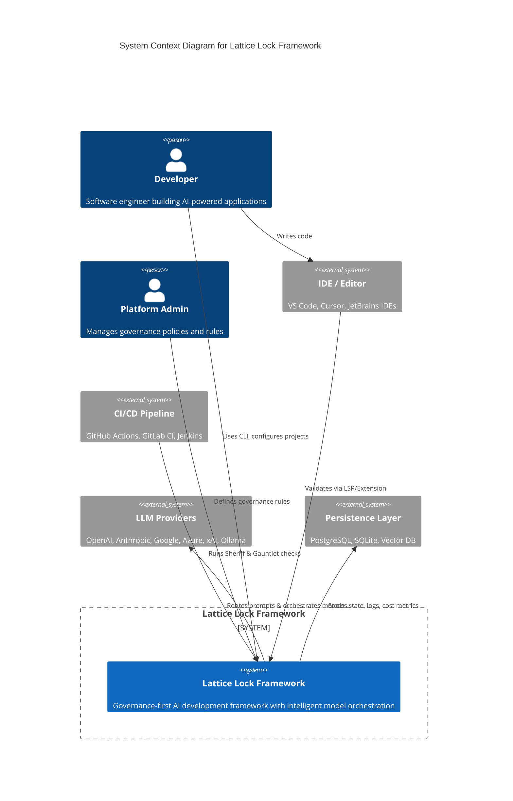
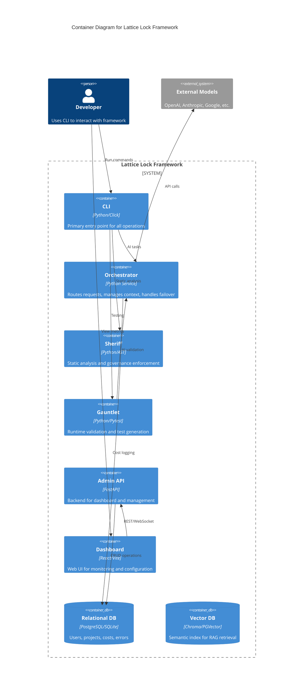
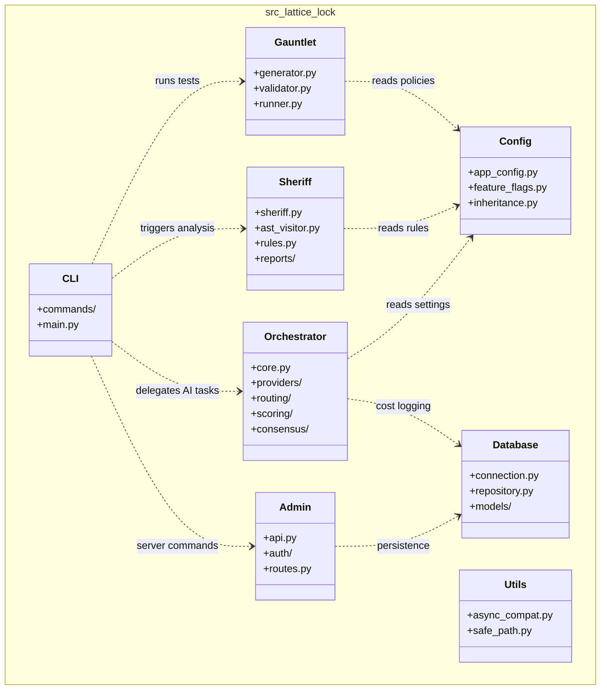
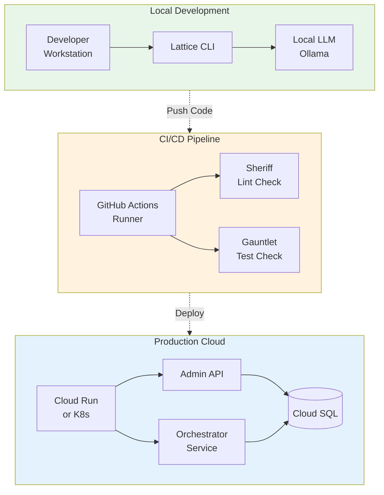
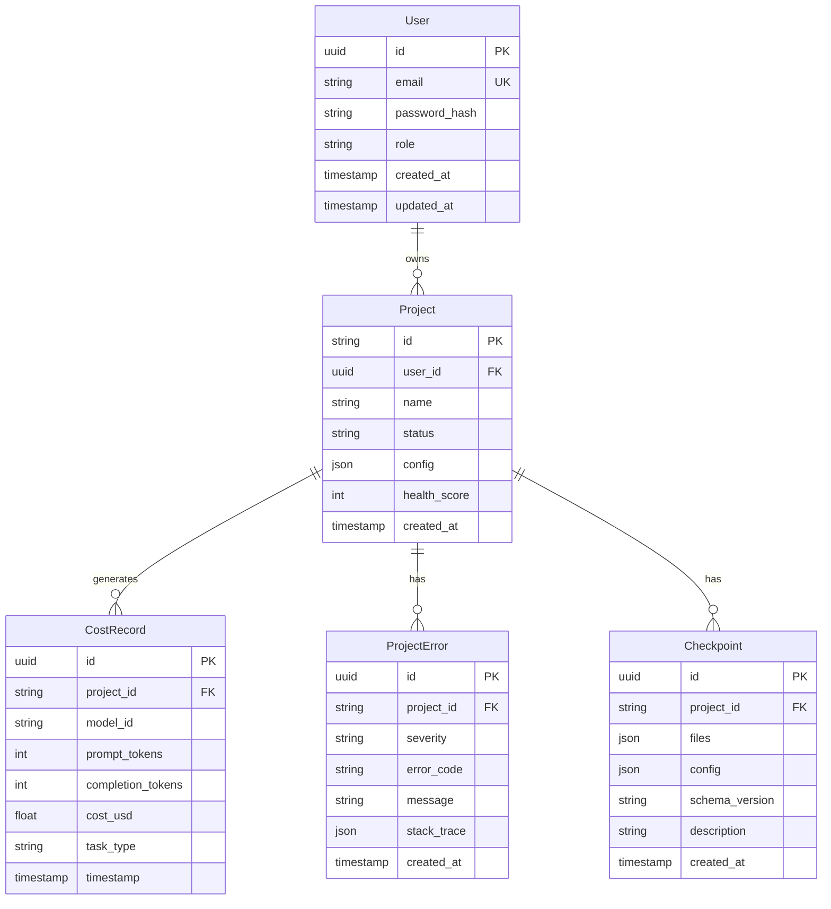
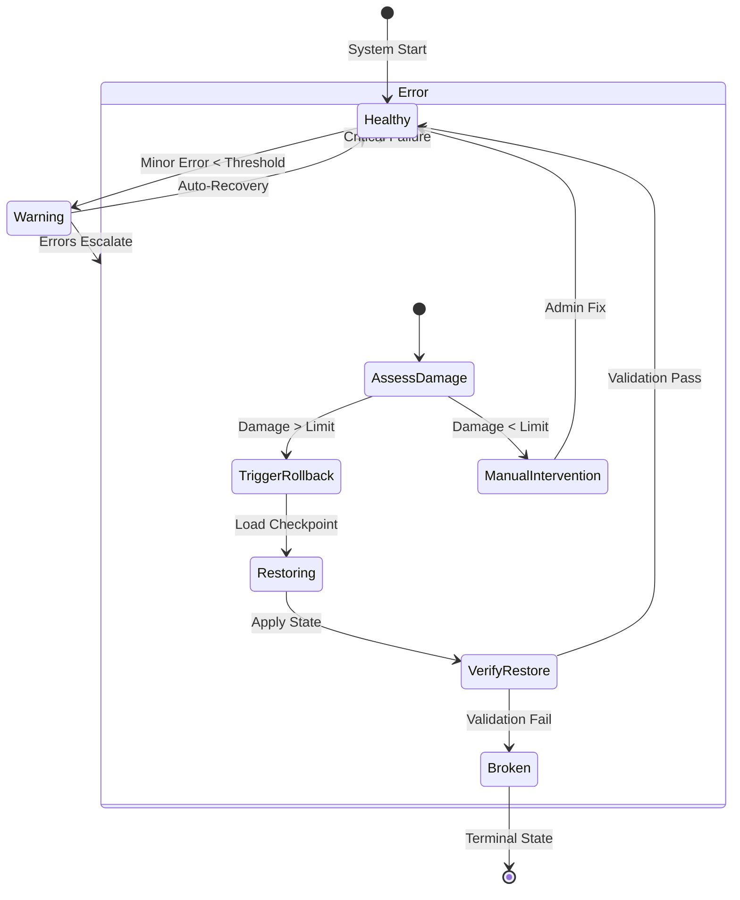
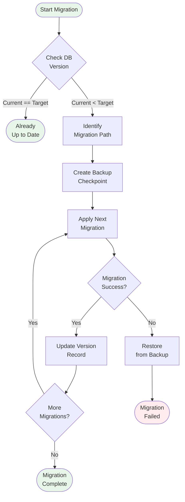

# Core Architecture - Comprehensive Diagram Documentation

Detailed Mermaid.js diagrams documenting the core system architecture including C4 diagrams, package structure, deployment topology, database schema, and state management.

---

## Table of Contents

1. [System Context (C4 Level 1)](#1-system-context-c4-level-1)
2. [Container Architecture (C4 Level 2)](#2-container-architecture-c4-level-2)
3. [Package Structure](#3-package-structure)
4. [Deployment Topology](#4-deployment-topology)
5. [Database Entity Relationship](#5-database-entity-relationship)
6. [Rollback State Machine](#6-rollback-state-machine)
7. [Migration Strategy Flow](#7-migration-strategy-flow)

---

## 1. System Context (C4 Level 1)

**Purpose**: High-level view showing the Lattice Lock Framework boundary, its users, and external systems it interacts with.

**Diagram Type**: C4 Context Diagram



### Element Descriptions

| Element | Type | Description |
|---------|------|-------------|
| **Developer** | Person | Primary user who builds AI applications using the framework |
| **Platform Admin** | Person | Configures governance policies and monitors compliance |
| **Lattice Lock Framework** | System | Core framework providing AI orchestration and governance |
| **IDE / Editor** | External System | Development environment with LSP integration |
| **CI/CD Pipeline** | External System | Automated validation in deployment pipelines |
| **LLM Providers** | External System | AI model providers (8 supported) |
| **Persistence Layer** | External System | Data storage for state, costs, and vectors |

### Key Relationships

| From | To | Interaction |
|------|-----|-------------|
| Developer | Framework | CLI commands, configuration files |
| IDE | Framework | Real-time validation via Language Server Protocol |
| Framework | LLM Providers | API calls for model inference |
| Framework | Database | Persist usage metrics and project state |

### Related Source Files

- [`src/cli/`](../../src/cli/) - CLI entry point
- [`src/orchestrator/`](../../src/orchestrator/) - Model orchestration
- [`src/admin/`](../../src/admin/) - Admin API and dashboard

---

## 2. Container Architecture (C4 Level 2)

**Purpose**: Shows the internal containers (deployable units) within the Lattice Lock Framework.

**Diagram Type**: C4 Container Diagram



### Container Descriptions

| Container | Technology | Responsibility |
|-----------|------------|----------------|
| **CLI** | Python/Click | Command parsing, user interaction |
| **Orchestrator** | Python | Model routing, failover, cost tracking |
| **Sheriff** | Python/AST | Static code analysis, governance checks |
| **Gauntlet** | Python/Pytest | Test generation and execution |
| **Admin API** | FastAPI | REST API, WebSocket, authentication |
| **Dashboard** | React/Vite | Real-time monitoring UI |
| **Relational DB** | PostgreSQL/SQLite | Structured data storage |
| **Vector DB** | Chroma/PGVector | Semantic search and retrieval |

### Related Source Files

- [`src/cli/`](../../src/cli/) - CLI container
- [`src/orchestrator/`](../../src/orchestrator/) - Orchestrator container
- [`src/sheriff/`](../../src/sheriff/) - Sheriff container
- [`src/gauntlet/`](../../src/gauntlet/) - Gauntlet container
- [`src/admin/`](../../src/admin/) - Admin API container
- [`frontend/`](../../frontend/) - Dashboard container
- [`src/database/`](../../src/database/) - Database abstraction

---

## 3. Package Structure

**Purpose**: Shows the Python package hierarchy and inter-module dependencies.

**Diagram Type**: UML Class Diagram (Package View)



### Package Descriptions

| Package | Purpose | Key Modules |
|---------|---------|-------------|
| **CLI** | User interface | `main.py`, command handlers |
| **Orchestrator** | AI routing | `core.py`, providers, scoring |
| **Sheriff** | Static analysis | `sheriff.py`, ast_visitor, rules |
| **Gauntlet** | Testing | generator, validator, runner |
| **Admin** | API layer | `api.py`, auth, routes |
| **Config** | Settings | app_config, feature_flags |
| **Database** | Persistence | connection, repository, models |
| **Utils** | Helpers | async_compat, safe_path |

### Dependency Flow

```
CLI (entry)
 ├── Orchestrator → LLM Providers
 ├── Sheriff → AST Analysis
 ├── Gauntlet → Test Execution
 └── Admin → Database → Storage
```

### Related Source Files

- [`src/lattice_lock/__init__.py`](../../src/lattice_lock/__init__.py) - Package root
- [`pyproject.toml`](../../pyproject.toml) - Package configuration

---

## 4. Deployment Topology

**Purpose**: Shows deployment environments from local development through CI/CD to production.

**Diagram Type**: Flowchart with Subgraphs



### Environment Descriptions

| Environment | Components | Purpose |
|-------------|------------|---------|
| **Local Development** | CLI, Ollama | Developer workstation setup |
| **CI/CD Pipeline** | Sheriff, Gauntlet | Automated validation gates |
| **Production Cloud** | Admin API, Orchestrator, Cloud SQL | Deployed services |

### Deployment Configurations

| Component | Local | CI/CD | Production |
|-----------|-------|-------|------------|
| Database | SQLite | SQLite | Cloud SQL |
| LLM Provider | Ollama | Mock/OpenAI | Multi-provider |
| Auth | Disabled | Disabled | JWT |
| Scaling | Single | Parallel | Auto-scale |

### Related Source Files

- [`Dockerfile`](../../Dockerfile) - Container definition
- [`docker-compose.yml`](../../docker-compose.yml) - Local multi-container
- [`.github/workflows/`](../../.github/workflows/) - CI/CD workflows
- [`infrastructure/`](../../infrastructure/) - Cloud deployment configs

---

## 5. Database Entity Relationship

**Purpose**: Shows the core database schema with entities and relationships.

**Diagram Type**: Entity Relationship Diagram



### Entity Descriptions

| Entity | Purpose | Key Fields |
|--------|---------|------------|
| **User** | Platform users | email, role, password_hash |
| **Project** | Registered projects | name, status, health_score |
| **CostRecord** | Usage tracking | model_id, tokens, cost_usd |
| **ProjectError** | Error history | severity, error_code, message |
| **Checkpoint** | Rollback state | files, config, schema_version |

### Relationships

| Relationship | Cardinality | Description |
|--------------|-------------|-------------|
| User → Project | 1:N | Users own multiple projects |
| Project → CostRecord | 1:N | Projects generate many cost records |
| Project → ProjectError | 1:N | Projects track error history |
| Project → Checkpoint | 1:N | Projects have rollback checkpoints |

### Related Source Files

- [`src/database/models/`](../../src/database/models/) - SQLAlchemy models
- [`src/database/repository.py`](../../src/database/repository.py) - Repository pattern
- [`src/admin/db.py`](../../src/admin/db.py) - Database session management

---

## 6. Rollback State Machine

**Purpose**: Shows system states and transitions for error handling and rollback.

**Diagram Type**: State Diagram



### State Descriptions

| State | Description | Triggers |
|-------|-------------|----------|
| **Healthy** | Normal operation | Successful operations |
| **Warning** | Minor issues detected | Error rate below threshold |
| **Error** | Significant failure | Critical errors, cascading failures |
| **AssessDamage** | Evaluate impact | Entry to Error state |
| **TriggerRollback** | Initiate recovery | Damage exceeds limit |
| **Restoring** | Apply checkpoint | Rollback in progress |
| **VerifyRestore** | Validate recovery | Post-restore checks |
| **Broken** | Unrecoverable | Failed validation |
| **ManualIntervention** | Human required | Damage below auto-fix threshold |

### Transition Thresholds

| Transition | Threshold | Action |
|------------|-----------|--------|
| Healthy → Warning | Error rate > 1% | Log warning, monitor |
| Warning → Error | Error rate > 10% | Initiate damage assessment |
| AssessDamage → Rollback | Affected files > 5 | Auto-rollback |
| AssessDamage → Manual | Affected files ≤ 5 | Alert admin |

### Related Source Files

- [`src/rollback/checkpoint.py`](../../src/rollback/checkpoint.py) - CheckpointManager
- [`src/rollback/state.py`](../../src/rollback/state.py) - RollbackState
- [`src/rollback/storage.py`](../../src/rollback/storage.py) - CheckpointStorage
- [`src/rollback/trigger.py`](../../src/rollback/trigger.py) - Rollback triggers

---

## 7. Migration Strategy Flow

**Purpose**: Documents the database migration process with backup and rollback.

**Diagram Type**: Flowchart



### Node Descriptions

| Node | Description | Action |
|------|-------------|--------|
| **Check DB Version** | Compare current vs target | Query version table |
| **Identify Migration Path** | List required migrations | Parse migration files |
| **Create Backup** | Save current state | Checkpoint creation |
| **Apply Migration** | Execute migration script | Run SQL/Alembic |
| **Update Version** | Record new version | Insert version record |
| **Restore Backup** | Revert on failure | Apply checkpoint |

### Migration Best Practices

1. **Always backup** before applying migrations
2. **Test in staging** before production
3. **Use transactions** for atomicity
4. **Version everything** in migration files
5. **Plan rollback** for every migration

### Related Source Files

- [`src/database/migrations/`](../../src/database/migrations/) - Alembic migrations
- [`src/rollback/checkpoint.py`](../../src/rollback/checkpoint.py) - Backup mechanism

---

## Summary

| Diagram | Type | Purpose | C4 Level |
|---------|------|---------|----------|
| System Context | C4 Context | External boundaries | Level 1 |
| Container Architecture | C4 Container | Internal components | Level 2 |
| Package Structure | Class | Code organization | N/A |
| Deployment Topology | Flowchart | Environment mapping | N/A |
| Database ERD | ER Diagram | Data model | N/A |
| Rollback State Machine | State | Error recovery | N/A |
| Migration Flow | Flowchart | DB updates | N/A |

---

## Usage

These diagrams render in GitHub, GitLab, VS Code (Mermaid extension), Obsidian, and [mermaid.live](https://mermaid.live).

Note: C4 diagrams require Mermaid v9.2+ for full C4 syntax support.
