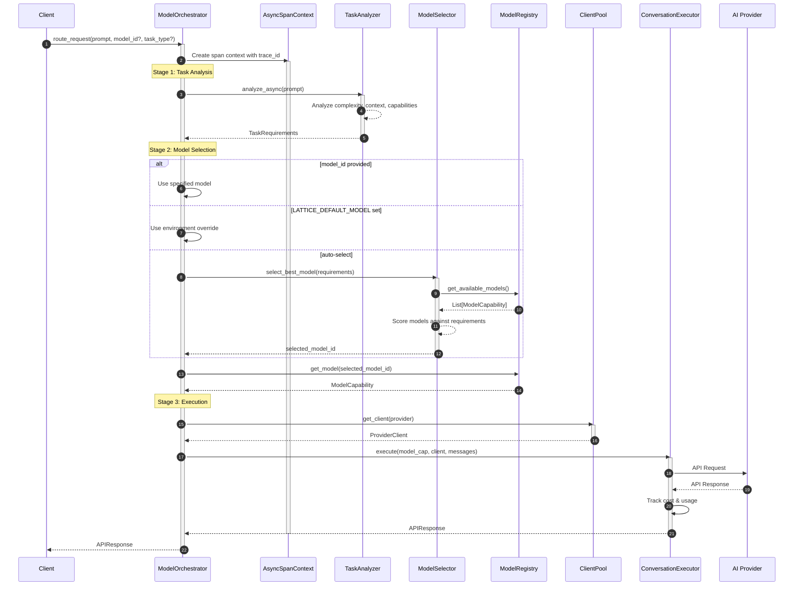
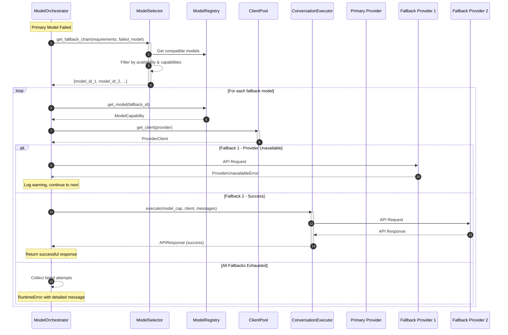
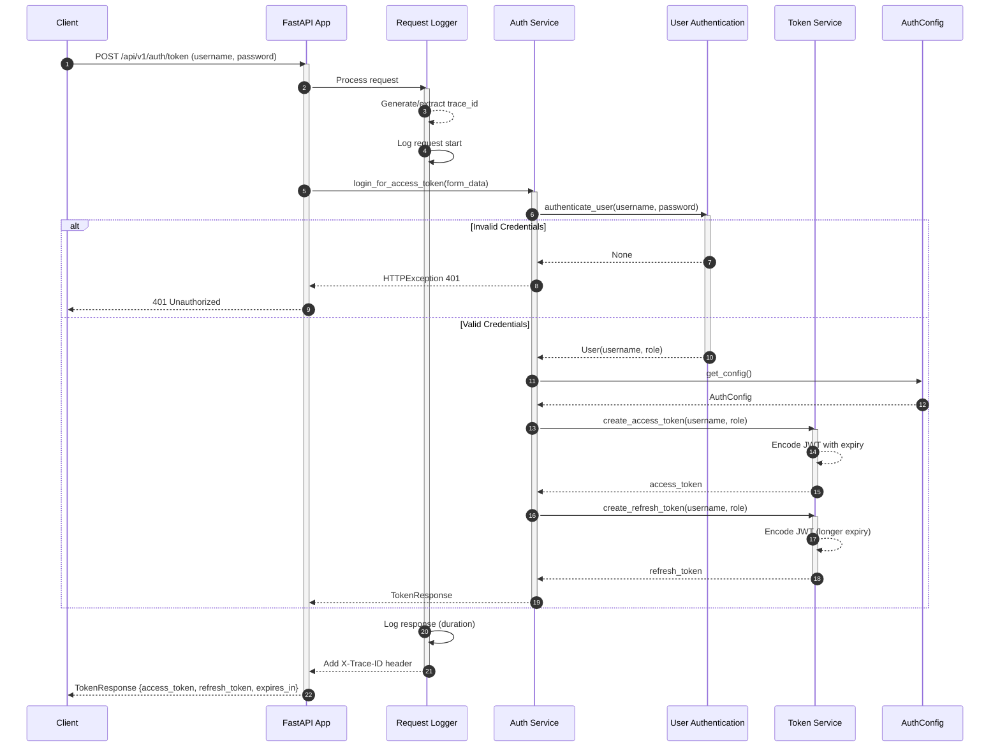
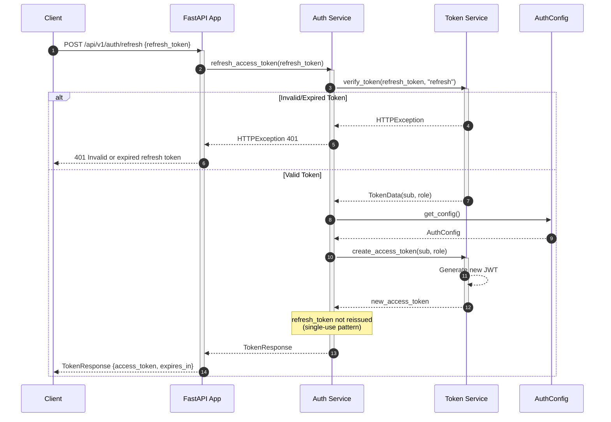
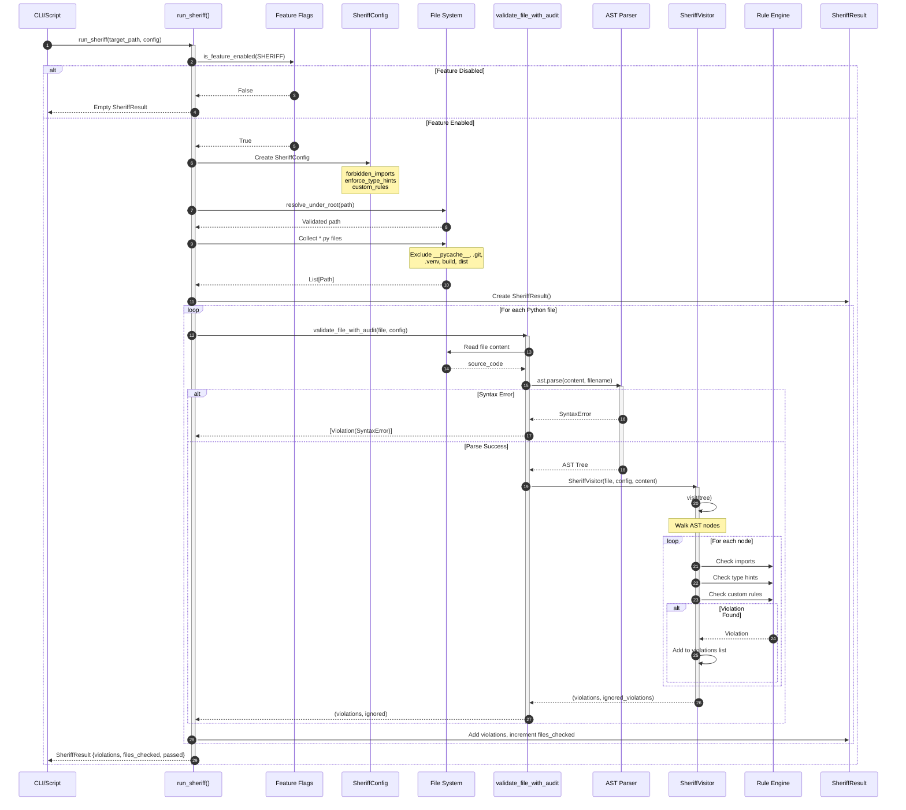
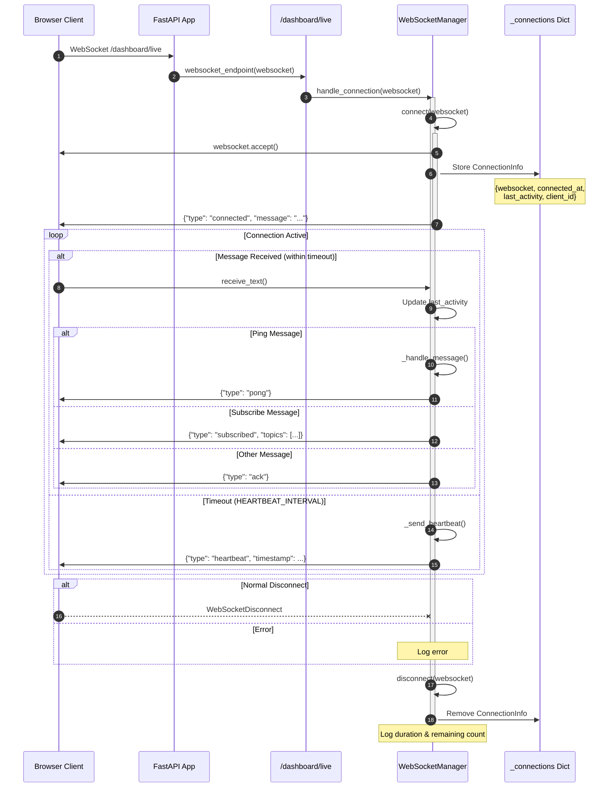
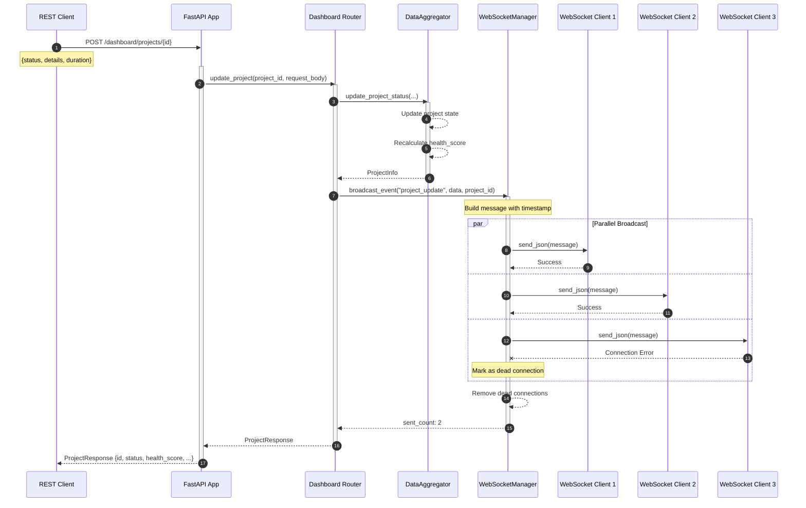
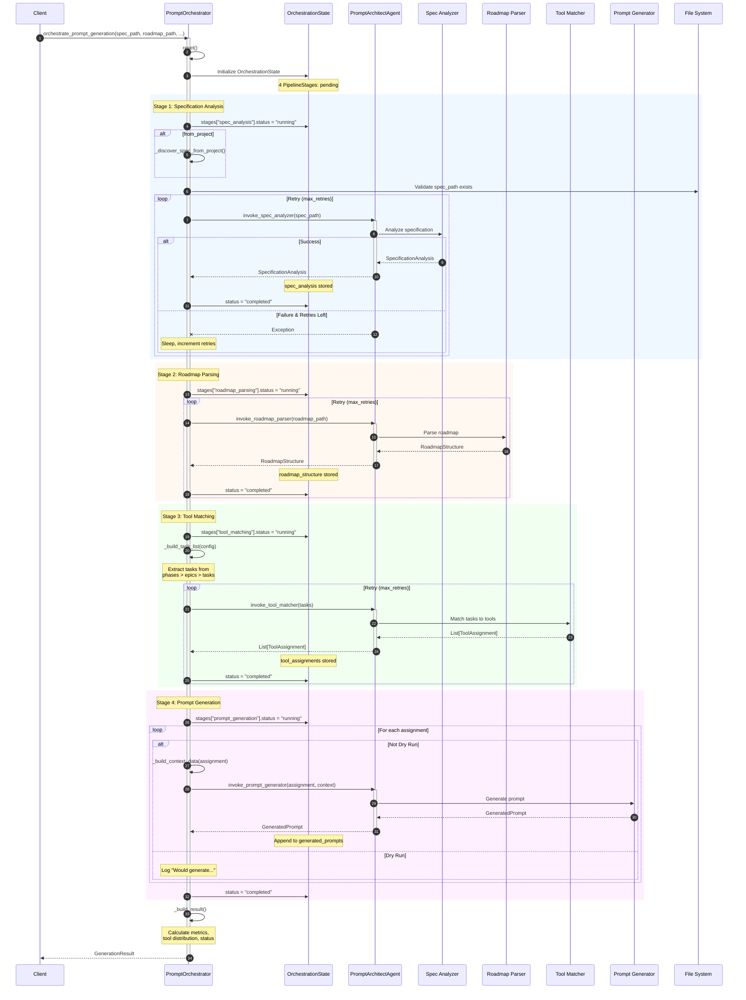
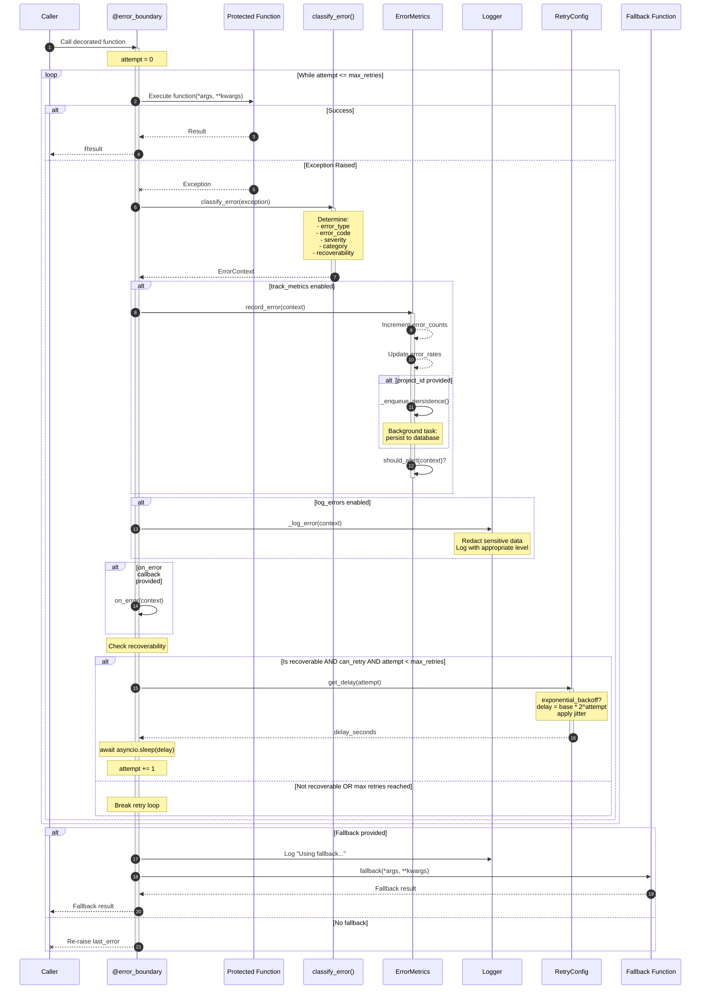

# Lattice Lock Framework - Sequence Diagrams

Comprehensive Mermaid.js sequence diagrams for the complex, well-designed components of the Lattice Lock Framework.

---

## Table of Contents

1. [Model Orchestrator - Request Routing](#1-model-orchestrator---request-routing)
2. [Model Orchestrator - Fallback Chain](#2-model-orchestrator---fallback-chain)
3. [Admin API - JWT Authentication Flow](#3-admin-api---jwt-authentication-flow)
4. [Admin API - Token Refresh Flow](#4-admin-api---token-refresh-flow)
5. [Sheriff - AST Validation Pipeline](#5-sheriff---ast-validation-pipeline)
6. [Dashboard - WebSocket Real-Time Updates](#6-dashboard---websocket-real-time-updates)
7. [Dashboard - Project Status Update with Broadcast](#7-dashboard---project-status-update-with-broadcast)
8. [Prompt Architect - Orchestration Pipeline](#8-prompt-architect---orchestration-pipeline)
9. [Checkpoint/Rollback - State Management](#9-checkpointrollback---state-management)
10. [Error Handling - Boundary with Retry](#10-error-handling---boundary-with-retry)

---

## 1. Model Orchestrator - Request Routing

The core routing flow that analyzes tasks, selects optimal models, and executes requests across 8 AI providers.



---

## 2. Model Orchestrator - Fallback Chain

Error handling with intelligent fallback to alternative models when the primary model fails.



---

## 3. Admin API - JWT Authentication Flow

Complete login flow with OAuth2 password grant, JWT token generation, and role-based access.



---

## 4. Admin API - Token Refresh Flow

Secure token refresh mechanism for maintaining authenticated sessions.



---

## 5. Sheriff - AST Validation Pipeline

Static analysis engine that parses Python files into AST and validates against configurable rules.



---

## 6. Dashboard - WebSocket Real-Time Updates

WebSocket connection lifecycle with heartbeat, message handling, and automatic cleanup.



---

## 7. Dashboard - Project Status Update with Broadcast

REST API update that triggers WebSocket broadcast to all connected clients.



---

## 8. Prompt Architect - Orchestration Pipeline

Four-stage pipeline that generates prompts from specifications and roadmaps with retry logic.



---

## 9. Checkpoint/Rollback - State Management

Checkpoint creation, file backup, and state restoration system.

```mermaid
sequenceDiagram
    autonumber
    participant Client
    participant Manager as CheckpointManager
    participant Storage as CheckpointStorage
    participant State as RollbackState
    participant FileSystem as File System

    rect rgb(240, 255, 240)
        Note over Client,FileSystem: Create Checkpoint Flow

        Client->>Manager: create_checkpoint(files, config, schema_version, description)
        activate Manager

        Manager->>State: Create RollbackState
        Note over State: timestamp<br/>files (path → hash)<br/>config<br/>schema_version<br/>description

        Manager->>Storage: save_state(state)
        activate Storage
        Storage-->>Storage: Generate checkpoint_id
        Storage-->>Storage: Serialize to JSON
        Storage-->>Storage: Write to storage
        Storage-->>Manager: checkpoint_id
        deactivate Storage

        loop For each file in files
            Manager->>FileSystem: open(filepath, "rb")
            FileSystem-->>Manager: content (bytes)
            Manager->>Storage: save_file_content(checkpoint_id, filepath, content)
            activate Storage
            Storage-->>Storage: Store file backup
            deactivate Storage
        end

        Manager-->>Client: checkpoint_id
        deactivate Manager
    end

    rect rgb(255, 248, 240)
        Note over Client,FileSystem: Restore File Flow

        Client->>Manager: restore_file(checkpoint_id, filepath)
        activate Manager

        Manager->>Storage: load_file_content(checkpoint_id, filepath)
        activate Storage

        alt Backup Found
            Storage-->>Manager: content (bytes)
            deactivate Storage

            Manager->>FileSystem: os.makedirs(dirname, exist_ok=True)
            Manager->>FileSystem: open(filepath, "wb").write(content)

            alt Write Success
                Manager-->>Client: True
            else OSError
                Manager-->>Client: False
            end

        else Backup Not Found
            Storage-->>Manager: None
            deactivate Storage
            Manager-->>Client: False
        end

        deactivate Manager
    end

    rect rgb(248, 240, 255)
        Note over Client,FileSystem: List & Prune Checkpoints

        Client->>Manager: list_checkpoints()
        Manager->>Storage: list_states()
        Storage-->>Manager: [checkpoint_id_1, checkpoint_id_2, ...]
        Manager-->>Client: List[str]

        Client->>Manager: prune_checkpoints(keep_n=5)
        Manager->>Storage: prune_states(5)
        Note over Storage: Delete oldest checkpoints<br/>keeping only last 5
    end
```

---

## 10. Error Handling - Boundary with Retry

Decorator-based error handling with classification, exponential backoff, and fallback.



---

## Component Quality Assessment

| Component | Complexity | Completeness | Design Quality | Lines |
|-----------|------------|--------------|----------------|-------|
| Model Orchestrator | High | Complete | Excellent | 296 |
| Admin API + Auth | Medium | Complete | Excellent | 365 |
| Sheriff Validation | Medium | Complete | Excellent | 291 |
| Dashboard + WebSocket | High | Complete | Excellent | 860 |
| Prompt Orchestrator | High | Complete | Excellent | 540 |
| Checkpoint Manager | Low | Complete | Good | 127 |
| Error Middleware | High | Complete | Excellent | 554 |

### Design Patterns Identified

- **Factory Pattern**: ModelOrchestrator, create_app()
- **Repository Pattern**: CheckpointStorage, ModelRegistry
- **Decorator Pattern**: error_boundary, handle_errors
- **Pipeline Pattern**: PromptOrchestrator stages
- **Observer Pattern**: WebSocket broadcast
- **Strategy Pattern**: Model selection, fallback chains
- **Context Manager**: ErrorHandler, AsyncSpanContext

---

## Usage

These diagrams are written in Mermaid.js format and can be rendered in:
- GitHub/GitLab Markdown viewers
- VS Code with Mermaid extension
- Obsidian
- Notion
- [Mermaid Live Editor](https://mermaid.live)

To render locally, ensure your markdown viewer supports Mermaid or use a compatible extension.
