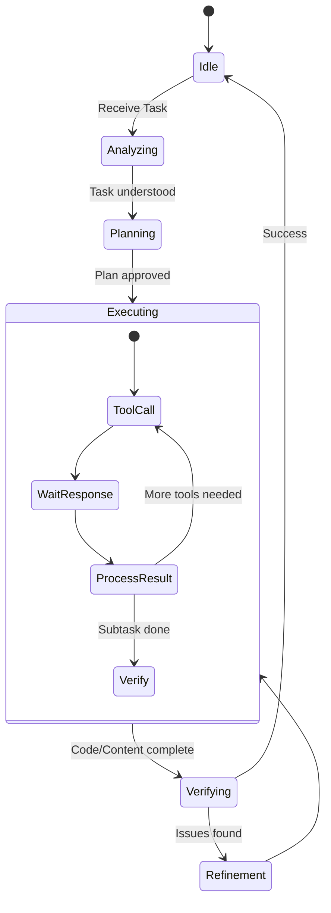

# Agent Lifecycle

```mermaid
stateDiagram-v2
    [*] --> Idle
    
    Idle --> Analyzing: Receive Task
    
    Analyzing --> Planning: Task understood
    
    Planning --> Executing: Plan approved
    
    state Executing {
        [*] --> ToolCall
        ToolCall --> WaitResponse
        WaitResponse --> ProcessResult
        ProcessResult --> ToolCall: More tools needed
        ProcessResult --> Verify: Subtask done
    }
    
    Executing --> Verifying: Code/Content complete
    
    Verifying --> Idle: Success
    Verifying --> Refinement: Issues found
    Refinement --> Executing
```
