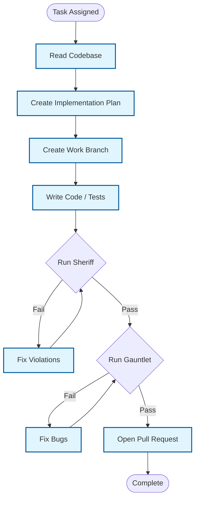

# Engineering Agent Workflow

```mermaid
flowchart TD
    classDef step fill:#e1f5fe,stroke:#01579b,stroke-width:2px;
    
    Start([Task Assigned]) --> Read[Read Codebase]:::step
    
    Read --> Plan[Create Implementation Plan]:::step
    
    Plan --> Codespace[Create Work Branch]:::step
    
    Codespace --> Write[Write Code / Tests]:::step
    
    Write --> Lint{Run Sheriff}
    Lint -- Fail --> Fix[Fix Violations]:::step
    Fix --> Lint
    
    Lint -- Pass --> Test{Run Gauntlet}
    Test -- Fail --> FixTest[Fix Bugs]:::step
    FixTest --> Test
    
    Test -- Pass --> PR[Open Pull Request]:::step
    
    PR --> Done([Complete])
```
