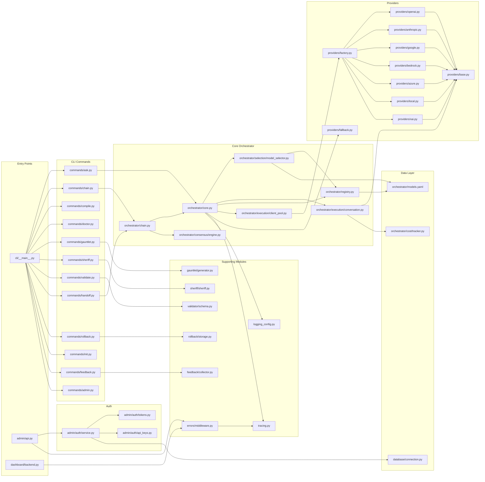
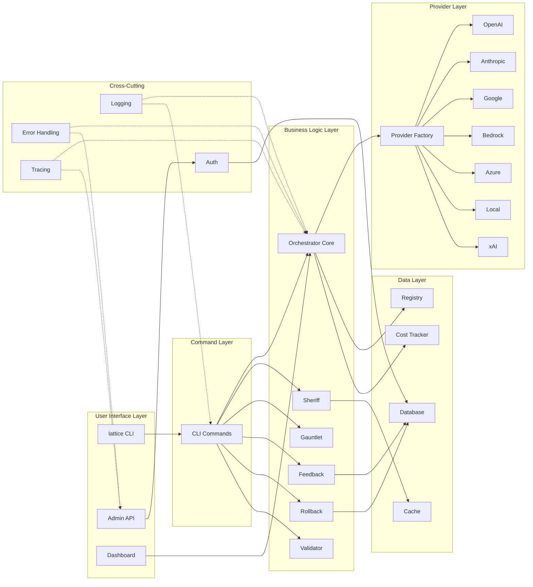

# Lattice Lock Framework - User-Facing File Map & Dependency Connections

> **Generated:** 2025-12-30  
> This document catalogs all user-facing files (excluding tests, CI/CD, caches) and provides a detailed mapping of how they interconnect.

---

## Table of Contents

1. [Complete User-Facing File Inventory](#complete-user-facing-file-inventory)
2. [Dependency Graph Overview](#dependency-graph-overview)
3. [Detailed Module Connections](#detailed-module-connections)
4. [Visual Architecture Diagram](#visual-architecture-diagram)

---

## Complete User-Facing File Inventory

### Root Level Files

| File | Purpose |
|------|---------|
| `pyproject.toml` | Project configuration, dependencies, entry points |
| `Makefile` | Build automation commands |
| `Dockerfile` | Container definition |
| `docker-compose.yml` | Multi-container orchestration |
| `LICENSE.md` | Project license |
| `MODELS.md` | Model documentation |
| `multi_turn_example.py` | Example script for multi-turn conversations |
| `test_prompt.py` | Interactive prompt testing script |

---

### Source Code: `src/lattice_lock/`

#### Core Package (`src/lattice_lock/`)

| File | Purpose |
|------|---------|
| `__init__.py` | Package exports, public API surface |
| `compile.py` | Schema compilation engine |
| `exceptions.py` | Base exception definitions |
| `logging_config.py` | Logging configuration and utilities |
| `tracing.py` | Distributed tracing support |
| `types.py` | Core type definitions |
| `version.txt` | Version tracking |

---

#### Admin Module (`src/lattice_lock/admin/`)

| File | Purpose |
|------|---------|
| `__init__.py` | Admin package exports |
| `api.py` | FastAPI application setup |
| `auth_routes.py` | Authentication endpoints |
| `db.py` | Database connection management |
| `models.py` | SQLAlchemy ORM models |
| `routes.py` | CRUD API endpoints |
| `schemas.py` | Pydantic request/response schemas |
| `services.py` | Business logic services |

##### Auth Submodule (`src/lattice_lock/admin/auth/`)

| File | Purpose |
|------|---------|
| `__init__.py` | Auth exports (login, refresh, require_permission) |
| `api_keys.py` | API key generation and validation |
| `config.py` | Auth configuration (secrets, expiry) |
| `dependencies.py` | FastAPI dependency injection |
| `models.py` | Auth-specific data models |
| `passwords.py` | Password hashing utilities |
| `service.py` | Auth business logic |
| `storage.py` | Token/key storage backend |
| `tokens.py` | JWT token management |
| `users.py` | User account management |

---

#### Agents Module (`src/lattice_lock/agents/`)

| File | Purpose |
|------|---------|
| `__init__.py` | Agent package exports |

##### Prompt Architect Agent (`src/lattice_lock/agents/prompt_architect/`)

| File | Purpose |
|------|---------|
| `__init__.py` | Prompt Architect exports |
| `agent.py` | Main agent orchestration |
| `cli.py` | CLI interface for agent |
| `engine.py` | Prompt processing engine |
| `models.py` | Data models for agent |
| `orchestrator.py` | Multi-step orchestration |
| `tracker_client.py` | Progress tracking client |

##### Subagents (`src/lattice_lock/agents/prompt_architect/subagents/`)

| File | Purpose |
|------|---------|
| `__init__.py` | Subagent exports |
| `models.py` | Subagent data models |
| `prompt_generator.py` | Prompt generation from specs |
| `roadmap_parser.py` | Roadmap document parsing |
| `spec_analyzer.py` | Specification analysis |
| `tool_matcher.py` | Tool capability matching |
| `tool_profiles.py` | Tool capability profiles |

##### Parsers (`src/lattice_lock/agents/prompt_architect/subagents/parsers/`)

| File | Purpose |
|------|---------|
| `__init__.py` | Parser exports |
| `roadmap_parser.py` | Roadmap parsing logic |
| `spec_parser.py` | Spec document parsing |

##### Validators (`src/lattice_lock/agents/prompt_architect/validators/`)

| File | Purpose |
|------|---------|
| `__init__.py` | Validator exports |
| `convention_checker.py` | Prompt convention validation |
| `prompt_validator.py` | Prompt quality validation |
| `quality_scorer.py` | Quality scoring logic |

##### Integrations (`src/lattice_lock/agents/prompt_architect/integrations/`)

| File | Purpose |
|------|---------|
| `__init__.py` | Integration exports |
| `project_agent.py` | Project-level agent integration |

---

#### CLI Module (`src/lattice_lock/cli/`)

| File | Purpose |
|------|---------|
| `__init__.py` | CLI package exports |
| `__main__.py` | CLI entry point |

##### Commands (`src/lattice_lock/cli/commands/`)

| File | Purpose |
|------|---------|
| `__init__.py` | Command exports |
| `admin.py` | Admin server control (`lattice admin`) |
| `ask.py` | Single prompt execution (`lattice ask`) |
| `chain.py` | Multi-model chaining (`lattice chain`) |
| `compile.py` | Schema compilation (`lattice compile`) |
| `doctor.py` | Health diagnostics (`lattice doctor`) |
| `feedback.py` | Feedback collection (`lattice feedback`) |
| `gauntlet.py` | Test gauntlet execution (`lattice gauntlet`) |
| `handoff.py` | Agent handoff (`lattice handoff`) |
| `init.py` | Project initialization (`lattice init`) |
| `rollback.py` | State rollback (`lattice rollback`) |
| `sheriff.py` | Code linting (`lattice sheriff`) |
| `validate.py` | Schema validation (`lattice validate`) |

##### Groups (`src/lattice_lock/cli/groups/`)

| File | Purpose |
|------|---------|
| `admin.py` | Admin command group |
| `orchestrator.py` | Orchestrator command group |

---

#### Config Module (`src/lattice_lock/config/`)

| File | Purpose |
|------|---------|
| `__init__.py` | Config exports |
| `app_config.py` | Application configuration |

---

#### Context Module (`src/lattice_lock/context/`)

| File | Purpose |
|------|---------|
| `serialization.py` | Context serialization/deserialization |

---

#### Dashboard Module (`src/lattice_lock/dashboard/`)

| File | Purpose |
|------|---------|
| `__init__.py` | Dashboard exports |
| `aggregator.py` | Metrics aggregation |
| `backend.py` | FastAPI backend |
| `generator.py` | Static file generation |
| `metrics.py` | Metrics collection |
| `mock_data.py` | Mock data for development |
| `websocket.py` | Real-time WebSocket server |

---

#### Database Module (`src/lattice_lock/database/`)

| File | Purpose |
|------|---------|
| `__init__.py` | Database exports |
| `connection.py` | Database connection pooling |
| `health.py` | Health check utilities |
| `repository.py` | Generic repository pattern |
| `transaction.py` | Transaction management |

---

#### Errors Module (`src/lattice_lock/errors/`)

| File | Purpose |
|------|---------|
| `__init__.py` | Error exports |
| `classification.py` | Error classification logic |
| `middleware.py` | Global error handling middleware |
| `remediation.py` | Error recovery strategies |
| `types.py` | Error type definitions |

---

#### Feedback Module (`src/lattice_lock/feedback/`)

| File | Purpose |
|------|---------|
| `__init__.py` | Feedback exports |
| `collector.py` | Feedback collection pipeline |
| `schemas.py` | Feedback data schemas |

---

#### Gauntlet Module (`src/lattice_lock/gauntlet/`)

| File | Purpose |
|------|---------|
| `__init__.py` | Gauntlet exports |
| `generator.py` | Test case generation |
| `parser.py` | Test result parsing |
| `plugin.py` | Plugin system |
| `validator.py` | Gauntlet validation |

---

#### Orchestrator Module (`src/lattice_lock/orchestrator/`)

| File | Purpose |
|------|---------|
| `__init__.py` | Orchestrator exports (ModelOrchestrator, registry) |
| `api_clients.py` | Deprecated shim for providers |
| `chain.py` | Multi-model chain execution |
| `core.py` | Core ModelOrchestrator implementation |
| `exceptions.py` | Orchestrator-specific exceptions |
| `function_calling.py` | Function calling support |
| `grok_api.py` | Grok (xAI) API client |
| `guide.py` | Model selection guide |
| `models.yaml` | Model definitions and capabilities |
| `models_schema.py` | Pydantic schema for models |
| `registry.py` | Model registry management |
| `scorer.py` | Response scoring |
| `scorer_config.yaml` | Scoring configuration |
| `types.py` | Orchestrator type definitions |

##### Providers (`src/lattice_lock/orchestrator/providers/`)

| File | Purpose |
|------|---------|
| `__init__.py` | Provider exports |
| `anthropic.py` | Anthropic Claude client |
| `azure.py` | Azure OpenAI client |
| `base.py` | Base provider interface |
| `bedrock.py` | AWS Bedrock client |
| `factory.py` | Provider factory |
| `fallback.py` | Fallback handling |
| `google.py` | Google Gemini client |
| `local.py` | Local/Ollama client |
| `openai.py` | OpenAI client |
| `xai.py` | xAI (Grok) client |

##### Consensus (`src/lattice_lock/orchestrator/consensus/`)

| File | Purpose |
|------|---------|
| `__init__.py` | Consensus exports |
| `engine.py` | Multi-model consensus engine |

##### Cost (`src/lattice_lock/orchestrator/cost/`)

| File | Purpose |
|------|---------|
| `models.py` | Cost data models |
| `storage.py` | Cost data persistence |
| `tracker.py` | Usage and cost tracking |

##### Execution (`src/lattice_lock/orchestrator/execution/`)

| File | Purpose |
|------|---------|
| `__init__.py` | Execution exports |
| `client_pool.py` | Connection pooling |
| `conversation.py` | Conversation execution |

##### Routing (`src/lattice_lock/orchestrator/routing/`)

| File | Purpose |
|------|---------|
| `analyzer.py` | Request routing analysis |

##### Selection (`src/lattice_lock/orchestrator/selection/`)

| File | Purpose |
|------|---------|
| `__init__.py` | Selection exports |
| `model_selector.py` | Model selection logic |

---

#### Rollback Module (`src/lattice_lock/rollback/`)

| File | Purpose |
|------|---------|
| `__init__.py` | Rollback exports |
| `checkpoint.py` | State checkpoint creation |
| `state.py` | State management |
| `storage.py` | Checkpoint storage |
| `trigger.py` | Rollback triggers |

---

#### Sheriff Module (`src/lattice_lock/sheriff/`)

| File | Purpose |
|------|---------|
| `__init__.py` | Sheriff exports |
| `ast_visitor.py` | AST analysis |
| `cache.py` | Lint result caching |
| `config.py` | Sheriff configuration |
| `formatters.py` | Output formatting |
| `rules.py` | Linting rules |
| `sheriff.py` | Main sheriff implementation |

---

#### Utils Module (`src/lattice_lock/utils/`)

| File | Purpose |
|------|---------|
| `__init__.py` | Utils exports |
| `async_compat.py` | Async/sync compatibility |
| `jinja.py` | Jinja2 template helpers |
| `logging.py` | Logging utilities |
| `safe_path.py` | Path sanitization |

---

#### Validator Module (`src/lattice_lock/validator/`)

| File | Purpose |
|------|---------|
| `__init__.py` | Validator exports |
| `agents.py` | Agent definition validation |
| `env.py` | Environment validation |
| `schema.py` | Schema validation |
| `structure.py` | Project structure validation |

---

### Scripts (`scripts/`)

| File | Purpose |
|------|---------|
| `__init__.py` | Scripts package |
| `agent_prompts.py` | Agent prompt utilities |
| `claude_code_agent.py` | Claude agent integration |
| `compile_lattice.py` | Schema compilation script |
| `devin_agent.py` | Devin agent integration |
| `gemini_antimatter_agent.py` | Gemini Antimatter integration |
| `gemini_cli_agent.py` | Gemini CLI integration |
| `lock_deps.py` | Dependency locking |
| `orchestrator_cli.py` | Orchestrator CLI script |
| `prompt_tracker.py` | Prompt tracking utilities |
| `run_e2e_300.py` | E2E test runner |
| `v1_verify_foundation.py` | Foundation verification |
| `validate_agents.py` | Agent validation script |
| `verify_agent_defs.py` | Agent definition verification |
| `verify_deps.py` | Dependency verification |
| `verify_provider_changes.py` | Provider change verification |

##### Setup Scripts (`scripts/setup/`)

| File | Purpose |
|------|---------|
| `grok.sh` | Grok setup |
| `setup_api_keys.sh` | API key configuration |
| `setup_orchestrator.sh` | Orchestrator setup |

##### Utilities (`scripts/utilities/`)

| File | Purpose |
|------|---------|
| `keep_models_loaded.py` | Keep local models warm |
| `list_all_models.py` | List available models |
| `local_manager.py` | Local model management |
| `local_model_automation.py` | Model automation |
| `optimized_keep_alive.py` | Optimized keep-alive |
| `ram_monitor.py` | RAM usage monitoring |

---

### Documentation (`docs/`)

| File | Purpose |
|------|---------|
| `AUDIT_REPORT.md` | Security/code audit |
| `DEPRECATIONS.md` | Deprecation notices |
| `FEATURES.md` | Feature documentation |

##### Agent Definitions (`docs/agents/agent_definitions/`)

Contains YAML agent definitions for:
- `business_review_agent/` - Business review workflows
- `cloud_agent/` - AWS/Azure/GCP agents
- `content_agent/` - Content creation agents
- `context_agent/` - Context management agents
- `engineering_agent/` - Engineering workflow agents
- `google_apps_script_agent/` - Google Apps Script integration

---

## Dependency Graph Overview



---

## Detailed Module Connections

### 1. CLI Entry Point Flow

```
cli/__main__.py
├── Imports Click framework
├── Registers command groups from cli/groups/
│   ├── groups/admin.py → commands/admin.py
│   └── groups/orchestrator.py → commands/{ask,chain,handoff}.py
└── Registers direct commands from cli/commands/
    ├── commands/ask.py
    │   ├── → orchestrator/core.py (ModelOrchestrator)
    │   ├── → orchestrator/registry.py (get_model_capabilities)
    │   └── → logging_config.py (setup_logging)
    ├── commands/chain.py
    │   ├── → orchestrator/chain.py (execute_chain)
    │   └── → orchestrator/consensus/engine.py
    ├── commands/compile.py
    │   └── → compile.py (LatticeCompiler)
    ├── commands/doctor.py
    │   ├── → validator/env.py (validate_environment)
    │   ├── → database/health.py (check_database)
    │   └── → orchestrator/providers/factory.py (test_providers)
    ├── commands/feedback.py
    │   └── → feedback/collector.py (FeedbackCollector)
    ├── commands/gauntlet.py
    │   ├── → gauntlet/generator.py (GauntletGenerator)
    │   ├── → gauntlet/parser.py (parse_results)
    │   └── → gauntlet/validator.py
    ├── commands/handoff.py
    │   └── → orchestrator/chain.py (handoff execution)
    ├── commands/init.py
    │   ├── → validator/structure.py (create_structure)
    │   └── → config/app_config.py
    ├── commands/rollback.py
    │   ├── → rollback/storage.py (CheckpointStorage)
    │   └── → rollback/trigger.py (RollbackTrigger)
    ├── commands/sheriff.py
    │   ├── → sheriff/sheriff.py (LintSheriff)
    │   ├── → sheriff/rules.py (load_rules)
    │   └── → sheriff/formatters.py
    └── commands/validate.py
        ├── → validator/schema.py (validate_schema)
        ├── → validator/agents.py (validate_agents)
        └── → validator/env.py
```

---

### 2. Orchestrator Module Connections

```
orchestrator/core.py (ModelOrchestrator)
├── Imports
│   ├── orchestrator/registry.py (ModelRegistry, get_model_capabilities)
│   ├── orchestrator/selection/model_selector.py (ModelSelector)
│   ├── orchestrator/execution/conversation.py (ConversationExecutor)
│   ├── orchestrator/execution/client_pool.py (ClientPool)
│   ├── orchestrator/types.py (Message, CompletionResponse)
│   ├── orchestrator/providers/fallback.py (FallbackHandler)
│   ├── tracing.py (trace_call)
│   └── logging_config.py (get_logger)
├── Methods
│   ├── chat() → Uses ConversationExecutor
│   ├── select_model() → Uses ModelSelector
│   └── get_client() → Uses ClientPool

orchestrator/chain.py
├── Imports
│   ├── orchestrator/core.py (ModelOrchestrator)
│   ├── orchestrator/consensus/engine.py (ConsensusEngine)
│   └── orchestrator/types.py
├── Provides
│   ├── execute_chain() - Sequential model execution
│   └── execute_with_consensus() - Multi-model voting

orchestrator/registry.py
├── Imports
│   ├── orchestrator/models.yaml (loads at runtime)
│   ├── orchestrator/models_schema.py (ModelCapabilities, ModelConfig)
│   └── pydantic validation
├── Provides
│   ├── ModelRegistry class
│   ├── get_model_capabilities()
│   └── list_available_models()

orchestrator/providers/factory.py
├── Imports
│   ├── providers/openai.py (OpenAIClient)
│   ├── providers/anthropic.py (AnthropicClient)
│   ├── providers/google.py (GoogleClient)
│   ├── providers/bedrock.py (BedrockAPIClient)
│   ├── providers/azure.py (AzureOpenAIClient)
│   ├── providers/local.py (LocalModelClient)
│   └── providers/xai.py (XAIClient)
├── Provides
│   └── get_api_client(provider_name, config) → BaseProvider

orchestrator/providers/base.py
├── Defines
│   ├── BaseProvider (abstract class)
│   ├── chat() abstract method
│   ├── stream() abstract method
│   └── validate_config() abstract method
├── All providers inherit from BaseProvider
```

---

### 3. Admin API Module Connections

```
admin/api.py (FastAPI Application)
├── Imports
│   ├── admin/routes.py (router)
│   ├── admin/auth_routes.py (auth_router)
│   ├── admin/db.py (get_db_session, init_db)
│   ├── admin/services.py (AdminService)
│   ├── errors/middleware.py (error_boundary)
│   └── tracing.py (TracingMiddleware)
├── Mounts
│   ├── /api/v1/admin → admin/routes.py
│   └── /api/v1/auth → admin/auth_routes.py

admin/auth/ (Authentication Subsystem)
├── __init__.py
│   ├── Exports: login_for_access_token, refresh_access_token
│   ├── Exports: require_permission, configure
│   └── Imports from: service.py, tokens.py, dependencies.py
├── service.py
│   ├── → tokens.py (create_token, verify_token)
│   ├── → passwords.py (hash_password, verify_password)
│   ├── → storage.py (TokenStorage)
│   └── → users.py (UserManager)
├── dependencies.py
│   ├── → service.py (AuthService)
│   ├── Provides: get_current_user, require_role
│   └── FastAPI Depends integration
├── tokens.py
│   ├── → config.py (JWT_SECRET, EXPIRY)
│   └── JWT encode/decode with python-jose

admin/models.py (SQLAlchemy Models)
├── User, Role, Permission, APIKey
└── → database/connection.py (Base, engine)

admin/schemas.py (Pydantic Schemas)
├── UserCreate, UserResponse, TokenResponse
└── Used by routes.py and services.py

admin/services.py
├── → models.py (User, Role)
├── → auth/service.py (AuthService)
└── → database/repository.py (BaseRepository)
```

---

### 4. Error Handling & Observability Connections

```
errors/middleware.py
├── Imports
│   ├── errors/types.py (ErrorCategory, ErrorSeverity)
│   ├── errors/classification.py (classify_error)
│   ├── errors/remediation.py (RemediationStrategy)
│   ├── tracing.py (get_trace_context)
│   └── logging_config.py (get_logger)
├── Provides
│   ├── error_boundary decorator
│   ├── ErrorHandlerMiddleware (FastAPI)
│   └── structured error responses

tracing.py
├── Imports
│   ├── opentelemetry (spans, trace context)
│   └── logging_config.py
├── Provides
│   ├── @trace_call decorator
│   ├── TracingMiddleware
│   └── get_trace_context()
├── Used by
│   ├── orchestrator/core.py
│   ├── admin/api.py
│   ├── dashboard/backend.py
│   └── errors/middleware.py

logging_config.py
├── Provides
│   ├── setup_logging(level, format)
│   ├── get_logger(name)
│   └── structured JSON logging
├── Used by
│   ├── All CLI commands
│   ├── orchestrator/core.py
│   ├── admin/api.py
│   └── All providers
```

---

### 5. Supporting Module Connections

```
sheriff/sheriff.py (LintSheriff)
├── Imports
│   ├── sheriff/rules.py (load_rules, RuleSet)
│   ├── sheriff/ast_visitor.py (ASTVisitor)
│   ├── sheriff/cache.py (ResultCache)
│   ├── sheriff/formatters.py (format_output)
│   └── sheriff/config.py (SheriffConfig)
├── Used by
│   └── cli/commands/sheriff.py

gauntlet/generator.py (GauntletGenerator)
├── Imports
│   ├── gauntlet/parser.py (parse_spec)
│   ├── gauntlet/validator.py (validate_test)
│   ├── gauntlet/plugin.py (load_plugins)
│   └── orchestrator/core.py (for execution)
├── Used by
│   └── cli/commands/gauntlet.py

feedback/collector.py (FeedbackCollector)
├── Imports
│   ├── feedback/schemas.py (FeedbackEntry)
│   ├── database/connection.py (get_session)
│   └── tracing.py
├── Used by
│   └── cli/commands/feedback.py

rollback/storage.py (CheckpointStorage)
├── Imports
│   ├── rollback/checkpoint.py (Checkpoint)
│   ├── rollback/state.py (StateManager)
│   └── rollback/trigger.py (RollbackTrigger)
├── Used by
│   └── cli/commands/rollback.py

validator/schema.py
├── Imports
│   ├── validator/structure.py
│   ├── validator/agents.py
│   └── validator/env.py
├── Used by
│   ├── cli/commands/validate.py
│   ├── cli/commands/doctor.py
│   └── cli/commands/init.py
```

---

### 6. Dashboard Module Connections

```
dashboard/backend.py (FastAPI Application)
├── Imports
│   ├── dashboard/metrics.py (MetricsCollector)
│   ├── dashboard/aggregator.py (MetricsAggregator)
│   ├── dashboard/websocket.py (WebSocketManager)
│   ├── errors/middleware.py (error_boundary)
│   └── tracing.py
├── Endpoints
│   ├── /metrics → aggregator.get_metrics()
│   ├── /ws → websocket.connect()
│   └── /health → health check

dashboard/metrics.py
├── Imports
│   ├── orchestrator/cost/tracker.py (CostTracker)
│   └── tracing.py (get_trace_context)
├── Collects
│   ├── Request counts
│   ├── Latency percentiles
│   ├── Cost per provider
│   └── Error rates

dashboard/websocket.py
├── Imports
│   ├── dashboard/metrics.py
│   └── dashboard/aggregator.py
├── Provides
│   └── Real-time metrics streaming
```

---

### 7. Database Module Connections

```
database/connection.py
├── Provides
│   ├── engine (SQLAlchemy engine)
│   ├── get_session() → AsyncSession
│   └── Base (declarative base)
├── Used by
│   ├── admin/db.py
│   ├── admin/models.py
│   ├── feedback/collector.py
│   └── rollback/storage.py

database/repository.py
├── Imports
│   ├── database/connection.py
│   └── database/transaction.py
├── Provides
│   └── BaseRepository (CRUD operations)
├── Used by
│   └── admin/services.py

database/health.py
├── Imports
│   └── database/connection.py
├── Provides
│   └── check_database_health()
├── Used by
│   └── cli/commands/doctor.py
```

---

### 8. Configuration & Types Flow

```
config/app_config.py
├── Provides
│   ├── AppConfig (Pydantic Settings)
│   └── get_settings()
├── Used by
│   ├── cli/commands/init.py
│   ├── admin/api.py
│   └── orchestrator/core.py

orchestrator/types.py
├── Provides
│   ├── Message (chat message)
│   ├── CompletionResponse
│   ├── Usage
│   └── Provider enum
├── Used by
│   ├── All CLI commands
│   ├── orchestrator/core.py
│   ├── orchestrator/chain.py
│   ├── All providers
│   └── feedback/schemas.py

orchestrator/models_schema.py
├── Provides
│   ├── ModelCapabilities (Pydantic model)
│   ├── ModelConfig
│   └── ProviderConfig
├── Used by
│   ├── orchestrator/registry.py
│   ├── orchestrator/selection/model_selector.py
│   └── cli/commands/doctor.py
```

---

## Visual Architecture Diagram



---

## Key Inter-Module Dependencies Summary

| Module | Primary Dependencies | Dependents |
|--------|---------------------|------------|
| `orchestrator/core.py` | registry, providers, execution, tracing | CLI commands, chain, dashboard |
| `orchestrator/registry.py` | models.yaml, models_schema | core, selector, CLI |
| `providers/factory.py` | All provider implementations | client_pool, core |
| `providers/base.py` | types | All providers |
| `admin/auth/service.py` | tokens, passwords, storage | routes, dependencies |
| `errors/middleware.py` | types, classification, tracing | admin API, dashboard |
| `tracing.py` | logging_config | core, middleware, all entry points |
| `logging_config.py` | stdlib logging | All modules |
| `database/connection.py` | SQLAlchemy | admin, feedback, rollback |
| `cli/__main__.py` | Click, all commands | Entry point only |

---

## File Count Summary

| Category | Count |
|----------|-------|
| Core Package Files | 7 |
| Admin Module | 18 |
| Agents Module | 20 |
| CLI Module | 18 |
| Config Module | 2 |
| Context Module | 1 |
| Dashboard Module | 7 |
| Database Module | 5 |
| Errors Module | 5 |
| Feedback Module | 3 |
| Gauntlet Module | 5 |
| Orchestrator Module | 30+ |
| Rollback Module | 5 |
| Sheriff Module | 7 |
| Utils Module | 5 |
| Validator Module | 5 |
| Scripts | 20+ |
| Documentation | 46 |
| **Total User-Facing** | **~200** |

---

*End of User-Facing File Map*
