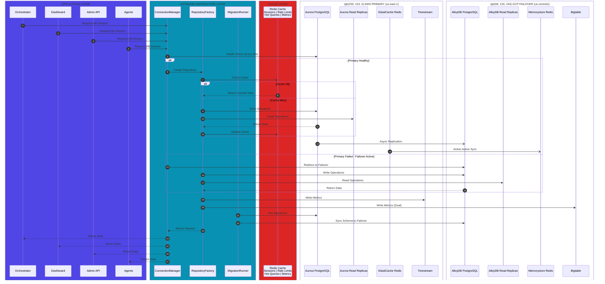

```mermaid

 sequenceDiagram
    autonumber

    box rgb(79, 70, 229) APPLICATION LAYER
        participant ORCH as Orchestrator
        participant DASH as Dashboard
        participant ADMIN as Admin API
        participant AGENTS as Agents
    end

    box rgb(8, 145, 178) DATABASE ABSTRACTION LAYER
        participant CM as ConnectionManager
        participant RF as RepositoryFactory
        participant MR as MigrationRunner
    end

    box rgb(220, 38, 38) CACHE LAYER
        participant REDIS as Redis Cache<br/>Sessions | Rate Limits<br/>Hot Queries | Metrics
    end

    box rgb(255, 153, 0) AWS PRIMARY (us-east-1)
        participant AURORA as Aurora PostgreSQL
        participant AURORA_R as Aurora Read Replicas
        participant ELASTI as ElastiCache Redis
        participant TS as Timestream
    end

    box rgb(66, 133, 244) GCP FAILOVER (us-central1)
        participant ALLOY as AlloyDB PostgreSQL
        participant ALLOY_R as AlloyDB Read Replicas
        participant MEMSTORE as Memorystore Redis
        participant BIGTABLE as Bigtable
    end

    %% Application to DAL
    ORCH->>CM: Request DB Session
    DASH->>CM: Request DB Session
    ADMIN->>CM: Request DB Session
    AGENTS->>CM: Request DB Session

    %% DAL Health Check
    CM->>AURORA: Health Check (every 30s)

    alt Primary Healthy
        CM->>RF: Create Repository
        RF->>REDIS: Check Cache

        alt Cache Hit
            REDIS-->>RF: Return Cached Data
        else Cache Miss
            RF->>AURORA: Write Operations
            RF->>AURORA_R: Read Operations
            AURORA-->>RF: Return Data
            RF->>REDIS: Update Cache
        end

        %% Async Replication
        AURORA-)ALLOY: Async Replication
        ELASTI-)MEMSTORE: Active-Active Sync

    else Primary Failed - Failover Active
        CM->>ALLOY: Redirect to Failover
        RF->>ALLOY: Write Operations
        RF->>ALLOY_R: Read Operations
        ALLOY-->>RF: Return Data
    end

    %% Metrics Flow (Dual Write)
    RF->>TS: Write Metrics
    RF->>BIGTABLE: Write Metrics (Dual)

    %% Migration Flow
    MR->>AURORA: Run Migrations
    MR->>ALLOY: Sync Schema to Failover

    RF-->>CM: Return Session
    CM-->>ORCH: Return Data
    CM-->>DASH: Return Data
    CM-->>ADMIN: Return Data
    CM-->>AGENTS: Return Data


```
