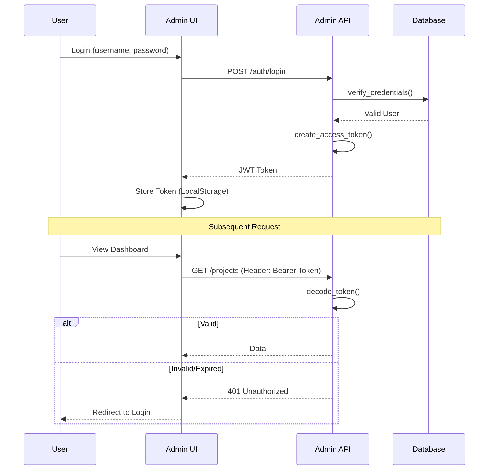
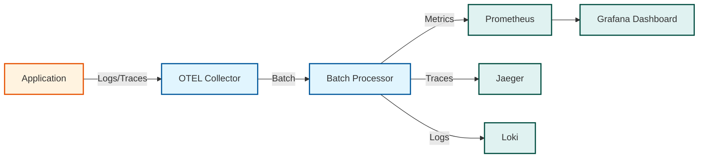
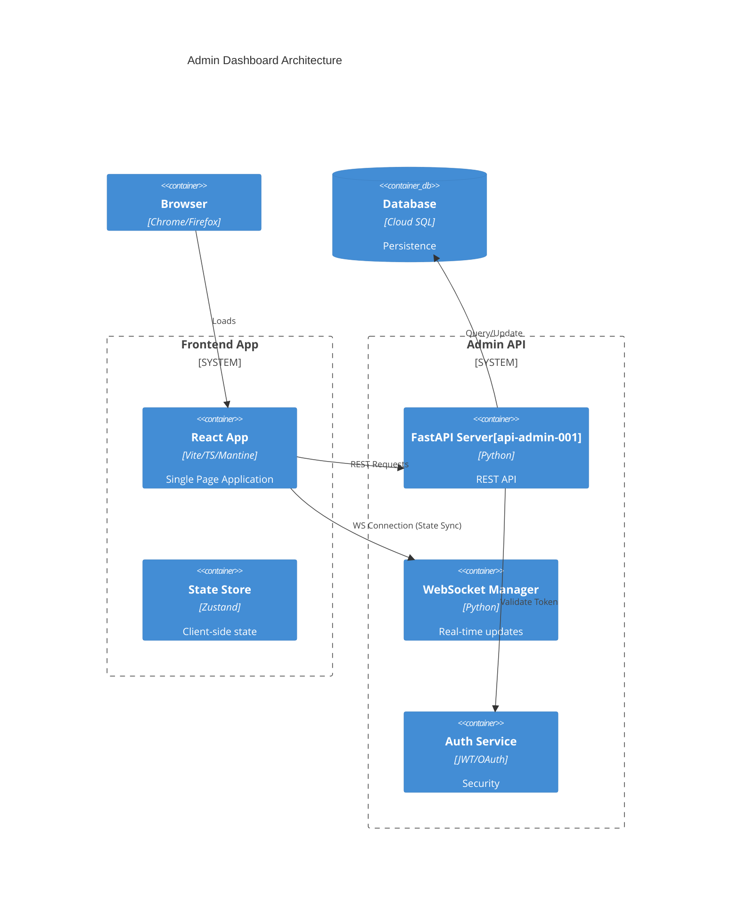
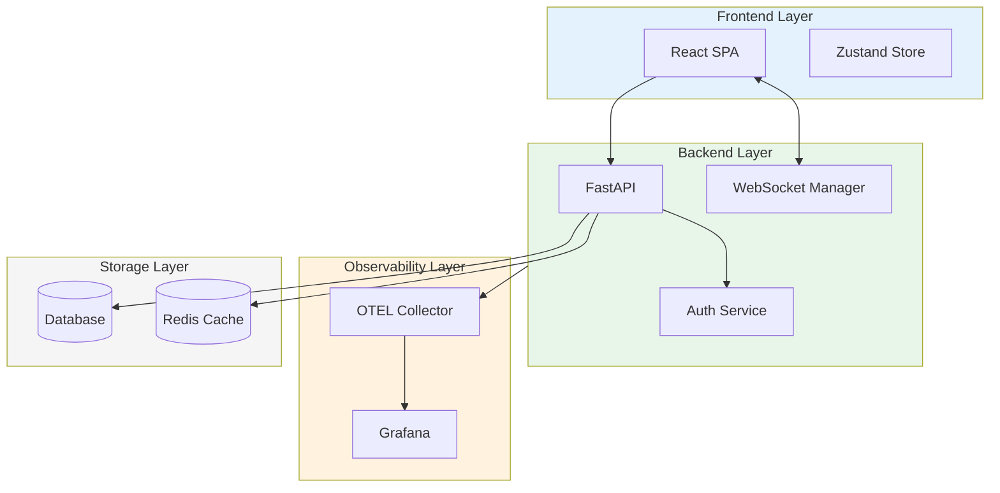

# Admin System - Comprehensive Diagram Documentation

Detailed Mermaid.js diagrams documenting the Admin subsystem including Authentication, Telemetry, and Dashboard Architecture.

---

## Table of Contents

1. [Authentication Flow](#1-authentication-flow)
2. [Telemetry Pipeline](#2-telemetry-pipeline)
3. [Admin Dashboard Architecture](#3-admin-dashboard-architecture)

---

## 1. Authentication Flow

**Purpose**: Shows the JWT-based authentication sequence for admin users, from login through token validation on subsequent requests.

**Diagram Type**: Sequence Diagram



### Node Descriptions

| Node | Description | Implementation |
|------|-------------|----------------|
| **User** | Admin user interacting with the system | Human actor with credentials |
| **Admin UI** | React-based single page application | Vite/TypeScript/Mantine frontend |
| **Admin API** | FastAPI backend server | REST API with JWT authentication |
| **Database** | Persistent storage | Cloud SQL for user credentials |

### Authentication Flow Details

| Step | Action | Security Consideration |
|------|--------|------------------------|
| **Login** | User submits credentials | HTTPS required, rate limiting |
| **Verify** | Database credential check | Bcrypt password hashing |
| **Token Creation** | JWT generation | RS256 signing, configurable expiry |
| **Token Storage** | Client-side storage | LocalStorage with XSS protection |
| **Token Validation** | Decode and verify | Signature verification, expiry check |

### Related Source Files

- [`src/admin/auth/service.py`](../../src/admin/auth/service.py) - JWT token creation and validation (lines 1-100)
- [`src/admin/api.py`](../../src/admin/api.py) - FastAPI routes and middleware (lines 1-265)
- [`src/admin/auth/models.py`](../../src/admin/auth/models.py) - User and token models
- [`src/admin/auth/dependencies.py`](../../src/admin/auth/dependencies.py) - FastAPI dependency injection for auth

---

## 2. Telemetry Pipeline

**Purpose**: Illustrates the observability stack for collecting, processing, and visualizing application metrics, traces, and logs.

**Diagram Type**: Flowchart (Left-Right)



### Node Descriptions

| Node | Description | Purpose |
|------|-------------|---------|
| **Application** | Instrumented Python application | Source of telemetry data |
| **OTEL Collector** | OpenTelemetry Collector | Receives and routes telemetry |
| **Batch Processor** | Data batching component | Optimizes data transmission |
| **Prometheus** | Time-series database | Stores and queries metrics |
| **Jaeger** | Distributed tracing platform | Visualizes request traces |
| **Loki** | Log aggregation system | Stores and indexes logs |
| **Grafana Dashboard** | Visualization platform | Unified observability UI |

### Telemetry Data Types

| Type | Description | Storage |
|------|-------------|---------|
| **Metrics** | Numeric measurements (latency, throughput, errors) | Prometheus TSDB |
| **Traces** | Distributed request traces with spans | Jaeger backend |
| **Logs** | Structured application logs | Loki with label indexing |

### Configuration

```yaml
# Example OTEL configuration
exporters:
  prometheus:
    endpoint: "0.0.0.0:8889"
  jaeger:
    endpoint: "jaeger:14250"
  loki:
    endpoint: "loki:3100"
```

### Related Source Files

- [`src/admin/telemetry/`](../../src/admin/telemetry/) - Telemetry module
- [`src/admin/telemetry/metrics.py`](../../src/admin/telemetry/metrics.py) - Prometheus metrics definitions
- [`src/admin/telemetry/tracing.py`](../../src/admin/telemetry/tracing.py) - OpenTelemetry tracing setup
- [`docker-compose.yaml`](../../docker-compose.yaml) - Container orchestration with observability stack

---

## 3. Admin Dashboard Architecture

**Purpose**: C4 Container diagram showing the high-level architecture of the Admin Dashboard system with frontend, backend, and data layers.

**Diagram Type**: C4 Container Diagram



### Container Descriptions

| Container | Technology | Responsibility |
|-----------|------------|----------------|
| **Browser** | Chrome/Firefox | User's web browser |
| **React App** | Vite + TypeScript + Mantine | SPA with component library |
| **State Store** | Zustand | Lightweight state management |
| **FastAPI Server** | Python + FastAPI | REST API endpoints |
| **WebSocket Manager** | Python asyncio | Real-time bidirectional communication |
| **Auth Service** | JWT + OAuth | Authentication and authorization |
| **Database** | Cloud SQL (PostgreSQL) | Persistent data storage |

### Communication Patterns

| Pattern | Protocol | Use Case |
|---------|----------|----------|
| **REST API** | HTTP/HTTPS | CRUD operations, data fetching |
| **WebSocket** | WS/WSS | Real-time updates, notifications |
| **Token Auth** | Bearer JWT | Stateless authentication |

### Frontend State Management

```typescript
// Zustand store structure
interface AdminStore {
  user: User | null;
  projects: Project[];
  notifications: Notification[];
  setUser: (user: User) => void;
  fetchProjects: () => Promise<void>;
}
```

### Related Source Files

- [`src/admin/api.py`](../../src/admin/api.py) - FastAPI application factory (lines 1-265)
- [`src/dashboard/websocket.py`](../../src/dashboard/websocket.py) - WebSocket connection manager (lines 1-364)
- [`src/admin/auth/service.py`](../../src/admin/auth/service.py) - Authentication service
- [`frontend/src/`](../../frontend/src/) - React application source
- [`frontend/src/stores/`](../../frontend/src/stores/) - Zustand state stores

---

## Admin System Integration

The admin components work together to provide a complete administration experience:



### Integration Points

| From | To | Data |
|------|-----|------|
| React App | FastAPI | REST requests with JWT |
| React App | WebSocket | Real-time state sync |
| FastAPI | Auth Service | Token validation |
| FastAPI | Database | CRUD operations |
| All Services | OTEL | Metrics, traces, logs |

---

## Summary

| Diagram | Type | Purpose | Key Insight |
|---------|------|---------|-------------|
| Authentication Flow | Sequence | Login and token validation | JWT-based stateless auth |
| Telemetry Pipeline | Flowchart | Observability data flow | OTEL-based unified collection |
| Dashboard Architecture | C4 Container | System structure | Layered frontend/backend design |

---

## Usage

These diagrams render in GitHub, GitLab, VS Code (Mermaid extension), Obsidian, and [mermaid.live](https://mermaid.live).
