# Domain Model (Entity Relationship Diagram)

This document provides the entity relationship diagram for the Lattice-Lock Framework, showing the core domain entities and their relationships.

## Core Domain Model

```mermaid
erDiagram
    PROJECT ||--o{ LATTICE_CONFIG : has
    PROJECT ||--o{ AGENT_DEFINITION : contains
    PROJECT ||--o{ VALIDATION_RESULT : produces

    LATTICE_CONFIG ||--o{ GOVERNANCE_RULE : defines
    LATTICE_CONFIG ||--o{ SCHEMA_DEFINITION : contains

    GOVERNANCE_RULE ||--o{ VIOLATION : detects
    GOVERNANCE_RULE }o--|| RULE_CATEGORY : belongs_to

    AGENT_DEFINITION ||--o{ AGENT_CAPABILITY : has
    AGENT_DEFINITION ||--o{ AGENT_MEMORY : stores
    AGENT_DEFINITION }o--|| AGENT_TYPE : is_type

    MODEL_REGISTRY ||--o{ MODEL_CONFIG : contains
    MODEL_CONFIG }o--|| PROVIDER : belongs_to
    MODEL_CONFIG ||--o{ CAPABILITY_FLAG : has
    MODEL_CONFIG ||--o{ COST_RATE : defines

    REQUEST ||--o{ TASK_ANALYSIS : produces
    REQUEST ||--o{ MODEL_SELECTION : results_in
    REQUEST ||--o{ RESPONSE : generates
    REQUEST ||--o{ COST_RECORD : incurs

    TASK_ANALYSIS }o--|| TASK_TYPE : classifies_as

    MODEL_SELECTION }o--|| MODEL_CONFIG : selects
    MODEL_SELECTION ||--|| SCORING_RESULT : based_on

    CONSENSUS_GROUP ||--o{ MODEL_SELECTION : includes
    CONSENSUS_GROUP ||--|| CONSENSUS_RESULT : produces

    PROMPT_TEMPLATE ||--o{ GENERATED_PROMPT : creates
    GENERATED_PROMPT ||--|| QUALITY_SCORE : receives

    CHECKPOINT ||--o{ STATE_SNAPSHOT : contains
    ROLLBACK_TRIGGER ||--o{ CHECKPOINT : uses

    FEEDBACK ||--o{ RATING : contains
    FEEDBACK }o--|| REQUEST : references

    PROJECT {
        string id PK
        string name
        string path
        datetime created_at
        datetime updated_at
        string status
    }

    LATTICE_CONFIG {
        string id PK
        string project_id FK
        string version
        json schema
        datetime compiled_at
    }

    GOVERNANCE_RULE {
        string id PK
        string config_id FK
        string name
        string description
        string severity
        string pattern
        boolean auto_fix
    }

    RULE_CATEGORY {
        string id PK
        string name
        string description
    }

    SCHEMA_DEFINITION {
        string id PK
        string config_id FK
        string name
        json properties
        json required_fields
    }

    VIOLATION {
        string id PK
        string rule_id FK
        string file_path
        int line_number
        string message
        string suggested_fix
        datetime detected_at
    }

    VALIDATION_RESULT {
        string id PK
        string project_id FK
        boolean valid
        int error_count
        int warning_count
        datetime validated_at
    }

    AGENT_DEFINITION {
        string id PK
        string project_id FK
        string name
        string description
        string version
        json instructions
    }

    AGENT_TYPE {
        string id PK
        string name
        string description
    }

    AGENT_CAPABILITY {
        string id PK
        string agent_id FK
        string capability_name
        string description
    }

    AGENT_MEMORY {
        string id PK
        string agent_id FK
        string key
        json value
        datetime updated_at
    }

    MODEL_REGISTRY {
        string id PK
        string name
        datetime last_updated
        int model_count
    }

    MODEL_CONFIG {
        string id PK
        string registry_id FK
        string provider_id FK
        string model_id
        string display_name
        int context_window
        float input_cost_per_1k
        float output_cost_per_1k
        boolean is_available
    }

    PROVIDER {
        string id PK
        string name
        string api_base_url
        string auth_type
        boolean requires_api_key
    }

    CAPABILITY_FLAG {
        string id PK
        string model_id FK
        string capability_name
        boolean enabled
    }

    COST_RATE {
        string id PK
        string model_id FK
        string rate_type
        float rate_value
        string currency
    }

    REQUEST {
        string id PK
        string prompt
        string strategy
        string status
        datetime created_at
        datetime completed_at
    }

    TASK_ANALYSIS {
        string id PK
        string request_id FK
        string task_type_id FK
        float confidence
        string analysis_method
    }

    TASK_TYPE {
        string id PK
        string name
        string description
        json patterns
    }

    MODEL_SELECTION {
        string id PK
        string request_id FK
        string model_id FK
        float score
        int rank
    }

    SCORING_RESULT {
        string id PK
        string selection_id FK
        float task_affinity_score
        float performance_score
        float accuracy_score
        float cost_score
        float total_score
    }

    RESPONSE {
        string id PK
        string request_id FK
        string model_id FK
        text content
        int input_tokens
        int output_tokens
        float latency_ms
    }

    COST_RECORD {
        string id PK
        string request_id FK
        string model_id FK
        float input_cost
        float output_cost
        float total_cost
        datetime recorded_at
    }

    CONSENSUS_GROUP {
        string id PK
        string request_id FK
        int num_models
        string strategy
    }

    CONSENSUS_RESULT {
        string id PK
        string group_id FK
        float agreement_score
        text aggregated_response
        json individual_responses
    }

    PROMPT_TEMPLATE {
        string id PK
        string name
        string category
        text template_content
        json variables
    }

    GENERATED_PROMPT {
        string id PK
        string template_id FK
        text prompt_content
        json context
        datetime generated_at
    }

    QUALITY_SCORE {
        string id PK
        string prompt_id FK
        float structure_score
        float completeness_score
        float clarity_score
        float total_score
    }

    CHECKPOINT {
        string id PK
        string project_id FK
        string description
        datetime created_at
    }

    STATE_SNAPSHOT {
        string id PK
        string checkpoint_id FK
        string entity_type
        string entity_id
        json state_data
    }

    ROLLBACK_TRIGGER {
        string id PK
        string checkpoint_id FK
        string trigger_type
        string reason
        datetime triggered_at
    }

    FEEDBACK {
        string id PK
        string request_id FK
        string user_id
        datetime submitted_at
    }

    RATING {
        string id PK
        string feedback_id FK
        string dimension
        int score
        text comment
    }
```



## Entity Descriptions

### Core Entities

| Entity | Description | Key Attributes |
|--------|-------------|----------------|
| **PROJECT** | A software project managed by Lattice-Lock | id, name, path, status |
| **LATTICE_CONFIG** | The `lattice.yaml` configuration for a project | version, schema, compiled_at |
| **GOVERNANCE_RULE** | A rule that enforces code governance | name, severity, pattern, auto_fix |
| **VIOLATION** | A detected violation of a governance rule | file_path, line_number, message |

### Agent Entities

| Entity | Description | Key Attributes |
|--------|-------------|----------------|
| **AGENT_DEFINITION** | Definition of an AI agent | name, version, instructions |
| **AGENT_TYPE** | Category of agent (engineering, content, etc.) | name, description |
| **AGENT_CAPABILITY** | A capability that an agent possesses | capability_name, description |
| **AGENT_MEMORY** | Persistent memory storage for agents | key, value, updated_at |

### Model Orchestration Entities

| Entity | Description | Key Attributes |
|--------|-------------|----------------|
| **MODEL_REGISTRY** | Central registry of all available models | name, model_count |
| **MODEL_CONFIG** | Configuration for a specific AI model | model_id, context_window, costs |
| **PROVIDER** | An AI model provider (OpenAI, Anthropic, etc.) | name, api_base_url, auth_type |
| **CAPABILITY_FLAG** | A capability flag for a model (vision, reasoning, etc.) | capability_name, enabled |

### Request Processing Entities

| Entity | Description | Key Attributes |
|--------|-------------|----------------|
| **REQUEST** | A user request to the orchestrator | prompt, strategy, status |
| **TASK_ANALYSIS** | Analysis result for a request | task_type, confidence, method |
| **TASK_TYPE** | Classification of task types | name, patterns |
| **MODEL_SELECTION** | A model selected for a request | model_id, score, rank |
| **RESPONSE** | Response from an AI model | content, tokens, latency |

### Cost Tracking Entities

| Entity | Description | Key Attributes |
|--------|-------------|----------------|
| **COST_RATE** | Cost rate for a model | rate_type, rate_value, currency |
| **COST_RECORD** | Record of costs incurred | input_cost, output_cost, total_cost |

### Consensus Entities

| Entity | Description | Key Attributes |
|--------|-------------|----------------|
| **CONSENSUS_GROUP** | A group of models for consensus | num_models, strategy |
| **CONSENSUS_RESULT** | Result of consensus aggregation | agreement_score, aggregated_response |

### Prompt Engineering Entities

| Entity | Description | Key Attributes |
|--------|-------------|----------------|
| **PROMPT_TEMPLATE** | Template for generating prompts | name, template_content, variables |
| **GENERATED_PROMPT** | A prompt generated from a template | prompt_content, context |
| **QUALITY_SCORE** | Quality score for a generated prompt | structure, completeness, clarity |

### State Management Entities

| Entity | Description | Key Attributes |
|--------|-------------|----------------|
| **CHECKPOINT** | A saved state checkpoint | description, created_at |
| **STATE_SNAPSHOT** | Snapshot of entity state | entity_type, state_data |
| **ROLLBACK_TRIGGER** | Trigger for rollback operation | trigger_type, reason |

### Feedback Entities

| Entity | Description | Key Attributes |
|--------|-------------|----------------|
| **FEEDBACK** | User feedback on a request | user_id, submitted_at |
| **RATING** | Rating dimension within feedback | dimension, score, comment |

## Relationship Summary

### One-to-Many Relationships

- PROJECT has many LATTICE_CONFIGs (versioned configurations)
- PROJECT contains many AGENT_DEFINITIONs
- LATTICE_CONFIG defines many GOVERNANCE_RULEs
- GOVERNANCE_RULE detects many VIOLATIONs
- MODEL_REGISTRY contains many MODEL_CONFIGs
- REQUEST produces many RESPONSEs (in consensus mode)
- REQUEST incurs many COST_RECORDs

### Many-to-One Relationships

- MODEL_CONFIG belongs to one PROVIDER
- GOVERNANCE_RULE belongs to one RULE_CATEGORY
- AGENT_DEFINITION is one AGENT_TYPE
- TASK_ANALYSIS classifies as one TASK_TYPE

### One-to-One Relationships

- MODEL_SELECTION is based on one SCORING_RESULT
- CONSENSUS_GROUP produces one CONSENSUS_RESULT
- GENERATED_PROMPT receives one QUALITY_SCORE

## Data Flow Patterns

### Request Processing Flow

```
REQUEST -> TASK_ANALYSIS -> MODEL_SELECTION -> RESPONSE -> COST_RECORD
```

### Governance Validation Flow

```
PROJECT -> LATTICE_CONFIG -> GOVERNANCE_RULE -> VIOLATION -> VALIDATION_RESULT
```

### Prompt Generation Flow

```
PROMPT_TEMPLATE -> GENERATED_PROMPT -> QUALITY_SCORE -> REQUEST
```

### State Management Flow

```
CHECKPOINT -> STATE_SNAPSHOT -> ROLLBACK_TRIGGER
```
