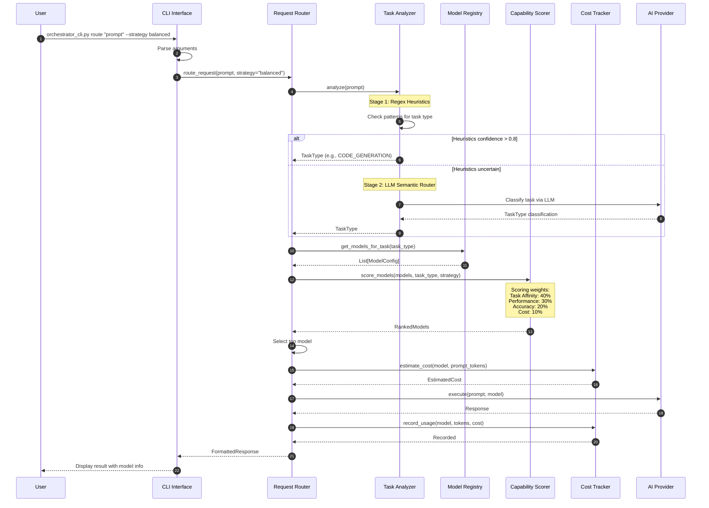
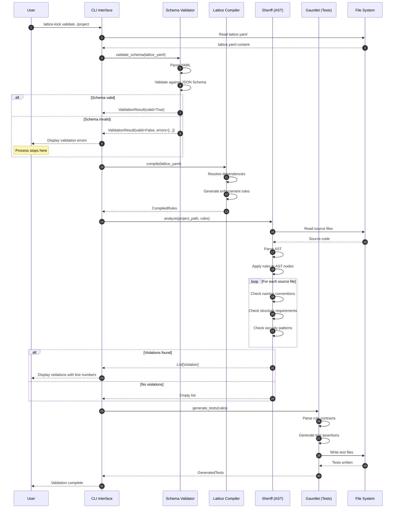
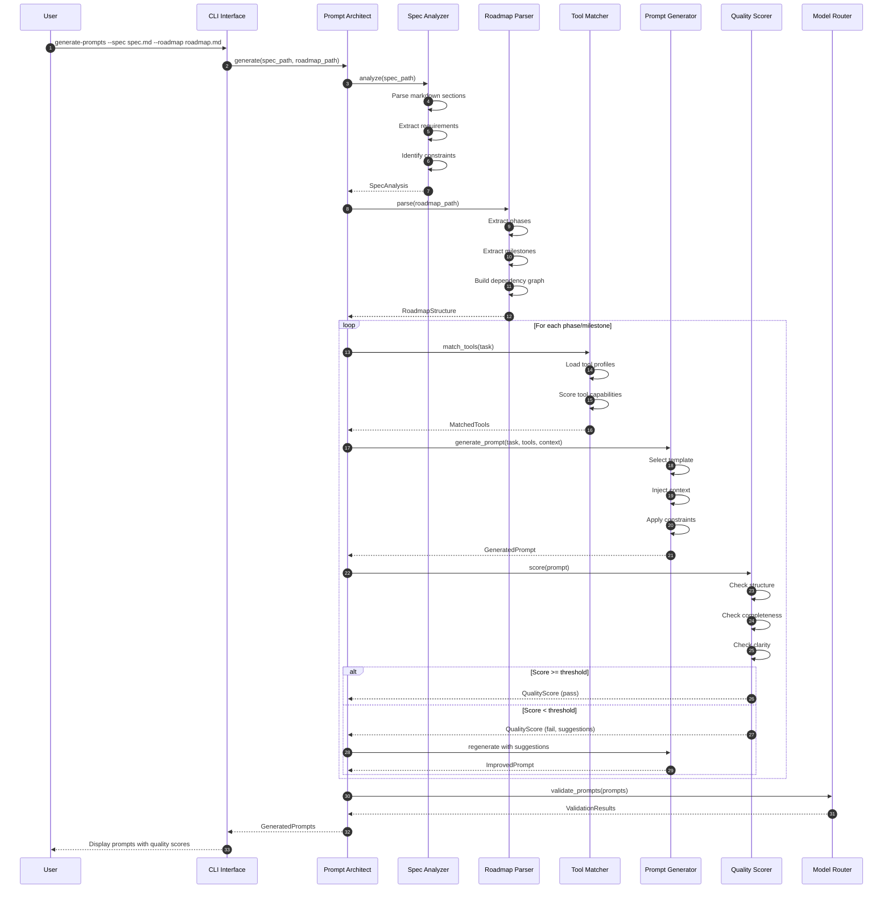
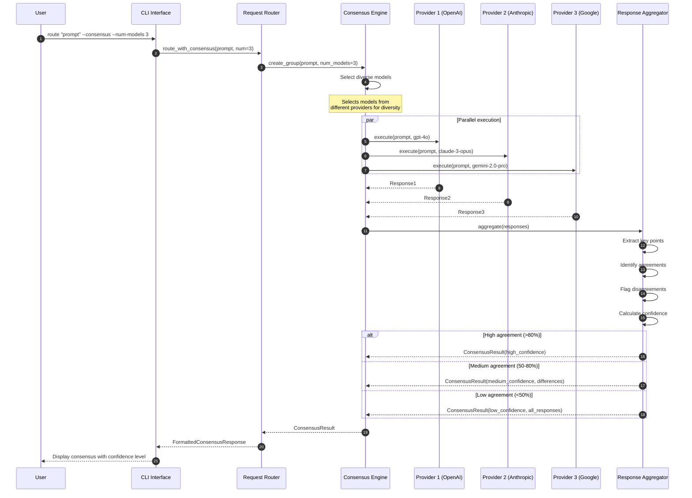
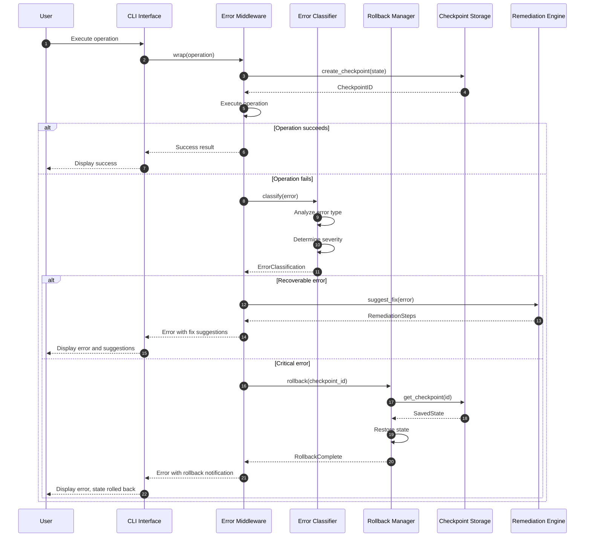
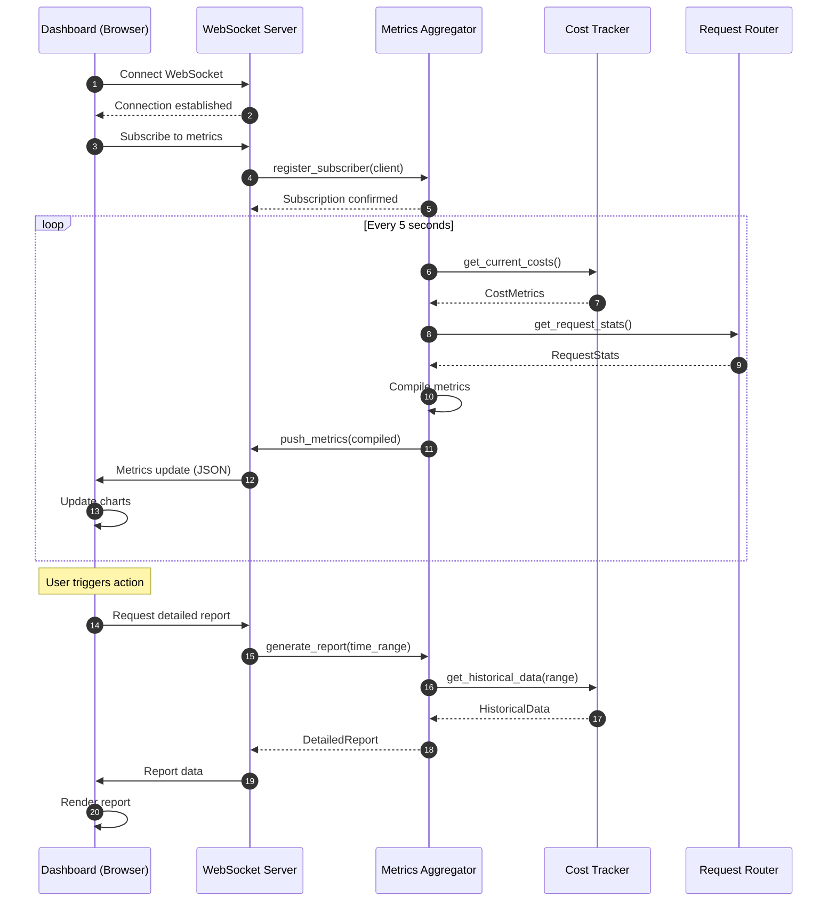

# Sequence Diagrams

This document provides detailed sequence diagrams for the key workflows in the Lattice-Lock Framework.

## 1. Model Orchestrator Request Routing

This sequence shows how a user request flows through the Model Orchestrator to select and execute on the optimal AI model.

## 2. Governance Validation Flow

This sequence shows how code is validated against governance rules defined in `lattice.yaml`.

## 3. Prompt Architect Workflow

This sequence shows how the Prompt Architect Agent generates optimized prompts from project specifications.

## 4. Consensus Engine Multi-Model Flow

This sequence shows how the Consensus Engine aggregates responses from multiple AI models.

## 5. Error Handling and Rollback Flow

This sequence shows how the framework handles errors and performs rollback operations.

## 6. Dashboard Real-Time Updates

This sequence shows how the Dashboard receives real-time updates via WebSocket.

## Key Decision Points Summary

| Workflow | Decision Point | Options | Default |
|----------|---------------|---------|---------|
| Request Routing | Task classification | Heuristics vs LLM | Heuristics first, LLM fallback |
| Request Routing | Model selection | 63 models across 8 providers | Highest scored model |
| Request Routing | Routing strategy | balanced, cost_optimized, performance, quality | balanced |
| Governance | Validation strictness | error, warning, info | error |
| Governance | Auto-fix | enabled, disabled | disabled |
| Prompt Architect | Quality threshold | 0.0 - 1.0 | 0.7 |
| Consensus | Agreement threshold | 0.0 - 1.0 | 0.8 |
| Error Handling | Rollback trigger | automatic, manual | automatic for critical |
