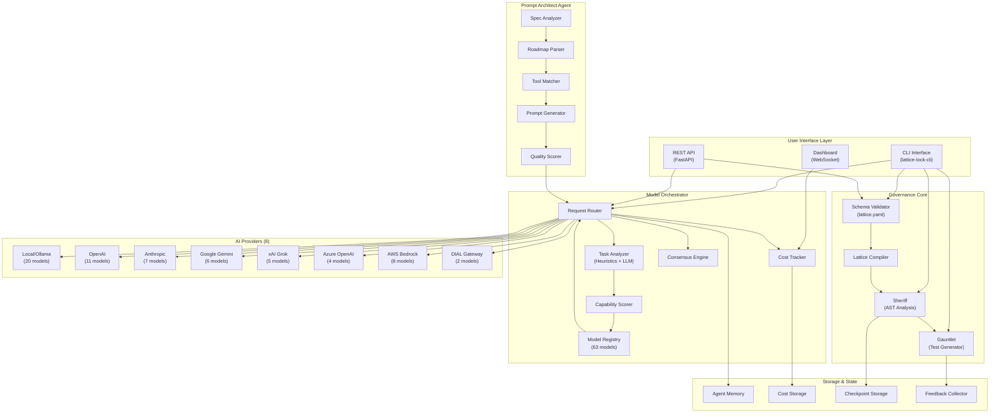
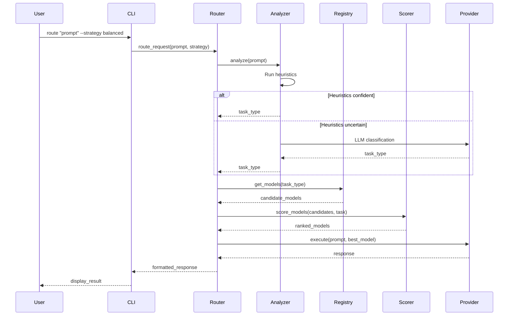

# System Design Diagram

This document provides a comprehensive visual representation of the Lattice-Lock Framework architecture, showing how all components interact to provide governance-first AI-assisted software development.

## High-Level System Architecture

## Component Descriptions

### User Interface Layer

| Component | Purpose | Capabilities | User Options |
|-----------|---------|--------------|--------------|
| **CLI Interface** | Command-line access to all framework features | validate, compile, sheriff, gauntlet, route, analyze, list | `--verbose`, `--strategy`, `--provider`, `--dry-run` |
| **REST API** | Programmatic access via HTTP endpoints | Project registration, validation, model routing | Authentication, rate limiting, async operations |
| **Dashboard** | Real-time monitoring and visualization | Cost tracking, model usage, performance metrics | WebSocket subscriptions, time range filters |

### Governance Core

| Component | Purpose | Capabilities | Decision Points |
|-----------|---------|--------------|-----------------|
| **Schema Validator** | Validates `lattice.yaml` configuration files | YAML parsing, schema validation, type checking | Pass/fail validation, error reporting with line numbers |
| **Lattice Compiler** | Compiles governance rules into enforceable policies | Rule compilation, dependency resolution, output generation | Compile targets (Python, TypeScript), optimization levels |
| **Sheriff** | Static analysis of code against governance rules | AST parsing, rule matching, violation detection | Severity levels (error, warning, info), auto-fix suggestions |
| **Gauntlet** | Generates contract tests from governance rules | Test generation, assertion creation, coverage analysis | Test frameworks (pytest, unittest), output formats |

### Model Orchestrator

| Component | Purpose | Capabilities | Decision Points |
|-----------|---------|--------------|-----------------|
| **Task Analyzer** | Determines task type from user prompts | Regex heuristics (Stage 1), LLM semantic routing (Stage 2) | Task types: CODE_GENERATION, TESTING, DEBUGGING, ARCHITECTURAL_DESIGN, DOCUMENTATION |
| **Model Registry** | Maintains catalog of 63 models across 8 providers | Model metadata, capability flags, cost information | Provider selection, model filtering by capability |
| **Capability Scorer** | Scores models for specific tasks | Task affinity (40%), performance (30%), accuracy (20%), cost (10%) | Scoring weights, minimum thresholds |
| **Request Router** | Routes requests to optimal models | Load balancing, fallback handling, retry logic | Routing strategies: balanced, cost_optimized, performance, quality |
| **Cost Tracker** | Tracks and reports API costs | Real-time cost accumulation, budget alerts, usage reports | Cost limits, alert thresholds, reporting periods |
| **Consensus Engine** | Aggregates responses from multiple models | Voting, weighted averaging, confidence scoring | Consensus strategies, minimum agreement thresholds |

### AI Providers

| Provider | Models | Key Strengths | Best For |
|----------|--------|---------------|----------|
| **Local/Ollama** | 20 | Privacy, offline, zero cost | Development, testing, sensitive data |
| **OpenAI** | 11 | GPT-4o, O1 reasoning | Complex reasoning, code generation |
| **Anthropic** | 7 | Claude 4.1 Opus, safety | Long context, nuanced analysis |
| **Google Gemini** | 6 | 2M context window | Large document processing |
| **xAI Grok** | 5 | 2M context, vision | Multimodal tasks |
| **Azure OpenAI** | 4 | Enterprise compliance | Regulated industries |
| **AWS Bedrock** | 8 | AWS integration | AWS-native workloads |
| **DIAL** | 2 | Enterprise gateway | Enterprise routing |

### Prompt Architect Agent

| Component | Purpose | Capabilities | Decision Points |
|-----------|---------|--------------|-----------------|
| **Spec Analyzer** | Parses project specifications | Markdown parsing, requirement extraction | Spec formats, extraction rules |
| **Roadmap Parser** | Extracts phases and milestones | Timeline parsing, dependency detection | Phase granularity, milestone types |
| **Tool Matcher** | Matches tasks to appropriate AI tools | Tool capability matching, constraint satisfaction | Tool profiles, matching thresholds |
| **Prompt Generator** | Generates optimized prompts | Template expansion, context injection | Prompt templates, context limits |
| **Quality Scorer** | Evaluates prompt quality | Structure validation, completeness checking | Quality thresholds, scoring rubrics |

### Storage & State

| Component | Purpose | Capabilities | Decision Points |
|-----------|---------|--------------|-----------------|
| **Agent Memory** | Persists agent state and context | Read/write operations, memory pruning | Retention policies, memory limits |
| **Cost Storage** | Stores cost tracking data | Time-series storage, aggregation queries | Storage backends, retention periods |
| **Checkpoint Storage** | Stores rollback checkpoints | State snapshots, restoration | Checkpoint frequency, storage limits |
| **Feedback Collector** | Collects user feedback | Rating collection, comment storage | Feedback types, aggregation methods |

## Data Flow Patterns

### Request Routing Flow

## Integration Points

The framework provides multiple integration points for extending functionality:

1. **Custom Providers**: Implement the `BaseProvider` interface to add new AI providers
2. **Custom Rules**: Add Sheriff rules via YAML configuration in `lattice.yaml`
3. **Custom Scorers**: Extend the scoring algorithm with custom capability weights
4. **Webhooks**: Register webhooks for governance events (validation failures, cost alerts)
5. **Plugins**: Load custom plugins for Gauntlet test generation

## Security Considerations

- All API keys are stored in environment variables or secure vaults
- Path traversal protection in file operations
- Input sanitization for all user-provided content
- Rate limiting on API endpoints
- Audit logging for governance decisions
