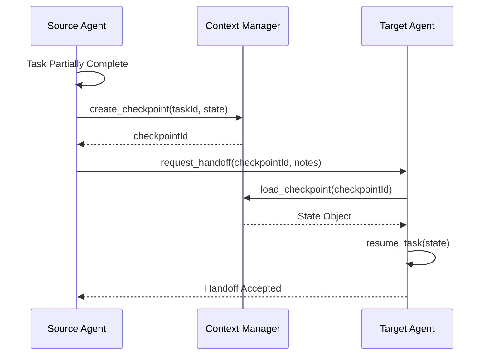

# Handoff Protocol

```mermaid
sequenceDiagram
    participant Source as Source Agent
    participant Context as Context Manager
    participant Target as Target Agent

    Source->>Source: Task Partially Complete
    Source->>Context: create_checkpoint(taskId, state)
    Context-->>Source: checkpointId

    Source->>Target: request_handoff(checkpointId, notes)

    Target->>Context: load_checkpoint(checkpointId)
    Context-->>Target: State Object

    Target->>Target: resume_task(state)
    Target-->>Source: Handoff Accepted
```
