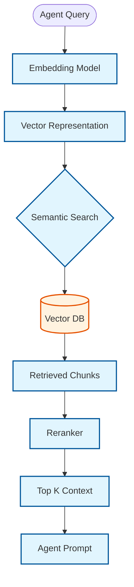

# Memory Retrieval Flow

```mermaid
flowchart TD
    classDef core fill:#e1f5fe,stroke:#01579b,stroke-width:2px;
    classDef storage fill:#fff3e0,stroke:#e65100,stroke-width:2px;

    Query([Agent Query]) --> Emb[Embedding Model]:::core
    
    Emb --> Vector[Vector Representation]:::core
    
    Vector --> Search{Semantic Search}:::core
    
    Search --> DB[(Vector DB)]:::storage
    
    DB --> Results[Retrieved Chunks]:::core
    
    Results --> Rerank[Reranker]:::core
    
    Rerank --> Context[Top K Context]:::core
    
    Context --> Agent[Agent Prompt]:::core
```
