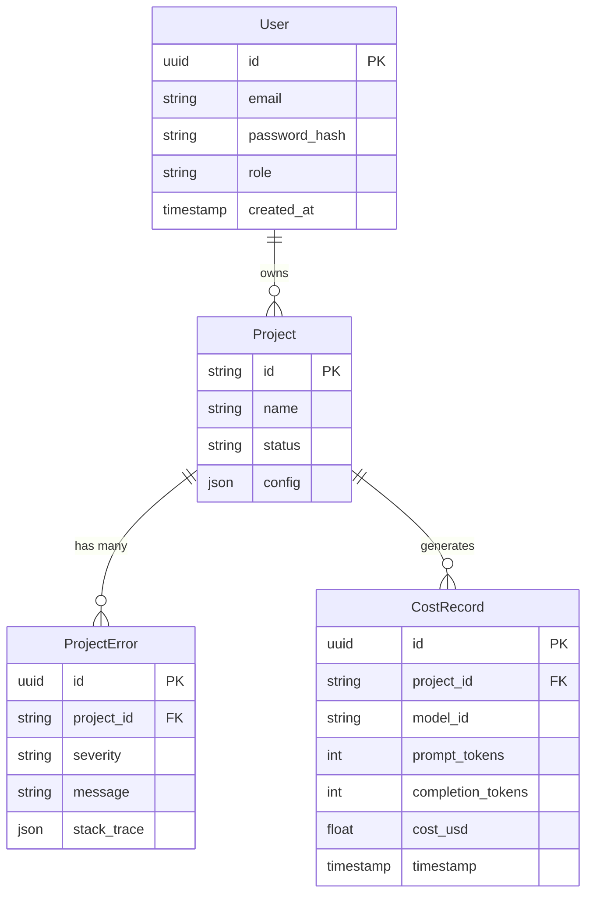

# Database Entity Relationship Diagram

```mermaid
erDiagram
    User ||--o{ Project : owns
    User {
        uuid id PK
        string email
        string password_hash
        string role
        timestamp created_at
    }

    Project ||--o{ ProjectError : "has many"
    Project ||--o{ CostRecord : "generates"
    Project {
        string id PK
        string name
        string status
        json config
    }

    CostRecord {
        uuid id PK
        string project_id FK
        string model_id
        int prompt_tokens
        int completion_tokens
        float cost_usd
        timestamp timestamp
    }

    ProjectError {
        uuid id PK
        string project_id FK
        string severity
        string message
        json stack_trace
    }
```
