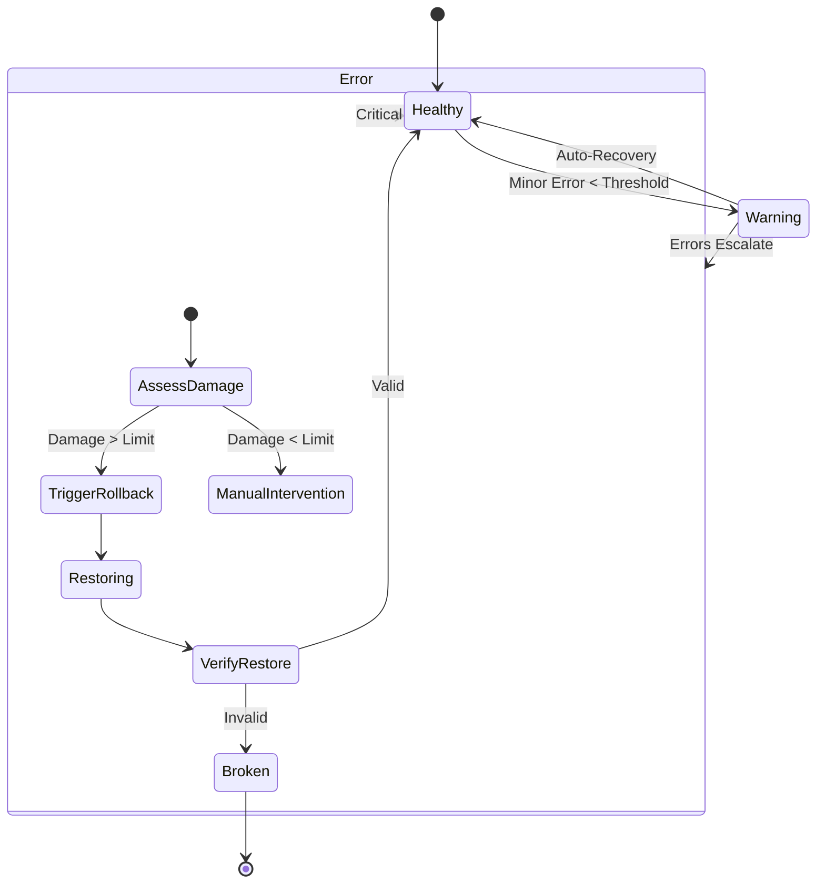

# Rollback State Machine

```mermaid
stateDiagram-v2
    [*] --> Healthy
    
    Healthy --> Warning: Minor Error < Threshold
    Healthy --> Error: Critical Failure
    
    Warning --> Healthy: Auto-Recovery
    Warning --> Error: Errors Escalate
    
    state Error {
        [*] --> AssessDamage
        AssessDamage --> TriggerRollback: Damage > Limit
        AssessDamage --> ManualIntervention: Damage < Limit
        
        TriggerRollback --> Restoring
        Restoring --> VerifyRestore
        
        VerifyRestore --> Healthy: Valid
        VerifyRestore --> Broken: Invalid
    }
    
    Broken --> [*]
```
