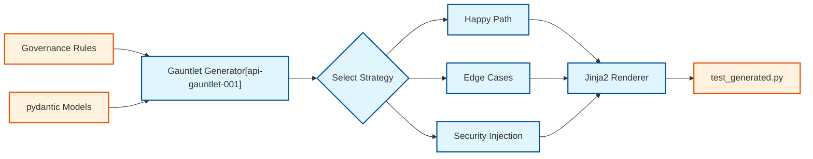

# Gauntlet Test Generation

```mermaid
flowchart LR
    classDef data fill:#fff3e0,stroke:#e65100,stroke-width:2px;
    classDef engine fill:#e1f5fe,stroke:#01579b,stroke-width:2px;
    
    Rules["Governance Rules"]:::data --> Generator["Gauntlet Generator[api-gauntlet-001]"]:::engine
    
    Models["pydantic Models"]:::data --> Generator
    
    Generator --> Strategy{Select Strategy}:::engine
    
    Strategy --> HappyPath[Happy Path]:::engine
    Strategy --> EdgeCase[Edge Cases]:::engine
    Strategy --> Security[Security Injection]:::engine
    
    HappyPath --> Renderer[Jinja2 Renderer]:::engine
    EdgeCase --> Renderer
    Security --> Renderer
    
    Renderer --> TestFile["test_generated.py"]:::data
```
