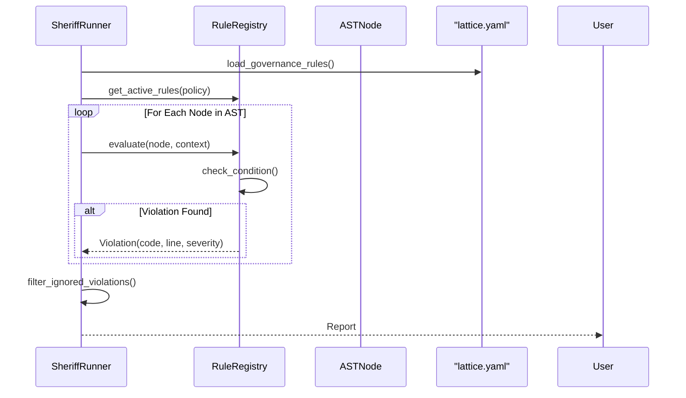

# Sheriff Rule Evaluation

```mermaid
sequenceDiagram
    participant Runner as SheriffRunner
    participant Rules as RuleRegistry
    participant Node as ASTNode
    participant Policy as "lattice.yaml"

    Runner->>Policy: load_governance_rules()
    Runner->>Rules: get_active_rules(policy)
    
    loop For Each Node in AST
        Runner->>Rules: evaluate(node, context)
        Rules->>Rules: check_condition()
        
        alt Violation Found
            Rules-->>Runner: Violation(code, line, severity)
        end
    end
    
    Runner->>Runner: filter_ignored_violations()
    Runner-->>User: Report
```
