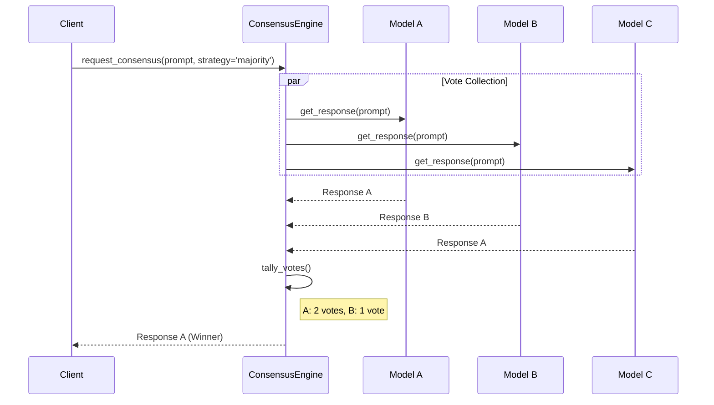

# Consensus Engine Voting

```mermaid
sequenceDiagram
    participant Client
    participant Engine as ConsensusEngine
    participant Voter1 as Model A
    participant Voter2 as Model B
    participant Voter3 as Model C

    Client->>Engine: request_consensus(prompt, strategy='majority')

    par Vote Collection
        Engine->>Voter1: get_response(prompt)
        Engine->>Voter2: get_response(prompt)
        Engine->>Voter3: get_response(prompt)
    end

    Voter1-->>Engine: Response A
    Voter2-->>Engine: Response B
    Voter3-->>Engine: Response A

    Engine->>Engine: tally_votes()
    Note right of Engine: A: 2 votes, B: 1 vote

    Engine-->>Client: Response A (Winner)
```
