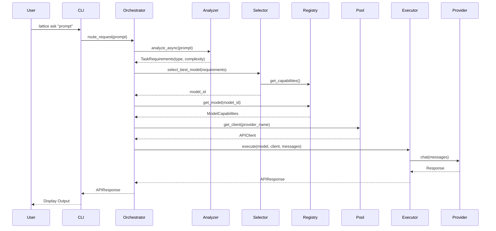

# Sequence Diagram

```mermaid
sequenceDiagram
    participant User
    participant CLI as CLI
    participant Orchestrator as Orchestrator
    participant Analyzer
    participant Selector
    participant Registry
    participant Pool
    participant Executor
    participant Provider

    User->>CLI: lattice ask "prompt"
    CLI->>Orchestrator: route_request(prompt)
    Orchestrator->>Analyzer: analyze_async(prompt)
    Analyzer-->>Orchestrator: TaskRequirements(type, complexity)

    Orchestrator->>Selector: select_best_model(requirements)
    Selector->>Registry: get_capabilities()
    Selector-->>Orchestrator: model_id

    Orchestrator->>Registry: get_model(model_id)
    Registry-->>Orchestrator: ModelCapabilities

    Orchestrator->>Pool: get_client(provider_name)
    Pool-->>Orchestrator: APIClient

    Orchestrator->>Executor: execute(model, client, messages)
    Executor->>Provider: chat(messages)
    Provider-->>Executor: Response
    Executor-->>Orchestrator: APIResponse
    Orchestrator-->>CLI: APIResponse
    CLI-->>User: Display Output
```
