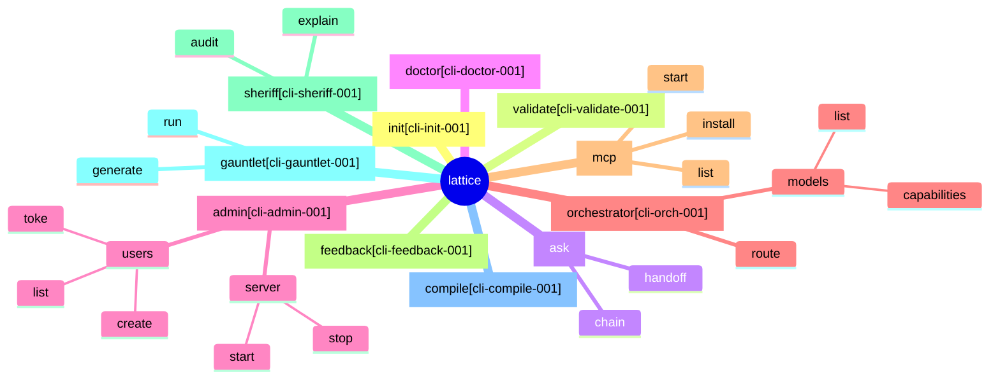

# CLI Command Hierarchy

```mermaid
mindmap
  root((lattice))
    init["init[cli-init-001]"]
    validate["validate[cli-validate-001]"]
    ask["ask"]
      chain
      handoff
    doctor["doctor[cli-doctor-001]"]
    admin["admin[cli-admin-001]"]
      server
        start
        stop
      users
        create
        list
        toke
    orchestrator["orchestrator[cli-orch-001]"]
      route
      models
        list
        capabilities
    mcp["mcp"]
      start
      install
      list
    feedback["feedback[cli-feedback-001]"]
    sheriff["sheriff[cli-sheriff-001]"]
      audit
      explain
    gauntlet["gauntlet[cli-gauntlet-001]"]
      generate
      run
    compile["compile[cli-compile-001]"]
```
