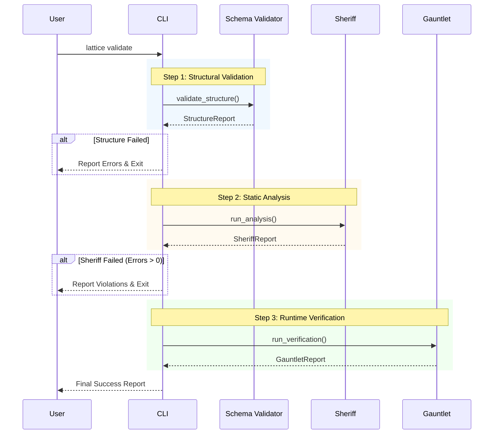

# Governance Validation Flow

```mermaid
sequenceDiagram
    participant User
    participant CLI as CLI
    participant Validator as Schema Validator
    participant Sheriff as Sheriff
    participant Gauntlet as Gauntlet

    User->>CLI: lattice validate

    rect rgb(240, 248, 255)
        Note over CLI, Validator: Step 1: Structural Validation
        CLI->>Validator: validate_structure()
        Validator-->>CLI: StructureReport
    end

    alt Structure Failed
        CLI-->>User: Report Errors & Exit
    end

    rect rgb(255, 250, 240)
        Note over CLI, Sheriff: Step 2: Static Analysis
        CLI->>Sheriff: run_analysis()
        Sheriff-->>CLI: SheriffReport
    end

    alt Sheriff Failed (Errors > 0)
        CLI-->>User: Report Violations & Exit
    end

    rect rgb(240, 255, 240)
        Note over CLI, Gauntlet: Step 3: Runtime Verification
        CLI->>Gauntlet: run_verification()
        Gauntlet-->>CLI: GauntletReport
    end

    CLI-->>User: Final Success Report
```
