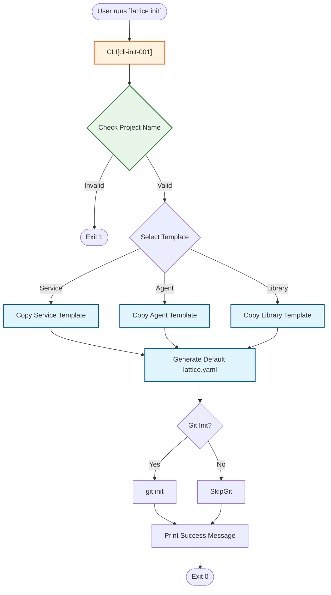

# Project Initialization Flow

```mermaid
flowchart TD
    %% Standard Class Definitions
    classDef cli fill:#fff3e0,stroke:#e65100,stroke-width:2px;
    classDef core fill:#e1f5fe,stroke:#01579b,stroke-width:2px;
    classDef check fill:#e8f5e9,stroke:#2e7d32,stroke-width:2px;

    Start([User runs `lattice init`]) --> CLI["CLI[cli-init-001]"]:::cli
    CLI --> CheckName{Check Project Name}:::check
    
    CheckName -- "Invalid" --> Error([Exit 1]):::error
    CheckName -- "Valid" --> SelectTemplate{Select Template}
    
    SelectTemplate --> |Service| CopyService[Copy Service Template]:::core
    SelectTemplate --> |Agent| CopyAgent[Copy Agent Template]:::core
    SelectTemplate --> |Library| CopyLib[Copy Library Template]:::core
    
    CopyService --> GenConfig[Generate Default lattice.yaml]:::core
    CopyAgent --> GenConfig
    CopyLib --> GenConfig
    
    GenConfig --> GitInit{Git Init?}
    GitInit -- Yes --> RunGit[git init]:::external
    GitInit -- No --> SkipGit
    
    RunGit --> Finalize
    SkipGit --> Finalize
    
    Finalize[Print Success Message] --> End([Exit 0])
```
