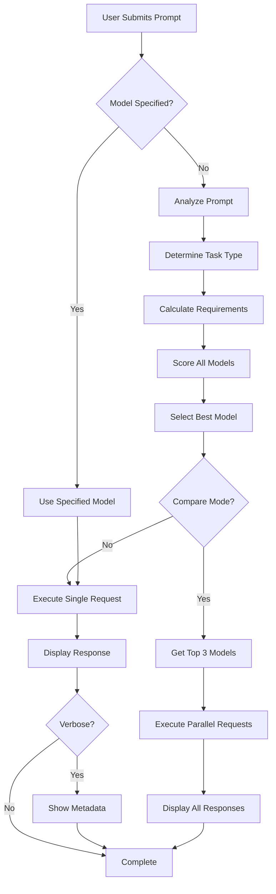
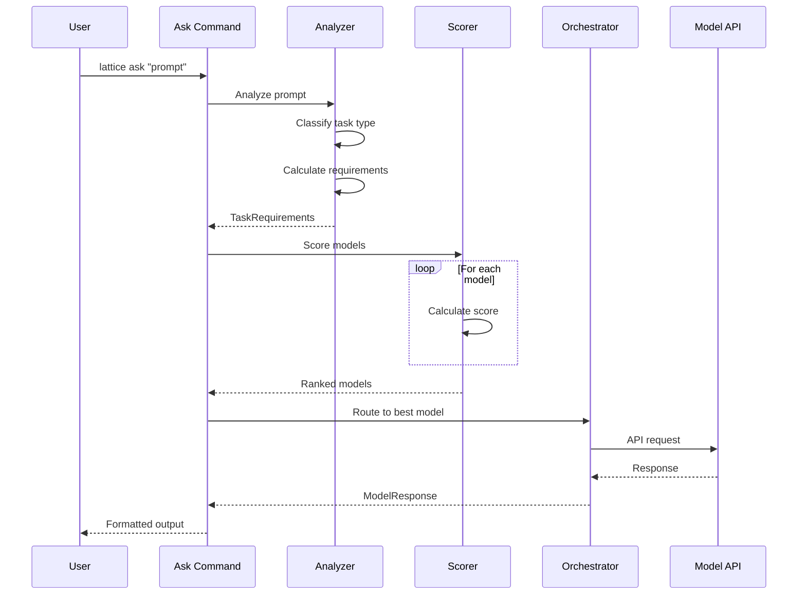
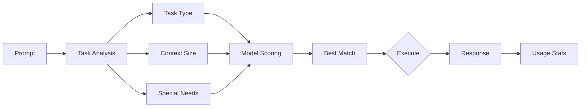
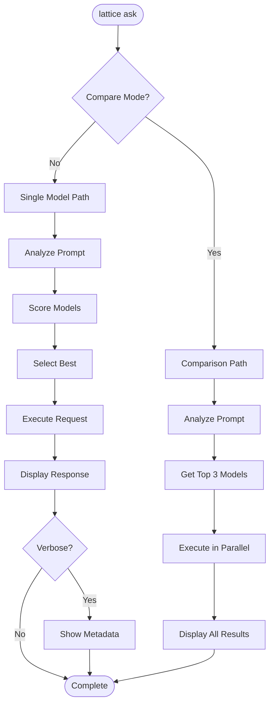
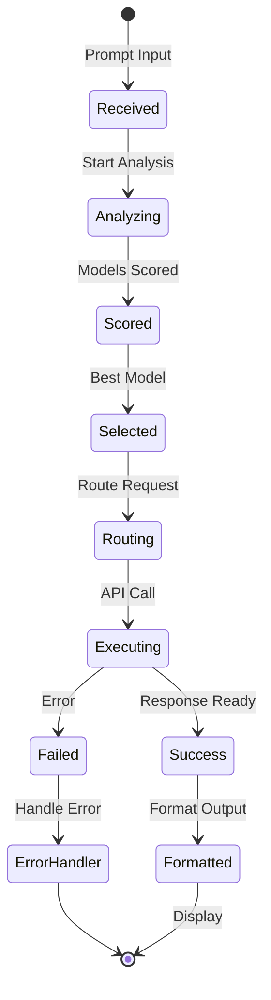

# cmd_ask

## lattice ask

Universal AI query routing that automatically selects the optimal model for any question. Analyzes prompts, determines task type and requirements, and routes requests to best-performing models based on performance metrics, cost efficiency, and task-specific capabilities.

```bash
lattice ask PROMPT [OPTIONS]
```

**Basic Examples:**

```bash
# Simple query with automatic routing
lattice ask "What is the capital of France?"
```

```bash
# Technical query
lattice ask "Explain quantum entanglement"
```

```bash
# Complex analysis query
lattice ask "Analyze this architectural pattern and suggest improvements"
```

#### --model, -m

Force a specific model instead of automatic selection.

```bash
# Use specific Claude model
lattice ask "Explain quantum computing" --model claude-3-5-sonnet
```

```bash
# Use specific GPT model
lattice ask "Write a Python function" --model gpt-4o
```

```bash
# Use local model
lattice ask "Summarize this text" -m llama-3-70b
```

#### --task-type, -t

Override automatic task classification.

```bash
# Force code generation task type
lattice ask "Write a function to sort an array" --task-type CODE_GENERATION
```

```bash
# Force reasoning task type
lattice ask "What are the implications of AGI?" --task-type REASONING
```

```bash
# Force writing task type
lattice ask "Draft an email" -t WRITING
```

#### --compare

Compare responses from multiple top-ranking models.

```bash
# Compare top 3 models
lattice ask "What are the implications of AGI?" --compare
```

```bash
# Compare with complex query
lattice ask "Design a distributed caching system" --compare
```

```bash
# Compare for research
lattice ask "Explain the halting problem" --compare
```

#### --verbose, -v

Show detailed routing metadata and token usage.

```bash
# Show routing details
lattice ask "Analyze this pattern" --verbose
```

```bash
# Show model selection reasoning
lattice ask "What is the best approach?" -v
```

```bash
# Show cost breakdown
lattice ask "Generate documentation" --verbose
```

**Use Cases:**
- Quick AI queries without manual model selection
- Model comparison for quality evaluation
- Cost-optimized routing (simple vs complex tasks)
- Task-specific routing overrides
- Research and benchmarking across models

### Process Flow Diagrams: lattice ask

#### Decision Flow: Query Routing Logic
This diagram shows how the ask command determines which model to use based on user input. Use this to understand the decision points for model selection, comparison mode, and metadata display.



#### Sequence Flow: Model Selection Process
This sequence diagram details the interaction between components during prompt analysis and model scoring. Follow this to see how task requirements are calculated and models are ranked.



#### Data Flow: Analysis to Execution
This data flow shows how a prompt is transformed into requirements, scored across models, and executed. Use this to understand the information flow from user input to model response.



#### Detailed Flowchart: Single vs Comparison Mode
This flowchart shows the two execution paths: single model queries and comparison mode. Reference this to understand how compare mode selects and executes multiple models in parallel.



#### State Diagram: Query Execution States
This state diagram illustrates the lifecycle of a query from receipt to completion. Use this to track the state transitions and identify where errors might occur during execution.


