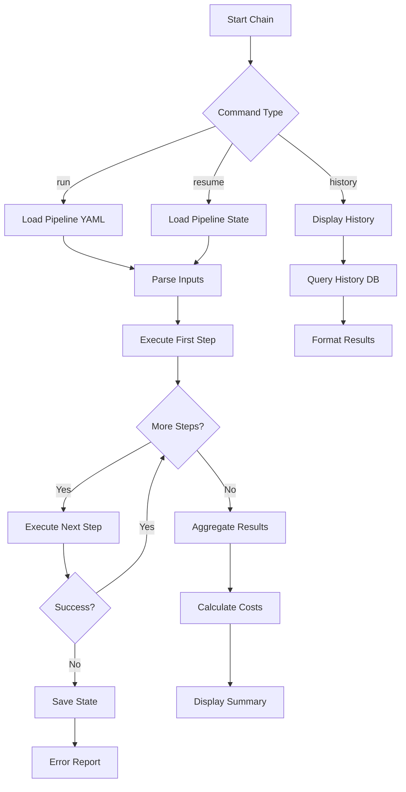
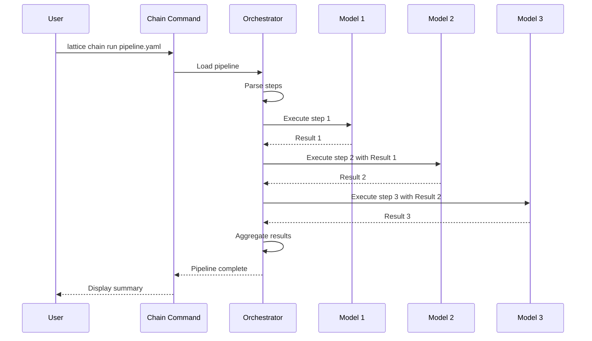
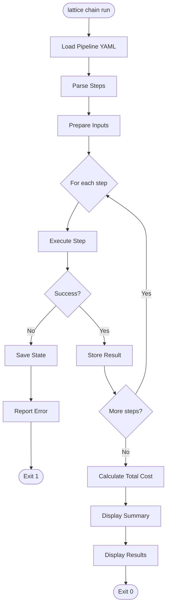
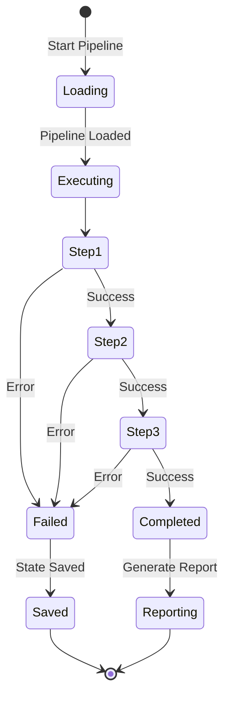
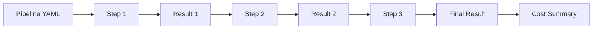

# cmd_chain

## lattice chain

Manages and executes multi-step AI model pipelines where outputs from one model feed into inputs for subsequent models. Enables complex workflows defined in YAML with support for pipeline resumption, execution history, and detailed cost tracking.

### lattice chain run

Execute a new pipeline from a YAML definition file with optional input parameters.

```bash
lattice chain run PIPELINE_YAML [OPTIONS]
```

**Basic Examples:**

```bash
# Execute a pipeline from YAML
lattice chain run pipeline.yaml
```

```bash
# Execute a different pipeline
lattice chain run research_workflow.yaml
```

```bash
# Execute with verbose output
lattice chain run pipeline.yaml --verbose
```

#### --input, -i

Provide input parameters as key=value pairs. Can be specified multiple times.

```bash
# Single input parameter
lattice chain run pipeline.yaml --input query="AI safety"
```

```bash
# Multiple input parameters
lattice chain run pipeline.yaml --input query="AI safety" --input depth="detailed" --input format="markdown"
```

```bash
# Using short form
lattice chain run pipeline.yaml -i model="gpt-4" -i temperature="0.7"
```

#### --input-json, -j

Path to a JSON file containing input parameters.

```bash
# Load inputs from JSON file
lattice chain run pipeline.yaml --input-json inputs.json
```

```bash
# Combine JSON inputs with CLI overrides
lattice chain run pipeline.yaml --input-json inputs.json --input priority="high"
```

```bash
# Use JSON file from specific path
lattice chain run pipeline.yaml -j /path/to/config/inputs.json
```

### lattice chain resume

Resume a failed or paused pipeline from the last successful step.

```bash
lattice chain resume [OPTIONS]
```

**Basic Examples:**

```bash
# Resume using pipeline ID only
lattice chain resume --id run_abc123
```

```bash
# Resume with YAML reference
lattice chain resume --yaml pipeline.yaml
```

```bash
# Resume with both ID and YAML
lattice chain resume --id run_abc123 --yaml pipeline.yaml
```

#### --id

Pipeline ID to resume from previous execution.

```bash
# Resume by pipeline ID
lattice chain resume --id run_abc123
```

```bash
# Resume with custom ID format
lattice chain resume --id pipeline_2024_01_15_001
```

```bash
# Resume specific run
lattice chain resume --id run_chk92xyz
```
#### --yaml

Original pipeline YAML file (optional if ID is known).

```bash
# Resume with YAML file
lattice chain resume --yaml pipeline.yaml
```

```bash
# Resume with YAML from specific path
lattice chain resume --yaml /path/to/pipelines/workflow.yaml
```

```bash
# Resume with YAML and ID for validation
lattice chain resume --id run_abc123 --yaml pipeline.yaml
```

#### --input, -i

New input parameter overrides for resumed pipeline.

```bash
# Resume with single input override
lattice chain resume --id run_abc123 --input retry="true"
```

```bash
# Resume with multiple overrides
lattice chain resume --id run_abc123 --input model="gpt-4" --input temperature="0.7"
```

```bash
# Resume with input from CLI
lattice chain resume --yaml pipeline.yaml -i debug="true" -i max_retries="5"
```

### lattice chain history

Show pipeline execution history with status and timing information.

```bash
lattice chain history [OPTIONS]
```

**Basic Examples:**

```bash
# View default history (last 10 runs)
lattice chain history
```

```bash
# View with custom limit
lattice chain history --limit 20
```

```bash
# View minimal history
lattice chain history --limit 5
```

#### --limit

Number of pipeline runs to display.

```bash
# Show last 20 runs
lattice chain history --limit 20
```

```bash
# Show last 50 runs for detailed review
lattice chain history --limit 50
```

```bash
# Show only most recent 3 runs
lattice chain history --limit 3
```

**Use Cases:**
- Multi-step reasoning tasks requiring different model strengths
- Automated research pipelines (gather, analyze, synthesize)
- Content generation pipelines (generate, refine, format)
- Data processing workflows with specialized models
- Fault-tolerant workflows with resumption capability

### Process Flow Diagrams: lattice chain

#### Decision Flow: Pipeline Execution Modes
This diagram shows the three main chain command modes: run, resume, and history. Use this to understand the different execution paths and when to use each mode.



#### Sequence Flow: Multi-Step Pipeline Execution
This sequence diagram illustrates how pipeline steps are executed sequentially with output chaining. Follow this to see how results from one model feed into the next step.



#### Detailed Flowchart: Step-by-Step Pipeline Processing
This flowchart details the iterative execution of pipeline steps with error handling. Reference this when building fault-tolerant pipelines or implementing resumption logic.



#### State Diagram: Pipeline Execution States
This state diagram shows the states during pipeline execution with failure handling. Use this to track pipeline progress and understand when state is saved for resumption.



#### Data Flow: Result Chaining Through Steps
This data flow shows how results flow through pipeline steps to produce final output with cost tracking. Use this to understand the data transformation pipeline and cost aggregation.


