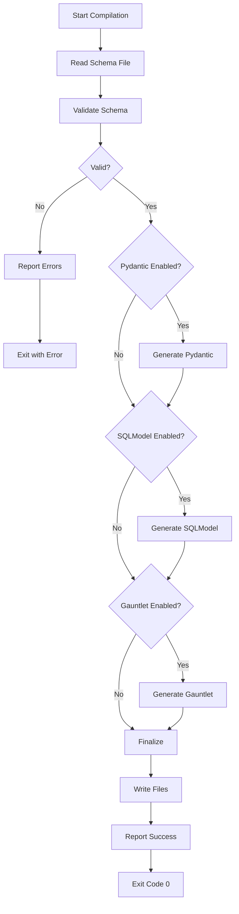
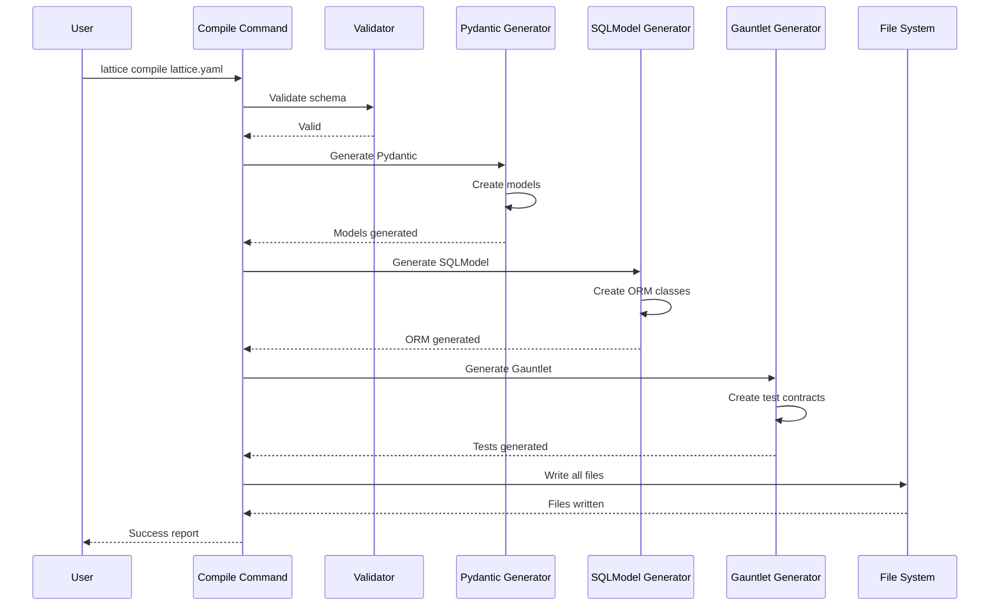
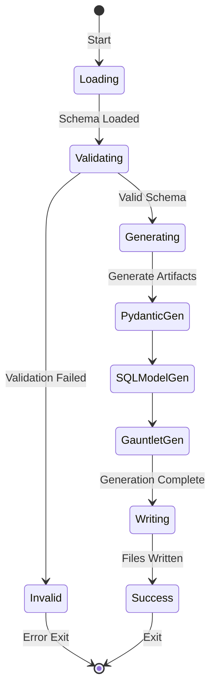

# cmd_compile

## lattice compile

Compiles lattice.yaml schemas into enforcement artifacts including Pydantic models, SQLModel ORM classes, and Gauntlet test contracts. Transforms declarative schema definitions into type-safe Python code that enforces contracts at runtime and provides comprehensive testing coverage.

```bash
lattice compile [SCHEMA_PATH] [OPTIONS]
```

**Basic Examples:**

```bash
# Compile default lattice.yaml
lattice compile
```

```bash
# Compile specific schema
lattice compile /path/to/schema.yaml
```

```bash
# Compile with custom output
lattice compile --output ./generated
```

#### --output, -o

Output directory for generated files (default: same as schema).

```bash
# Custom output directory
lattice compile --output ./generated
```

```bash
# Output to specific path
lattice compile lattice.yaml --output /path/to/output
```

```bash
# Use short form
lattice compile -o ./build
```

#### --pydantic/--no-pydantic

Generate Pydantic models (default: enabled).

```bash
# Generate only Pydantic
lattice compile --pydantic --no-gauntlet
```

```bash
# Disable Pydantic
lattice compile --no-pydantic
```

```bash
# Explicit Pydantic generation
lattice compile --pydantic
```

#### --sqlmodel/--no-sqlmodel

Generate SQLModel ORM classes (default: disabled).

```bash
# Enable SQLModel generation
lattice compile --sqlmodel
```

```bash
# SQLModel with Pydantic
lattice compile --sqlmodel --pydantic
```

```bash
# SQLModel only
lattice compile --sqlmodel --no-pydantic --no-gauntlet
```

#### --gauntlet/--no-gauntlet

Generate Gauntlet test contracts (default: enabled).

```bash
# Generate only Gauntlet tests
lattice compile --gauntlet --no-pydantic
```

```bash
# Disable Gauntlet
lattice compile --no-gauntlet
```

```bash
# Explicit Gauntlet generation
lattice compile --gauntlet
```

**Use Cases:**
- Type-safe model generation for runtime validation
- Database ORM creation with type safety
- Contract testing automation
- CI/CD code generation pipelines
- Rapid prototyping from schemas

### Process Flow Diagrams: lattice compile

#### Decision Flow: Artifact Generation
This diagram shows the compilation process including schema validation and conditional artifact generation. Use this to understand which artifacts are generated based on command flags.



#### Sequence Flow: Generator Coordination
This sequence diagram illustrates how different code generators are coordinated during compilation. Follow this to see the order of generation: Pydantic, SQLModel, then Gauntlet.



#### State Diagram: Compilation States
This state diagram represents the states during compilation from loading through generation to file writing. Use this to track compilation progress and identify where generation might fail.


