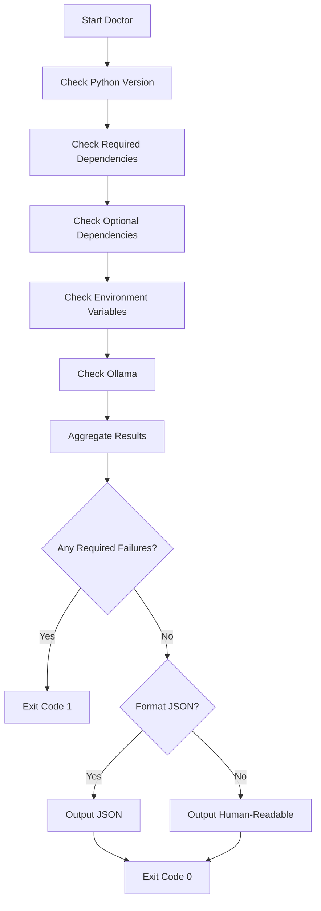

# cmd_doctor

## lattice doctor

Performs comprehensive environment health checks for Lattice Lock projects. Verifies Python version compatibility, dependency installations, environment variable configurations, and optional tool availability. Provides actionable feedback to quickly identify and resolve setup issues.

```bash
lattice doctor [OPTIONS]
```

**Basic Examples:**

```bash
# Run basic health check
lattice doctor
```

```bash
# Health check with JSON output
lattice doctor --json
```

```bash
# Verbose health check
lattice doctor --verbose
```

#### --json

Output results as JSON for CI/CD integration.

```bash
# JSON output for CI
lattice doctor --json
```

```bash
# Machine-readable format
lattice doctor --json > health.json
```

```bash
# Parse with jq
lattice doctor --json | jq '.status'
```

#### --verbose, -v

Show detailed diagnostic information.

```bash
# Verbose output
lattice doctor --verbose
```

```bash
# Detailed diagnostics
lattice doctor -v
```

```bash
# Debug environment issues
lattice doctor --verbose --json
```

**Use Cases:**
- Initial setup verification
- Troubleshooting environment issues
- CI/CD health checks
- Onboarding new developers
- Pre-deployment validation

### Process Flow Diagrams: lattice doctor

#### Decision Flow: Health Check Sequence
This diagram shows the ordered health checks performed by the doctor command. Use this to understand which checks are performed and how failures affect the final exit code.


