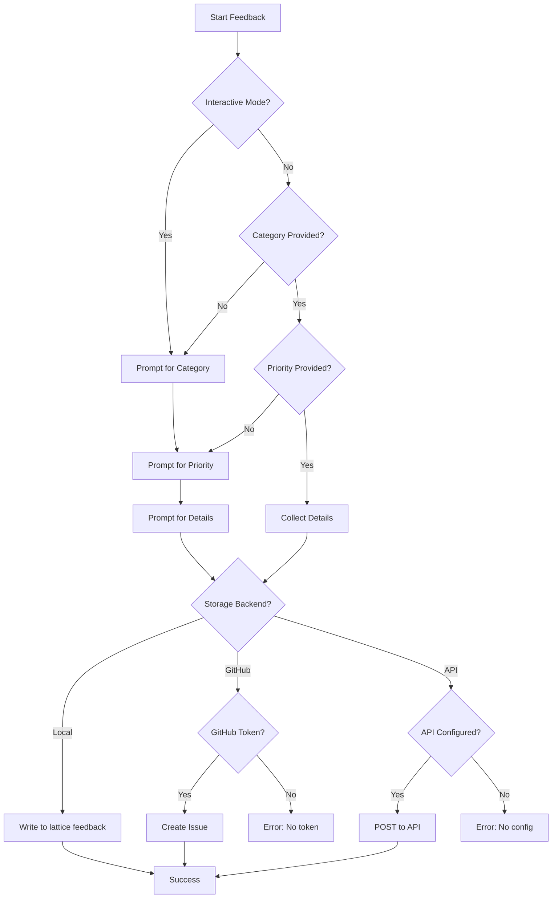
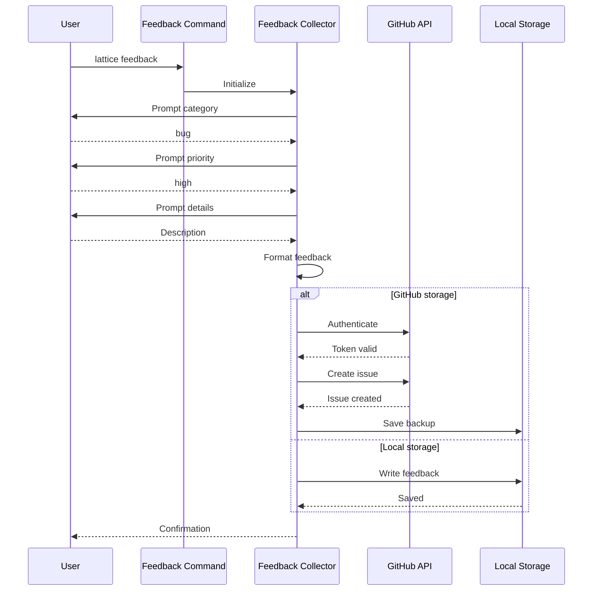
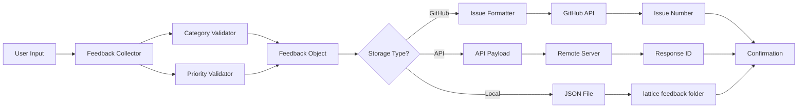
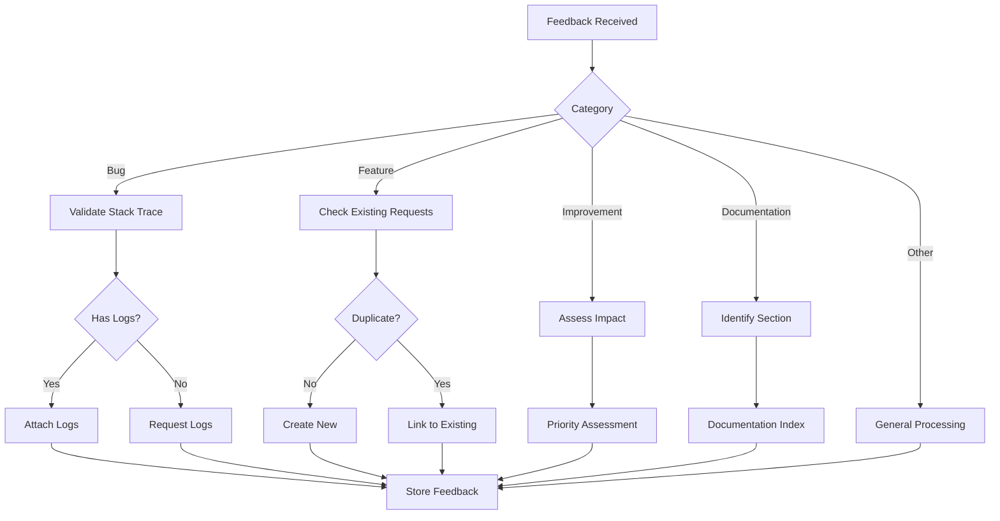
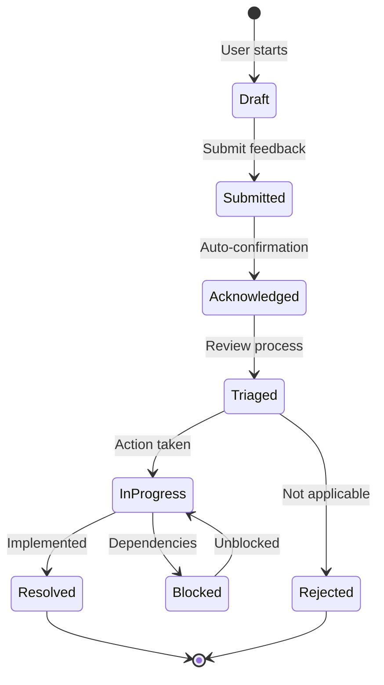

# cmd_feedback

## lattice feedback

Submit structured feedback about Lattice Lock framework. Collects categorized feedback with priority levels for framework improvement and bug reporting.

```bash
lattice feedback [OPTIONS]
```

**Basic Examples:**

```bash
# Submit feedback interactively
lattice feedback
```

```bash
# Submit bug report
lattice feedback --category bug --priority high
```

```bash
# Feature request
lattice feedback --category feature --priority medium
```

#### --category

Category of feedback: bug, feature, improvement, documentation, other.

```bash
# Report a bug
lattice feedback --category bug
```

```bash
# Request new feature
lattice feedback --category feature
```

```bash
# Suggest improvement
lattice feedback --category improvement
```

#### --priority

Priority level: low, medium, high, critical.

```bash
# Low priority feedback
lattice feedback --priority low
```

```bash
# High priority issue
lattice feedback --category bug --priority high
```

```bash
# Critical bug
lattice feedback --category bug --priority critical
```

#### --storage

Storage backend for feedback: local, github, api.

```bash
# Store locally
lattice feedback --storage local
```

```bash
# Submit to GitHub issues
lattice feedback --storage github
```

```bash
# Send to API endpoint
lattice feedback --storage api
```

**Use Cases:**
- Bug reporting
- Feature requests
- Documentation improvements
- User experience feedback
- Framework enhancement suggestions

### Process Flow Diagrams: lattice feedback

#### Decision Flow: Feedback Collection and Routing
This diagram shows how feedback is collected, categorized, and routed to appropriate storage backends. Use this to understand the feedback submission flow.



#### Sequence Flow: GitHub Integration
This diagram illustrates the process of submitting feedback as a GitHub issue. Use this when configuring GitHub integration for feedback collection.



#### Data Flow: Feedback Processing
This diagram shows how feedback data flows from collection to storage. Use this to understand feedback data handling.



#### Detailed Flowchart: Category-Based Routing
This flowchart details how different feedback categories are processed and routed. Use this to understand category-specific handling.



#### State Diagram: Feedback Lifecycle
This state diagram shows the different states of submitted feedback. Use this to track feedback status over time.


