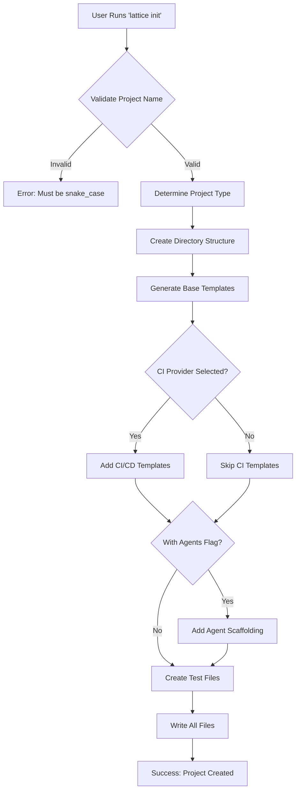
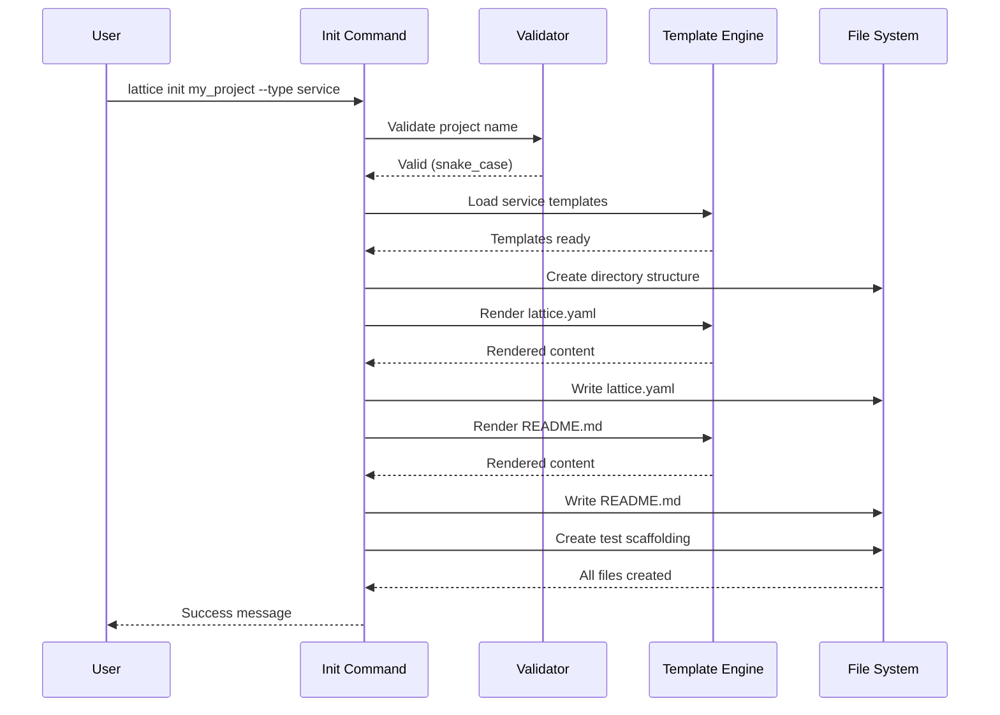
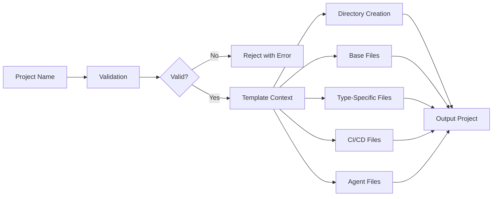
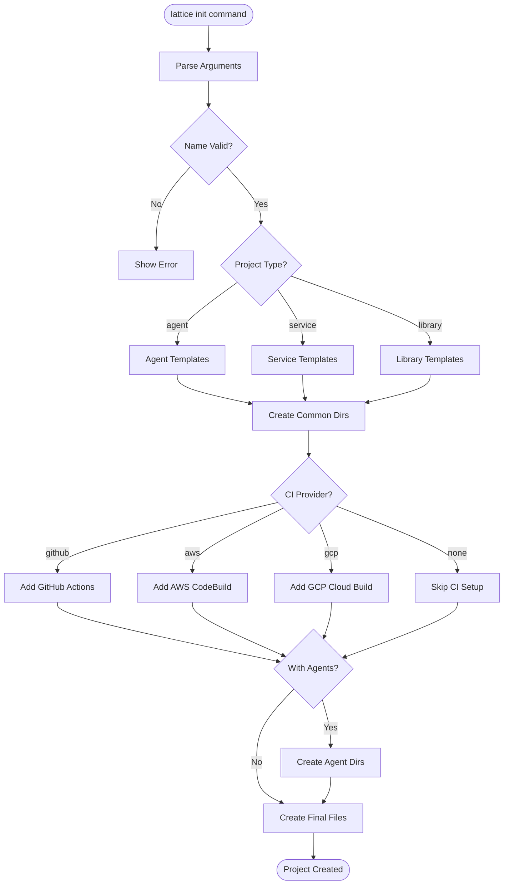
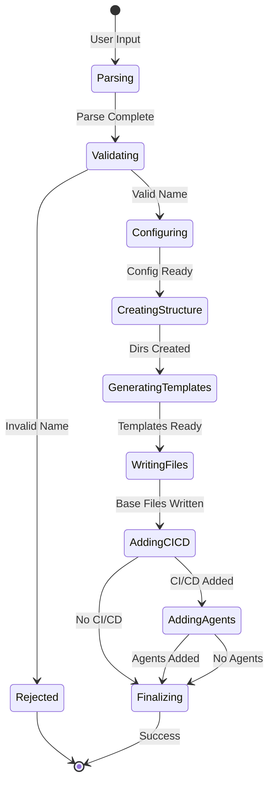

# cmd_init

## lattice init

Scaffolds new projects with compliant directory structures. Creates a properly structured Lattice Lock project from scratch, including all necessary configuration files, directory hierarchies, and initial templates. Supports multiple project types (agent, service, library) and can integrate with various CI/CD providers.

```bash
lattice init PROJECT_NAME --type TYPE [OPTIONS]
```

**Basic Examples:**

```bash
# Initialize a basic service project
lattice init my_service --type service
```

```bash
# Initialize an agent project
lattice init my_agent --type agent
```

```bash
# Initialize a library project
lattice init my_lib --type library
```

#### --type

Project type: agent, service, or library (required).

```bash
# Create service project
lattice init my_service --type service
```

```bash
# Create agent project
lattice init ai_agent --type agent
```

```bash
# Create library project
lattice init utils_lib --type library
```

#### --ci-provider

CI/CD provider integration: github, aws, or gcp.

```bash
# Setup GitHub Actions
lattice init my_project --type service --ci-provider github
```

```bash
# Setup AWS CodeBuild
lattice init my_service --type service --ci-provider aws
```

```bash
# Setup GCP Cloud Build
lattice init my_app --type service --ci-provider gcp
```

#### --github-repo

GitHub repository URL for CI integration.

```bash
# Link to GitHub repo
lattice init my_project --type library --ci-provider github --github-repo https://github.com/org/repo
```

```bash
# Setup with custom org
lattice init app --type service --github-repo https://github.com/myorg/myapp
```

```bash
# Private repo setup
lattice init private_app --type service --ci-provider github --github-repo https://github.com/company/private
```

#### --with-agents

Include agent scaffolding directories.

```bash
# Create with agent directories
lattice init my_agent --type agent --with-agents
```

```bash
# Service with agent support
lattice init hybrid_app --type service --with-agents
```

```bash
# Library with agent definitions
lattice init agent_lib --type library --with-agents
```

#### --verbose, -v

Show detailed output of created files.

```bash
# Verbose initialization
lattice init my_project --type service --verbose
```

```bash
# See all created files
lattice init my_app --type agent --with-agents -v
```

```bash
# Debug project creation
lattice init test_project --type library --verbose
```

**Use Cases:**
- Starting new AI agent projects with specialized scaffolding
- Creating microservices with organized source structure
- Building library packages with proper initialization
- Setting up CI/CD pipelines (GitHub Actions, AWS, GCP)
- Onboarding new team members with consistent project structure

### Process Flow Diagrams: lattice init

#### Decision Flow: Project Initialization
This diagram shows the complete decision tree for initializing a new project. Use this to understand the validation steps, directory creation process, and conditional template generation based on project type, CI provider, and agent requirements.



#### Sequence Flow: Component Interactions
This sequence diagram illustrates the interaction between CLI components during initialization. Follow this to see how the validator, template engine, and file system work together to create a new project.



#### Data Flow: Template Processing
This data flow diagram shows how project configuration flows through the system to generate final output files. Use this to understand how different template types are selected and processed based on inputs.



#### Detailed Flowchart: Execution Path
This detailed flowchart provides a step-by-step view of the entire initialization process. Reference this when debugging or understanding the exact order of operations for different project configurations.



#### State Diagram: Project Creation States
This state diagram shows all possible states during project creation and transitions between them. Use this to understand the lifecycle of an initialization request and identify where failures might occur.


