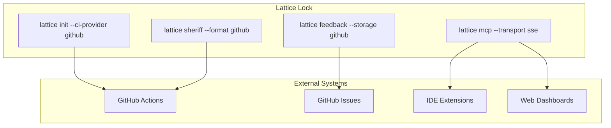
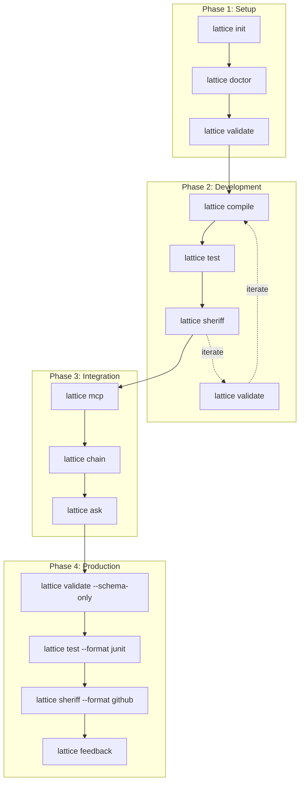
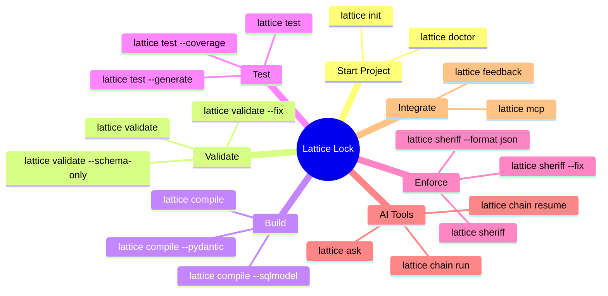
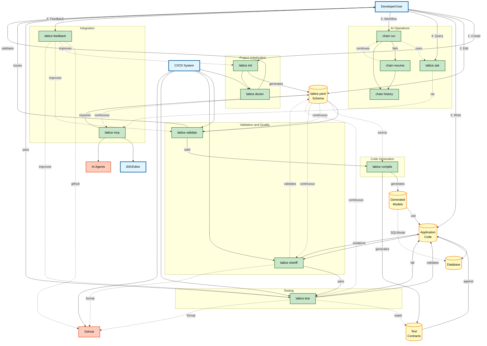
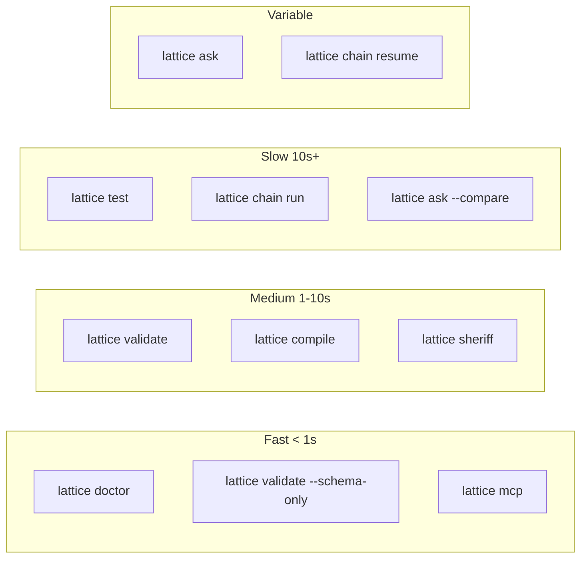
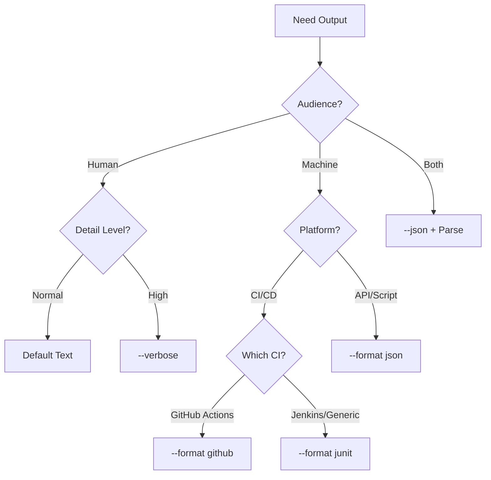
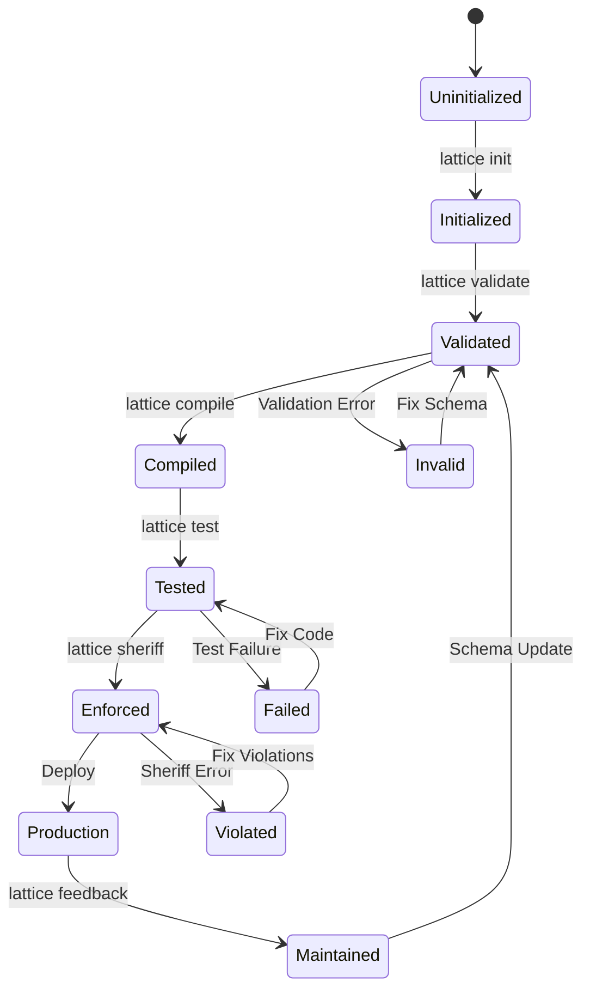
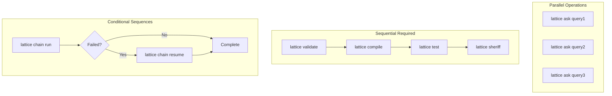

# Lattice Lock Integration Patterns

This document covers how Lattice Lock commands integrate with external systems, best practices by project phase, and the complete command ecosystem.

## Integration Points

### External System Connections

How Lattice Lock commands integrate with external systems.

## Best Practices by Phase

### Project Phase Recommendations

Which commands to emphasize at different project stages.

## Command Cheat Sheet

### Quick Reference by Goal

## Unified Command Ecosystem Diagram

### Complete Lattice Lock Command Integration

This comprehensive diagram shows all Lattice Lock commands, their subcommands, data flows, integrations, and how they connect throughout the entire development lifecycle.

### Diagram Legend

**Node Colors:**
- Blue: Entry points (Developer, CI/CD, IDE)
- Yellow: Core artifacts (schemas, models, code, databases)
- Green: Lattice Lock commands
- Orange: External systems

**Connection Types:**
- Solid arrows: Direct flow or execution
- Dotted arrows: Optional or continuous operations
- Numbered paths: Developer workflow sequence

**Command Categories:**
- Project Initialization: Setup and environment verification
- Validation and Quality: Schema and code compliance
- Code Generation: Transform schemas to code
- Testing: Generate and run contract tests
- AI Operations: Query models and run pipelines
- Integration: External tools and feedback

### Key Integration Points

1. **Schema as Central Truth**: lattice.yaml is the single source of truth for all operations

2. **Multi-Stage Quality Gates**: Code flows through validate, compile, sheriff, and test stages

3. **AI-Enhanced Development**: Ask and chain commands integrate with MCP for context-aware assistance

4. **Bidirectional Feedback**: Developer actions inform the system and improve the framework

5. **CI/CD Native**: Commands provide JSON, GitHub, and JUnit output formats

6. **Resumable Workflows**: Chain commands support failure recovery

## Command Performance Characteristics

### Execution Time Categories

Understanding relative performance of different commands.

## Command Output Types

### Output Format Decision Tree

Choosing the right output format for different scenarios.

## Command Execution States

### State Machine for Command Workflows

This state diagram shows typical states during Lattice Lock workflows.

## Command Interaction Patterns

### Parallel vs Sequential Execution

Understanding when commands can run in parallel or must be sequential.

## Summary

This document demonstrates how Lattice Lock commands integrate with external systems to provide:

1. **External System Integration**: Native support for GitHub, IDEs, and CI/CD pipelines
2. **Phase-Based Best Practices**: Clear guidance on which commands to use when
3. **Complete Ecosystem View**: Understanding of how all commands work together
4. **Performance Awareness**: Knowledge of command execution characteristics
5. **Output Flexibility**: Multiple output formats for different consumers
