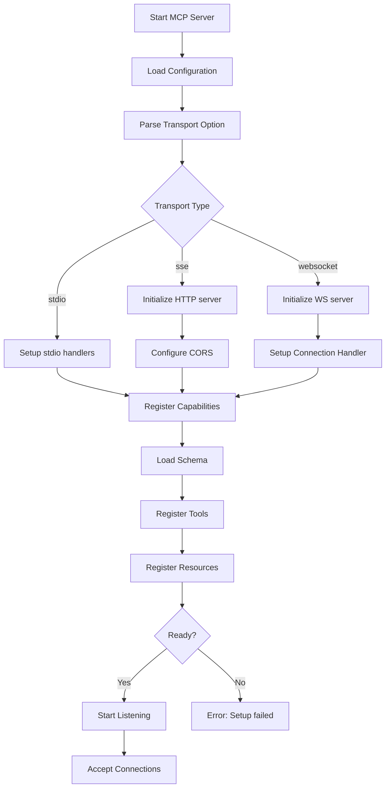
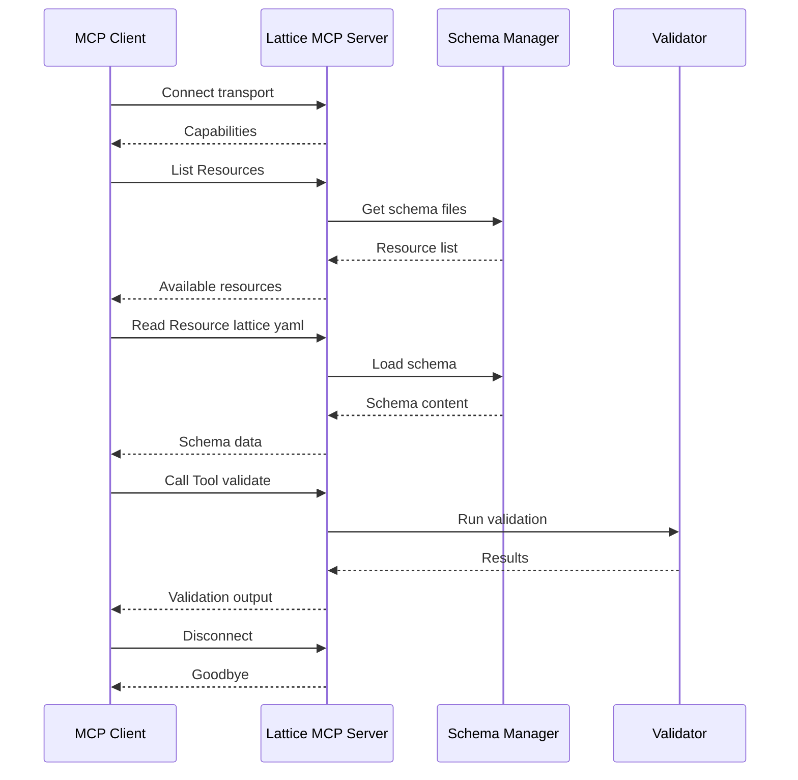
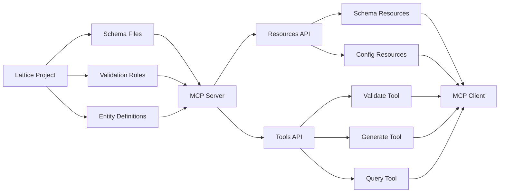
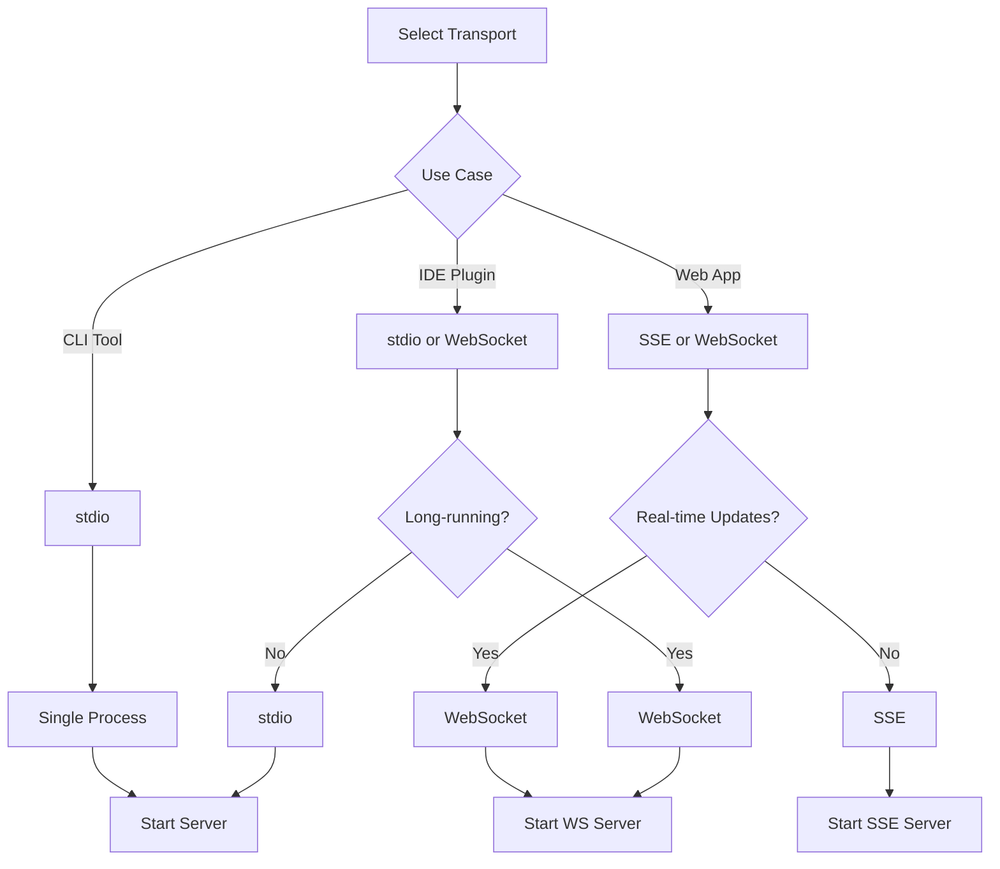
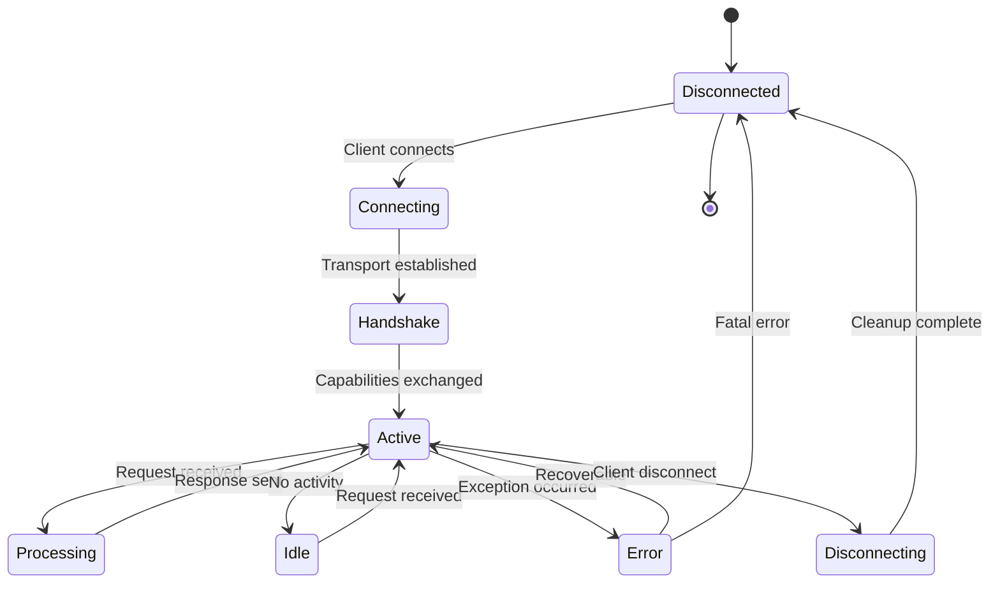

# cmd_mcp

## lattice mcp

Start MCP (Model Context Protocol) server to expose Lattice context to AI agents. Enables programmatic access to schema information, validation, and framework operations.

```bash
lattice mcp [OPTIONS]
```

**Basic Examples:**

```bash
# Start MCP server with default transport
lattice mcp
```

```bash
# Use stdio transport
lattice mcp --transport stdio
```

```bash
# Use SSE transport
lattice mcp --transport sse
```

#### --transport

Transport protocol: stdio, sse, websocket.

```bash
# Standard IO transport (default)
lattice mcp --transport stdio
```

```bash
# Server-Sent Events transport
lattice mcp --transport sse
```

```bash
# WebSocket transport
lattice mcp --transport websocket
```

**Use Cases:**
- AI agent integration
- IDE extensions
- Automated tooling
- Remote schema access
- Context provisioning for LLMs

### Process Flow Diagrams: lattice mcp

#### Decision Flow: Server Initialization
This diagram shows how the MCP server initializes based on transport type. Use this to understand server startup and protocol selection.



#### Sequence Flow: Client-Server Interaction
This diagram illustrates a typical interaction between an MCP client and the Lattice server. Use this to understand request-response patterns.



#### Data Flow: Context Provisioning
This diagram shows how Lattice context flows from the framework to connected clients. Use this when understanding what data is exposed through MCP.



#### Detailed Flowchart: Transport Selection
This flowchart details the differences between transport protocols and their use cases. Use this to choose the appropriate transport for your integration.



#### State Diagram: Connection Lifecycle
This state diagram shows the lifecycle of an MCP client connection. Use this to understand connection management and error handling.


