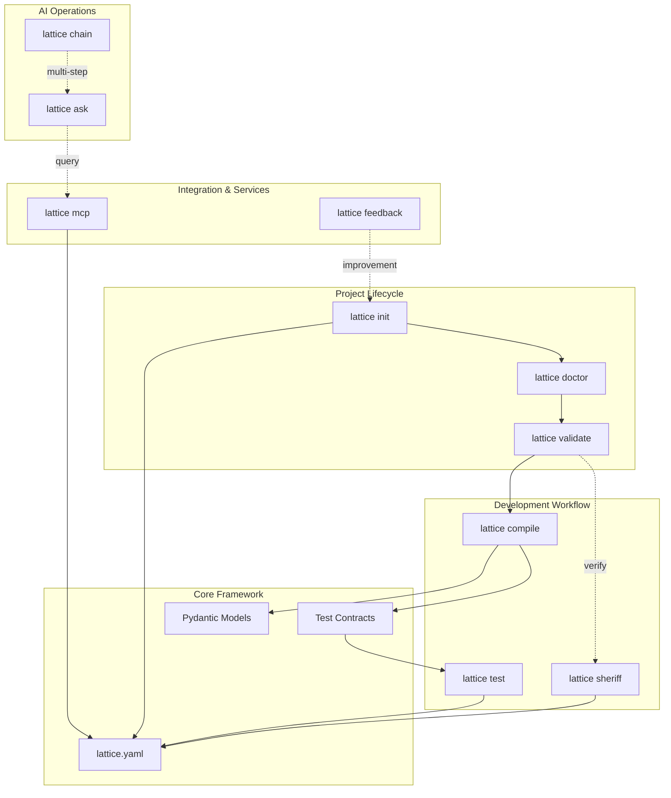
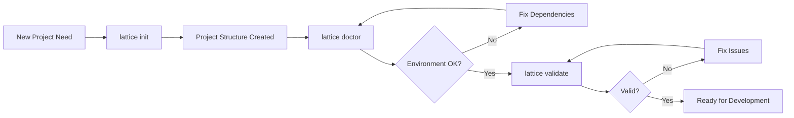
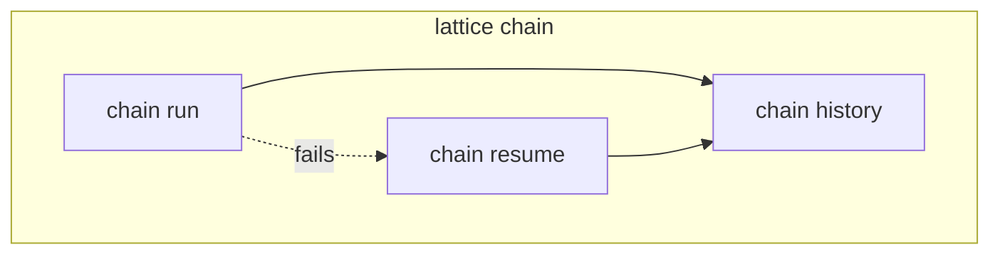
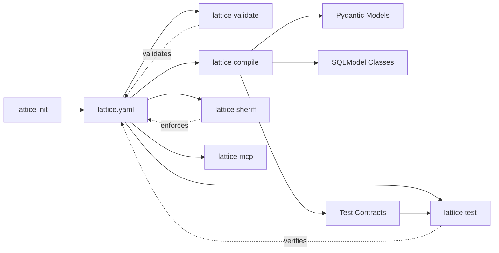
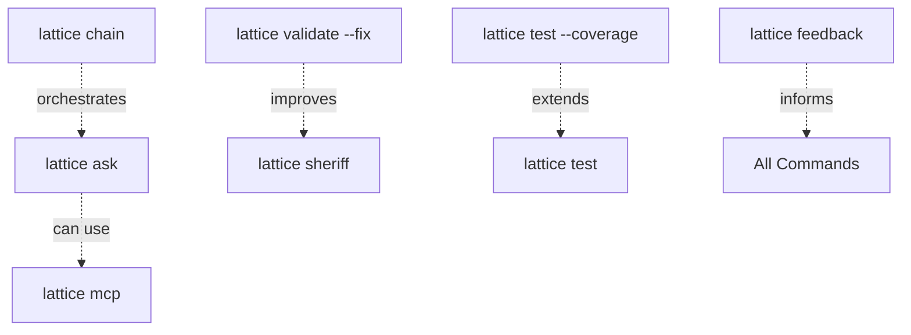
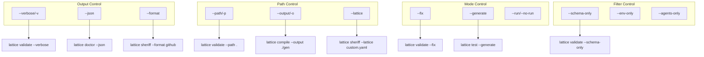

# Lattice Lock Commands Overview

This document provides a high-level overview of all Lattice Lock CLI commands, their relationships, and how they connect to the core framework.

For detailed workflows and use cases, see [workflows.md](./workflows.md).
For integration patterns and external system connections, see [integration_patterns.md](./integration_patterns.md).

## Command Ecosystem Architecture

This diagram shows how all Lattice Lock commands relate to each other and the core framework components.

## Command Relationships by Category

### Project Initialization Flow

### Subcommand Relationships

## Command Dependencies

### Direct Dependencies

This diagram shows which commands depend on outputs from other commands.

### Optional Dependencies

Commands that can enhance or extend other commands.

## Command Flag Patterns

### Common Flag Combinations

Frequently used flag patterns across commands.

## Command Categories

| Category | Commands | Purpose |
|----------|----------|---------|
| **Project Lifecycle** | `init`, `doctor`, `validate` | Setup and verification |
| **Development** | `compile`, `test`, `sheriff` | Build and quality |
| **AI Operations** | `ask`, `chain` | AI-powered assistance |
| **Integration** | `mcp`, `feedback` | External tool support |

## Related Documentation

- **[CLI Reference](./README.md)** - Complete command reference with all options
- **[Workflows](./workflows.md)** - Detailed use case workflows and sequences
- **[Integration Patterns](./integration_patterns.md)** - External system integration
- **Individual Commands** - See specific command files for detailed documentation:
  - [init](./init.md), [doctor](./doctor.md), [validate](./validate.md)
  - [compile](./compile.md), [test](./test.md), [sheriff](./sheriff.md)
  - [ask](./ask.md), [chain](./chain.md)
  - [mcp](./mcp.md), [feedback](./feedback.md), [admin](./admin.md)
