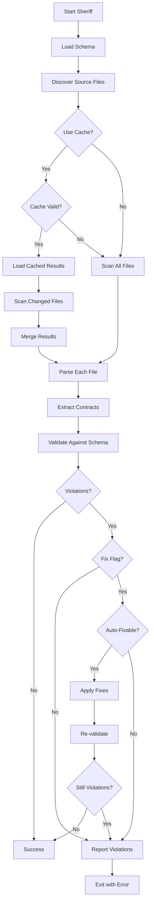
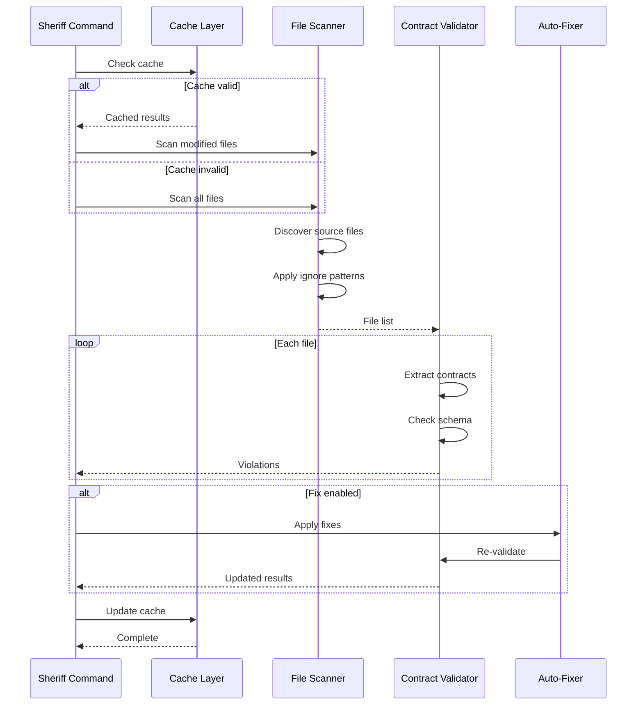
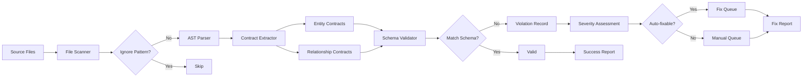
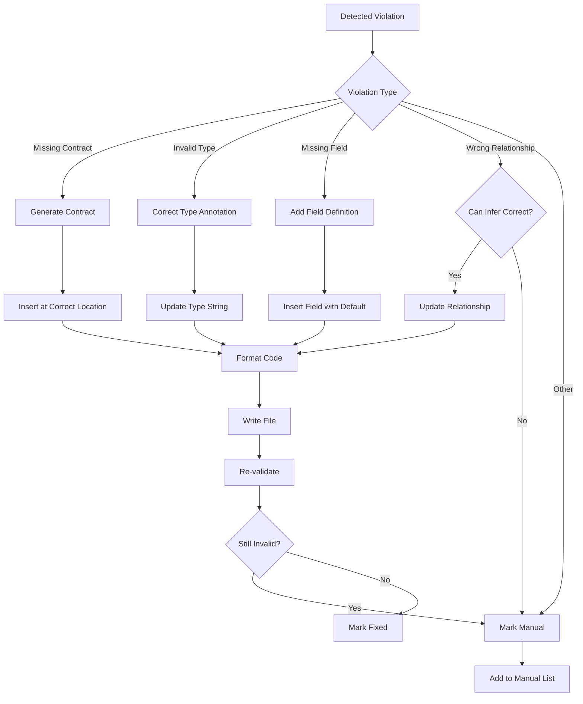
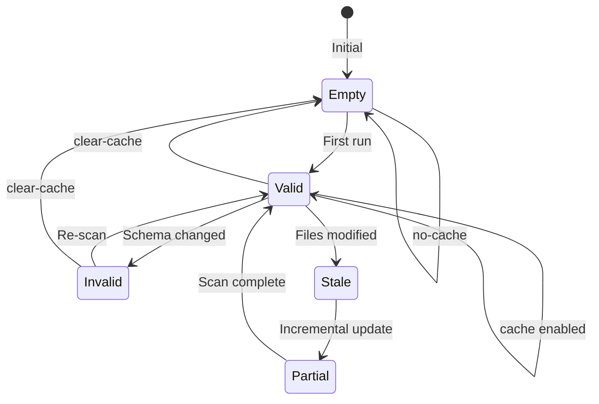

# cmd_sheriff

## lattice sheriff

Enforces lattice schema rules and validates code compliance. Automatically checks semantic contracts, relationships, and entity definitions against lattice.yaml specifications. Provides automated fixing capabilities.

```bash
lattice sheriff [OPTIONS]
```

**Basic Examples:**

```bash
# Validate all contracts
lattice sheriff
```

```bash
# Auto-fix violations
lattice sheriff --fix
```

```bash
# Check with custom schema
lattice sheriff --lattice custom.yaml
```

#### --lattice

Path to lattice.yaml file (default: lattice.yaml).

```bash
# Use custom schema
lattice sheriff --lattice schemas/production.yaml
```

```bash
# Different directory
lattice sheriff --lattice /path/to/lattice.yaml
```

```bash
# Named configuration
lattice sheriff --lattice configs/strict.yaml
```

#### --fix

Automatically fix violations where possible.

```bash
# Auto-fix all issues
lattice sheriff --fix
```

```bash
# Fix with custom schema
lattice sheriff --fix --lattice custom.yaml
```

```bash
# Fix and ignore patterns
lattice sheriff --fix --ignore "tests/**"
```

#### --ignore

Patterns to ignore (glob syntax).

```bash
# Ignore test files
lattice sheriff --ignore "tests/**"
```

```bash
# Multiple patterns
lattice sheriff --ignore "tests/**" --ignore "**/__pycache__/**"
```

```bash
# Ignore with fix
lattice sheriff --fix --ignore "generated/**"
```

#### --format

Output format: text, json, github, junit.

```bash
# JSON output
lattice sheriff --format json
```

```bash
# GitHub Actions format
lattice sheriff --format github
```

```bash
# JUnit XML for CI
lattice sheriff --format junit
```

#### --cache/--no-cache

Enable or disable caching (default: enabled).

```bash
# Disable caching
lattice sheriff --no-cache
```

```bash
# Explicit enable
lattice sheriff --cache
```

```bash
# Force fresh check
lattice sheriff --no-cache --fix
```

#### --cache-dir

Directory for cache files (default: .lattice-cache).

```bash
# Custom cache directory
lattice sheriff --cache-dir /tmp/lattice-cache
```

```bash
# Project-specific cache
lattice sheriff --cache-dir .cache/sheriff
```

```bash
# Shared cache location
lattice sheriff --cache-dir ~/.lattice/cache
```

#### --clear-cache

Clear the cache before running.

```bash
# Clear and run
lattice sheriff --clear-cache
```

```bash
# Clear then fix
lattice sheriff --clear-cache --fix
```

```bash
# Fresh validation
lattice sheriff --clear-cache --no-cache
```

**Use Cases:**
- Pre-commit hook validation
- CI/CD contract enforcement
- Code review automation
- Migration validation
- Compliance auditing

### Process Flow Diagrams: lattice sheriff

#### Decision Flow: Validation and Fixing
This diagram shows the sheriff's decision-making process for validating and fixing violations. Use this to understand when automatic fixes are applied versus when manual intervention is required.



#### Sequence Flow: Cache-Optimized Validation
This diagram illustrates how the sheriff uses caching to optimize repeated validations. Use this to understand performance characteristics and when cache invalidation occurs.



#### Data Flow: Violation Detection
This diagram shows how violations flow from source files through the validation pipeline. Use this when debugging why certain violations are detected or missed.



#### Detailed Flowchart: Auto-Fix Logic
This flowchart details the automatic fixing process for different violation types. Use this to understand which violations can be automatically resolved and which require manual intervention.



#### State Diagram: Cache Lifecycle
This state diagram shows cache state transitions during sheriff operations. Use this to understand cache invalidation triggers and optimization strategies.


