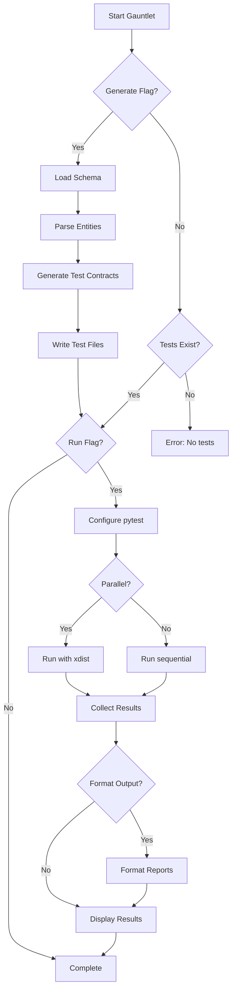
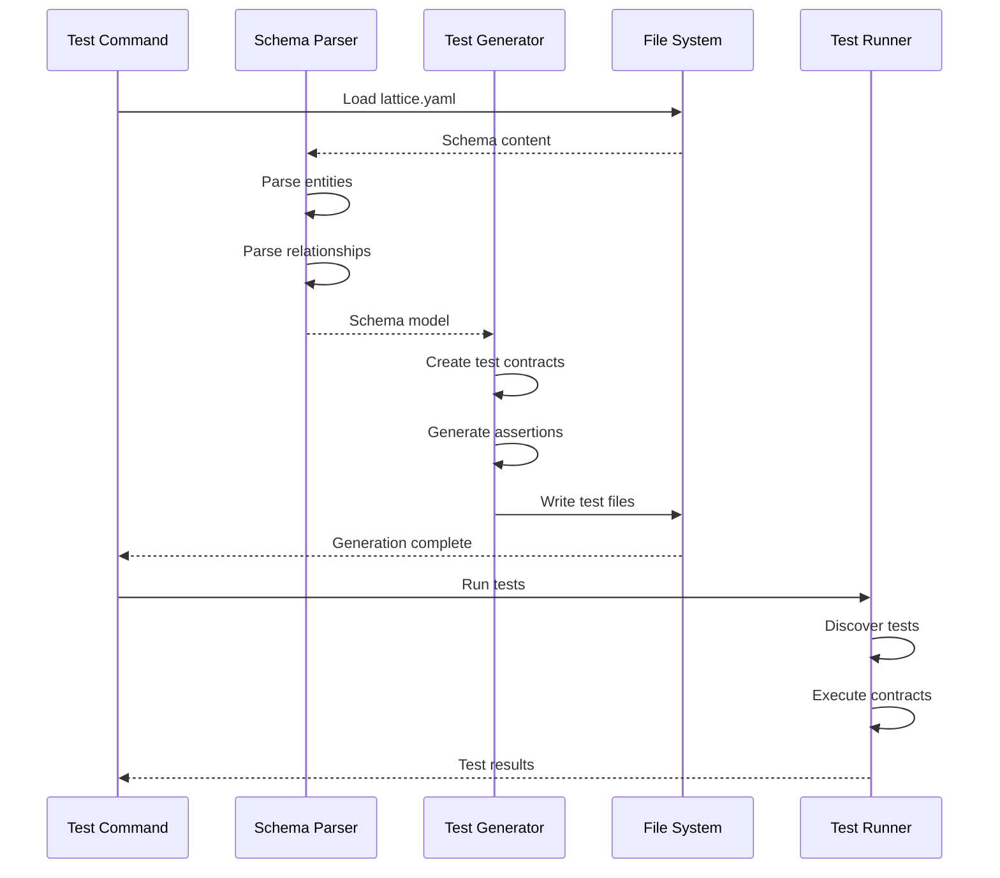
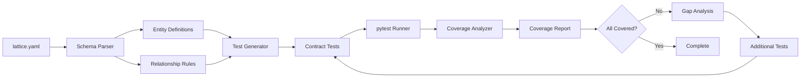
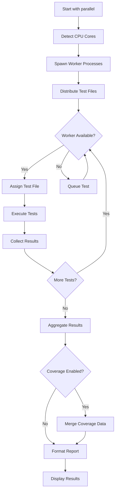
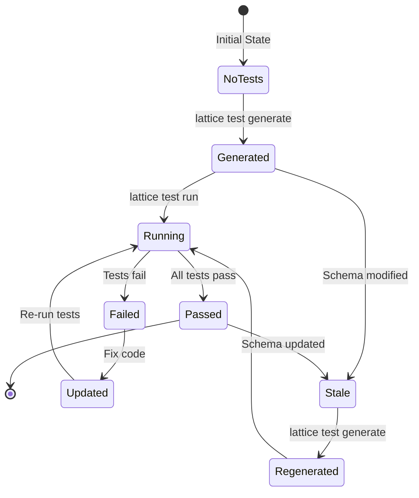

# cmd_test

## lattice test

Generates and runs semantic contract tests from lattice.yaml schemas. Automatically creates comprehensive test suites that validate code against schema definitions. Alias: `lattice gauntlet`.

```bash
lattice test [OPTIONS]
```

**Basic Examples:**

```bash
# Generate and run tests
lattice test
```

```bash
# Generate tests without running
lattice test --generate --no-run
```

```bash
# Run existing tests with coverage
lattice test --coverage
```

#### --generate

Generate tests from lattice.yaml without running them.

```bash
# Just generate tests
lattice test --generate --no-run
```

```bash
# Generate to custom directory
lattice test --generate --output tests/contracts
```

```bash
# Regenerate existing tests
lattice test --generate
```

#### --run/--no-run

Run the tests (default: True).

```bash
# Skip running tests
lattice test --generate --no-run
```

```bash
# Explicitly run tests
lattice test --run
```

```bash
# Generate and run
lattice test --generate --run
```

#### --output

Directory to output generated tests.

```bash
# Custom output directory
lattice test --generate --output tests/gauntlet
```

```bash
# Different location
lattice test --output contracts/tests
```

```bash
# Specific path
lattice test --generate --output /path/to/tests
```

#### --lattice

Path to lattice.yaml file.

```bash
# Use specific schema
lattice test --lattice custom.yaml
```

```bash
# Different schema location
lattice test --lattice /path/to/lattice.yaml
```

```bash
# Named schema
lattice test --lattice schemas/production.yaml
```

#### --coverage

Enable coverage reporting.

```bash
# Run with coverage
lattice test --coverage
```

```bash
# Coverage with custom output
lattice test --coverage --output tests/contracts
```

```bash
# Generate coverage report
lattice test --coverage --format json
```

#### --format

Output format(s): json, junit, github.

```bash
# JSON format
lattice test --format json
```

```bash
# JUnit XML
lattice test --format junit
```

```bash
# GitHub Actions
lattice test --format github
```

#### --parallel

Run tests in parallel with pytest-xdist.

```bash
# Auto-detect workers
lattice test --parallel
```

```bash
# Specific worker count
lattice test --parallel 4
```

```bash
# Parallel with coverage
lattice test --parallel --coverage
```

**Use Cases:**
- Contract verification testing
- Regression testing
- CI/CD integration
- Test-driven development
- Coverage analysis

### Process Flow Diagrams: lattice test

#### Decision Flow: Test Generation and Execution
This diagram shows the dual-mode operation of Gauntlet: test generation and/or execution. Use this to understand when tests are generated from schemas versus executed from existing test files.



#### Sequence Flow: Test Generation Pipeline
This diagram illustrates the step-by-step process of parsing a lattice schema and generating test files. Use this to understand the transformation from schema definitions to executable tests.



#### Data Flow: Contract Coverage
This diagram shows how schema coverage information flows through the testing system. Use this when analyzing which schema elements are validated by your test suite.



#### Detailed Flowchart: Parallel Execution
This flowchart details the parallel test execution process using pytest-xdist. Use this to understand how tests are distributed across worker processes for faster execution.



#### State Diagram: Test Lifecycle
This state diagram shows the different states of generated test files and their transitions. Use this to understand test file management and regeneration scenarios.


