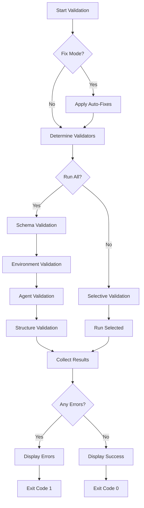
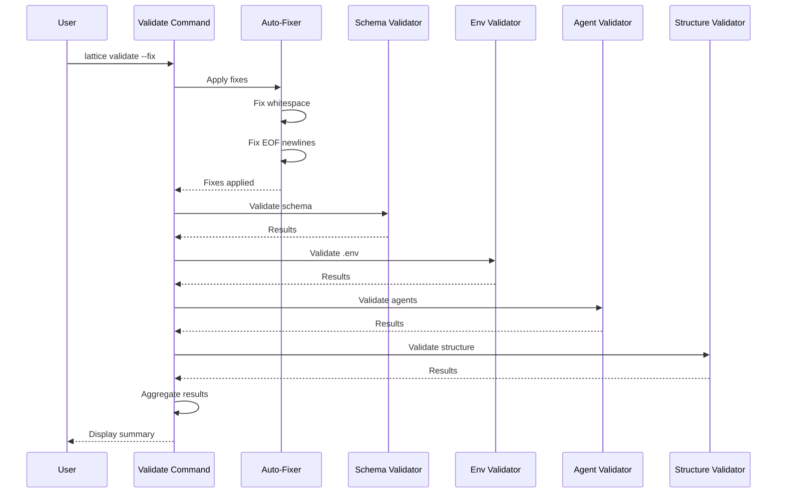
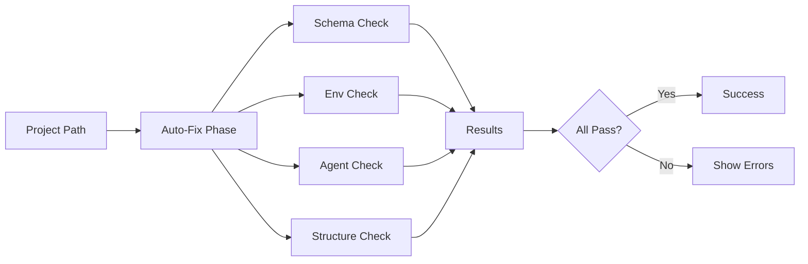
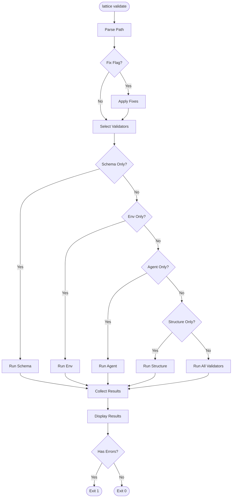
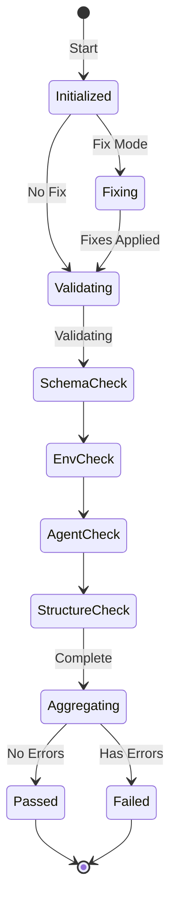

# cmd_validate

## lattice validate

Runs comprehensive validators on a Lattice Lock project to ensure compliance with governance rules and best practices. Performs schema validation, environment file checks, agent manifest validation, and repository structure verification. Can automatically fix common issues like trailing whitespace and missing EOF newlines.

```bash
lattice validate [OPTIONS]
```

**Basic Examples:**

```bash
# Validate entire project
lattice validate
```

```bash
# Validate specific path
lattice validate --path /path/to/project
```

```bash
# Validate current directory explicitly
lattice validate --path .
```

#### --path, -p

Path to project directory (default: current directory).

```bash
# Validate specific project
lattice validate --path /path/to/project
```

```bash
# Validate parent directory
lattice validate --path ../other_project
```

```bash
# Validate with absolute path
lattice validate -p /Users/me/projects/my_app
```

#### --fix

Auto-fix issues where possible (trailing whitespace, missing EOF newline).

```bash
# Apply auto-fixes
lattice validate --fix
```

```bash
# Fix and validate
lattice validate --path /path/to/project --fix
```

```bash
# Fix with verbose output
lattice validate --fix --verbose
```

#### --schema-only

Run only schema validation (lattice.yaml).

```bash
# Validate only schema
lattice validate --schema-only
```

```bash
# Schema validation for specific path
lattice validate --path /path/to/project --schema-only
```

```bash
# Quick schema check
lattice validate --schema-only --path .
```

#### --env-only

Run only environment file validation (.env).

```bash
# Validate only environment files
lattice validate --env-only
```

```bash
# Check env in specific project
lattice validate --path /path/to/project --env-only
```

```bash
# Env validation with fixes
lattice validate --env-only --fix
```

#### --agents-only

Run only agent manifest validation.

```bash
# Validate only agent manifests
lattice validate --agents-only
```

```bash
# Agent validation for specific path
lattice validate --path /path/to/agents --agents-only
```

```bash
# Quick agent check
lattice validate --agents-only --verbose
```

#### --structure-only

Run only repository structure validation.

```bash
# Validate only repository structure
lattice validate --structure-only
```

```bash
# Structure check for project
lattice validate --path /path/to/project --structure-only
```

```bash
# Verify folder organization
lattice validate --structure-only --verbose
```

#### --verbose

Verbose output with detailed warnings.

```bash
# Show detailed validation output
lattice validate --verbose
```

```bash
# Verbose with specific path
lattice validate --path . --verbose
```

```bash
# Detailed fix output
lattice validate --fix --verbose
```

**Use Cases:**
- Pre-commit validation before version control
- CI/CD pipeline integration
- Schema compliance verification
- Code quality checks
- Automated formatting fixes

### Process Flow Diagrams: lattice validate

#### Decision Flow: Validation Pipeline
This diagram shows the validation workflow including optional auto-fix mode and selective validator execution. Use this to understand how validation runs are configured and results are collected.



#### Sequence Flow: Validator Execution Order
This sequence diagram shows how validators are executed in order after optional auto-fixing. Follow this to see the interaction between different validation components.



#### Data Flow: Multi-Validator Processing
This data flow diagram illustrates how validation results from multiple validators are aggregated. Use this to understand the parallel nature of different validation checks.



#### Detailed Flowchart: Selective Validation Logic
This flowchart details the logic for selecting which validators to run based on command flags. Reference this when using specific validation modes (schema-only, env-only, etc.).



#### State Diagram: Validation Lifecycle
This state diagram shows the progression through validation states from initialization to completion. Use this to identify at which stage validation errors or warnings occur.


