# Lattice Lock Workflows

This document provides detailed workflows showing how Lattice Lock commands work together in various development scenarios.

## Use Case 1: New Agent Project Setup

Complete workflow for initializing an AI agent project.

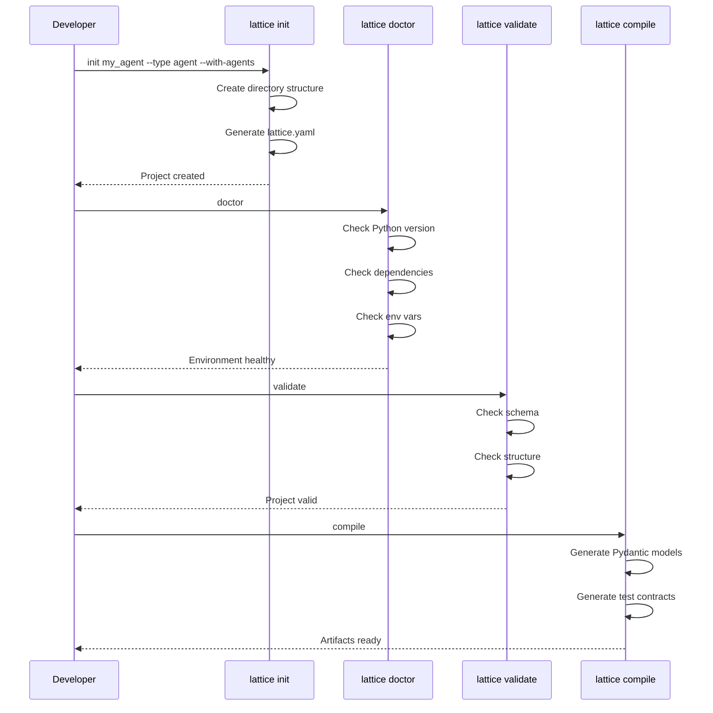

## Use Case 2: Schema-Driven Development

Workflow showing how schema changes propagate through the system.

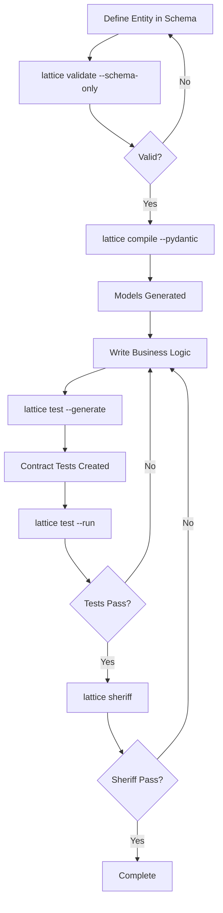

## Use Case 3: AI Query Workflow

How AI operations integrate with the framework.

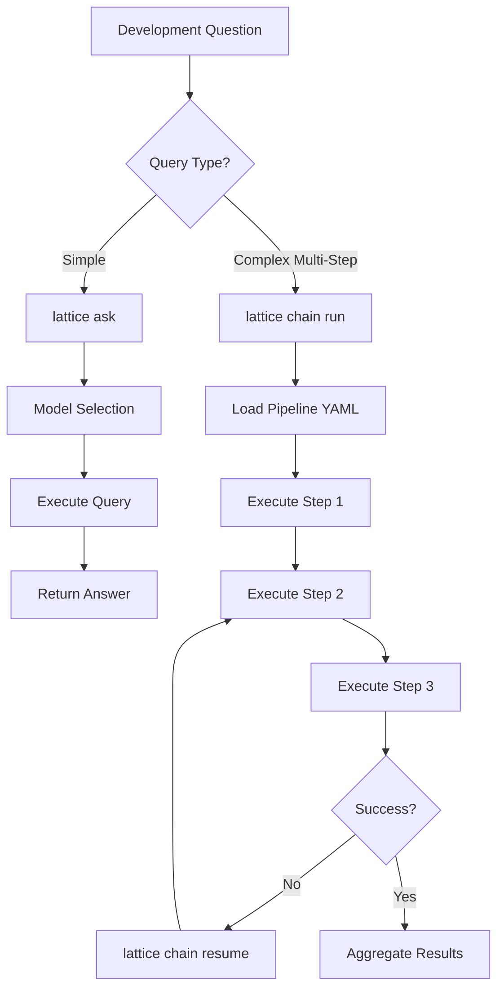

## Use Case 4: CI/CD Pipeline Integration

Complete CI/CD workflow using Lattice Lock commands.

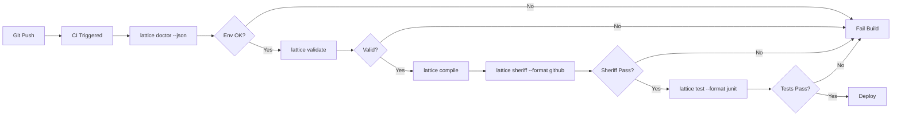

## Use Case 5: MCP Server Integration

How the MCP server enables external tool integration.

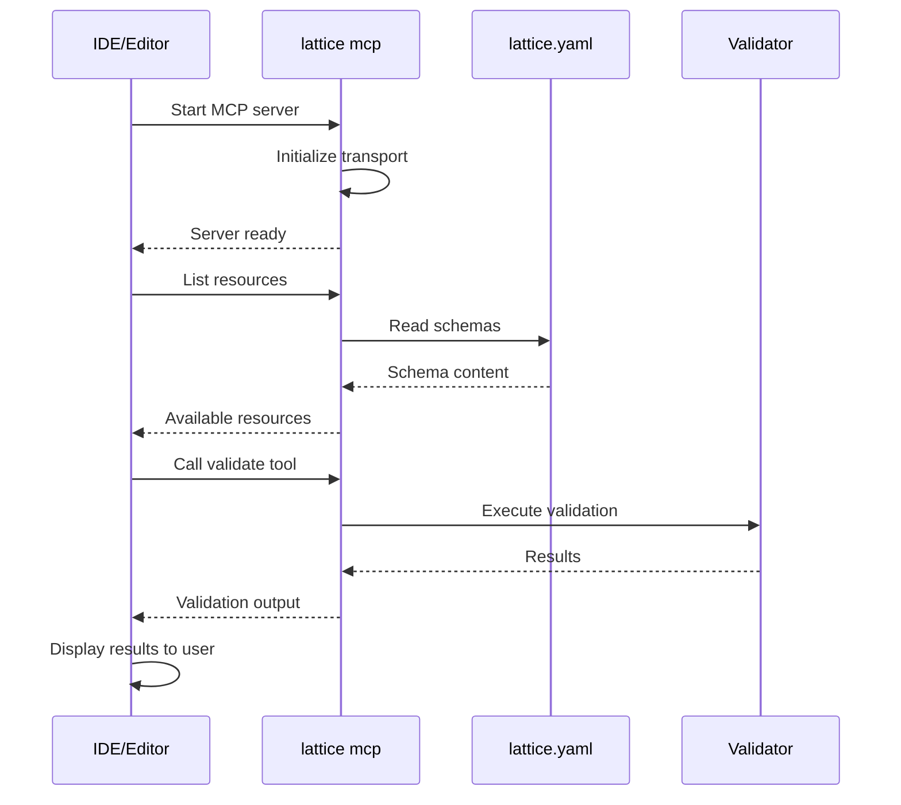

## Development Workflow

The typical daily development cycle with Lattice Lock commands.

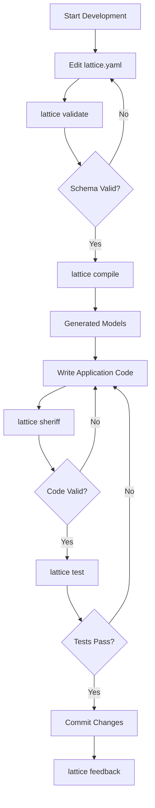

## Multi-Environment Deployment

Using Lattice Lock across development, staging, and production.

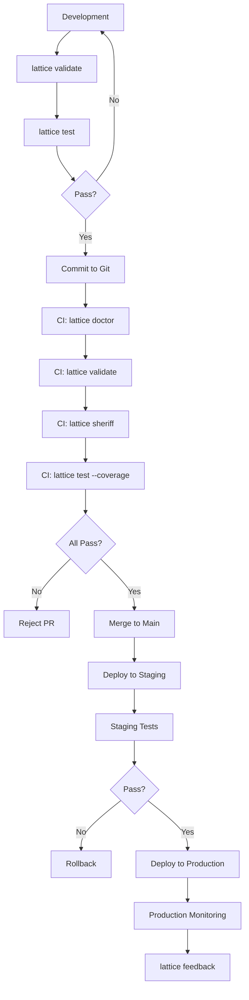

## Agent Development Lifecycle

Specialized workflow for AI agent development.

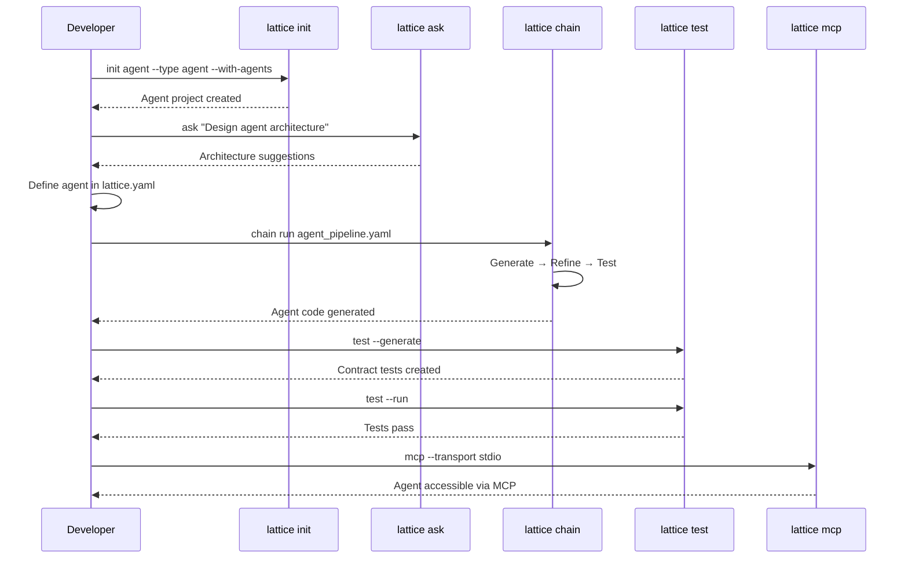

## Schema Evolution Workflow

Managing schema changes over time.

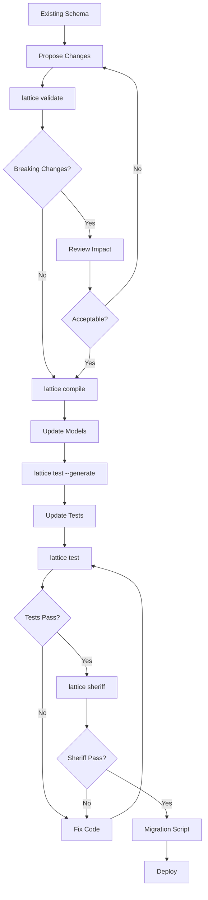

## Data Flow Through Commands

### Schema to Production Flow

Complete data transformation from schema definition to running code.

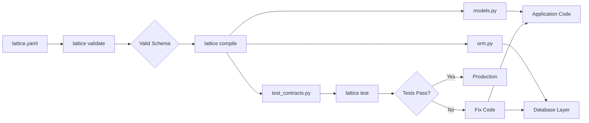

### Feedback Loop

How validation, testing, and enforcement create a quality feedback loop.

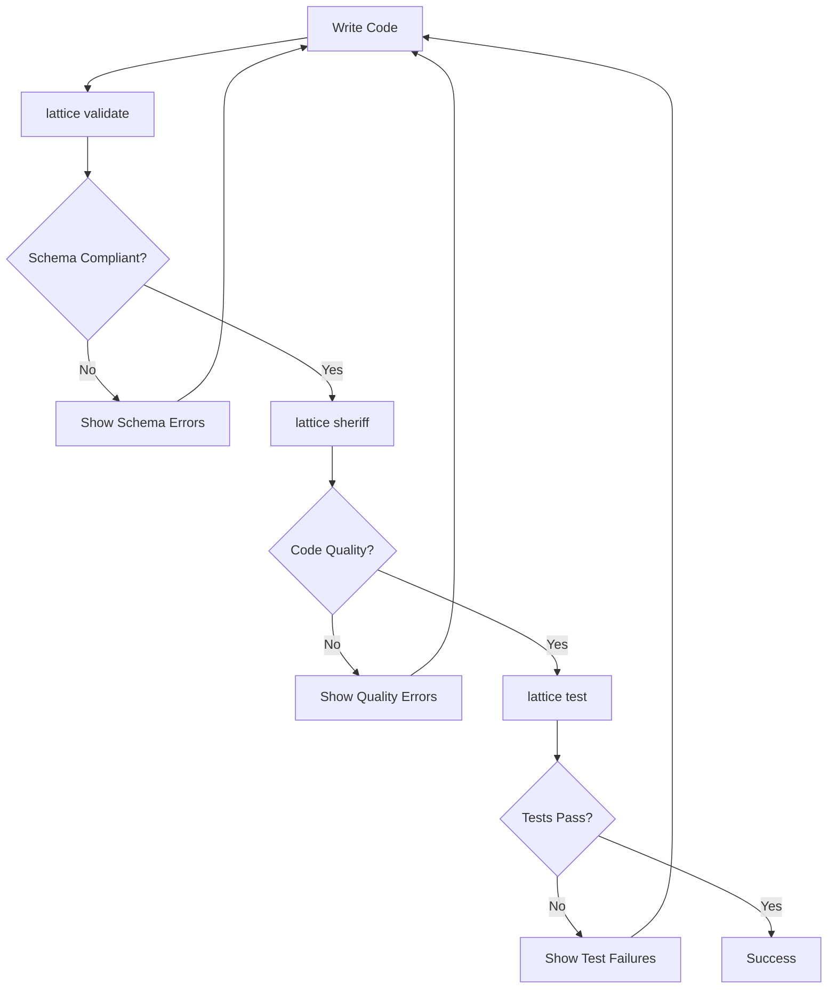

## Error Handling Patterns

### Common Error Recovery Flows

How to recover from errors in different commands.

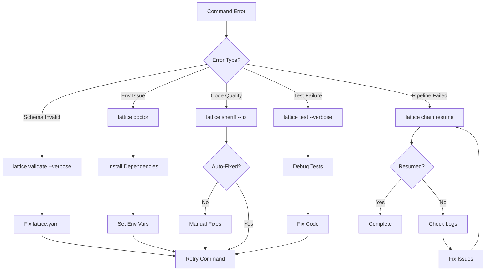

## End-to-End: From Idea to Production

Comprehensive example showing all commands in a complete workflow.

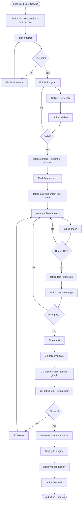

## Developer Journey: Command Flow

The typical decision flow a developer follows when using Lattice Lock commands.

```mermaid
flowchart TD
    START([Start New Project]) --> INIT[lattice init]
    INIT --> DOCTOR{lattice doctor<br/>Environment OK?}
    DOCTOR -->|No| FIX_ENV[Fix Environment]
    FIX_ENV --> DOCTOR
    DOCTOR -->|Yes| EDIT_SCHEMA[Edit lattice.yaml]
    
    EDIT_SCHEMA --> VALIDATE{lattice validate<br/>Schema Valid?}
    VALIDATE -->|No| EDIT_SCHEMA
    VALIDATE -->|Yes| COMPILE[lattice compile]
    
    COMPILE --> WRITE_CODE[Write Application Code]
    WRITE_CODE --> SHERIFF{lattice sheriff<br/>Quality OK?}
    SHERIFF -->|No| WRITE_CODE
    SHERIFF -->|Yes| TEST_GEN[lattice test --generate]
    
    TEST_GEN --> TEST_RUN{lattice test<br/>Tests Pass?}
    TEST_RUN -->|No| WRITE_CODE
    TEST_RUN -->|Yes| COMMIT[Git Commit]
    
    COMMIT --> CI_START[CI Pipeline Triggered]
    CI_START --> CI_DOCTOR[CI: lattice doctor]
    CI_DOCTOR --> CI_VALIDATE[CI: lattice validate]
    CI_VALIDATE --> CI_SHERIFF[CI: lattice sheriff]
    CI_SHERIFF --> CI_TEST[CI: lattice test]
    
    CI_TEST --> CI_PASS{All Checks Pass?}
    CI_PASS -->|No| WRITE_CODE
    CI_PASS -->|Yes| DEPLOY[Deploy to Production]
    
    DEPLOY --> MONITOR[Monitor & Feedback]
    MONITOR --> FEEDBACK[lattice feedback]
    FEEDBACK --> CONTINUE{Continue Development?}
    CONTINUE -->|Yes| EDIT_SCHEMA
    CONTINUE -->|No| END([Project Complete])
    
    style START fill:#4caf50,stroke:#2e7d32,stroke-width:3px,color:#fff
    style END fill:#4caf50,stroke:#2e7d32,stroke-width:3px,color:#fff
    style DEPLOY fill:#ff9800,stroke:#e65100,stroke-width:2px,color:#fff
    style DOCTOR fill:#2196f3,stroke:#0d47a1,stroke-width:2px,color:#fff
    style VALIDATE fill:#2196f3,stroke:#0d47a1,stroke-width:2px,color:#fff
    style SHERIFF fill:#2196f3,stroke:#0d47a1,stroke-width:2px,color:#fff
    style TEST_RUN fill:#2196f3,stroke:#0d47a1,stroke-width:2px,color:#fff
    style CI_PASS fill:#2196f3,stroke:#0d47a1,stroke-width:2px,color:#fff
```
