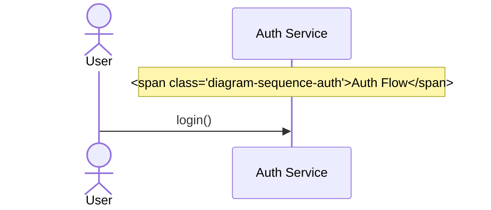

# Automated Diagram Generation & Maintenance System

---
## Executive Overview

Design and implement an automated system that generates, maintains, and updates Mermaid.js diagrams in response to code changes within the Lattice Lock Framework. The system tracks relationships between code artifacts and diagram files, triggers automated diagram reviews and updates when relevant code is modified, creates pull requests with appropriate documentation, and provides a unified navigable interface connecting diagrams, code, and design standards through backlinks, wikilinks, and visual mapping.

---

## 1. System Architecture & Workflow

### 1.1 High-Level Process Flow

```
Code Change (PR Submitted)
    ↓
Code Diff Analysis
    ↓
Identify Affected Diagram Dependencies
    ↓
Validate Against Diagram Design Standards
    ↓
LLM-Driven Diagram Generation/Update
    ↓
Diagram Linter Validation
    ↓
YAML Frontmatter Metadata Update
    ↓
Update Related Diagram Backlinks
    ↓
Regenerate Diagram Map of Contents
    ↓
Automated PR Creation with Tags
    ↓
@greptileai Review Assignment
    ↓
Commit & Merge
```

### 1.2 Key Components

- **Change Detection System**: Monitor code modifications, additions, and deletions
- **Dependency Mapping**: Maintain relationships between code files and diagrams via YAML metadata
- **LLM Processing Layer**: Multiple LLM instances executing diagram generation, analysis, and updates
- **Diagram Linter**: Enforce best practices, consistency, and design standards
- **Design System Reference**: Central diagram design file defining visual and structural standards
- **Metadata Management**: YAML frontmatter tracking diagram state, relationships, and triggers
- **Backlink & Wikilink Engine**: Create bidirectional connections between diagrams and code
- **Map of Contents Generator**: Automated creation of interconnected diagram navigation
- **Visualization Layer**: Generate visual representation of diagram relationships and code connections
- **Automation Framework**: GitHub Actions or equivalent CI/CD orchestration
- **Version Control Integration**: Automated commit and PR creation

---

## 2. Diagram Inventory & Classification

### 2.1 Required Diagram Types

|Diagram Type|Purpose|Use Case|
|---|---|---|
|**Sequence Diagrams**|Temporal interactions and call sequences|API flows, user interactions, async processes|
|**Entity Relationship Diagrams (ERD)**|Data model structure and relationships|Database schema, domain models|
|**Class Diagrams**|Object-oriented structure and inheritance|Architecture, module organization|
|**User Flow Charts**|Navigation and decision paths|Feature workflows, user journeys|
|**User Journey Diagrams**|User experience across touchpoints|Feature adoption, system interaction patterns|
|**Requirement Diagrams**|Features mapped to requirements|Feature specifications, dependency tracking|
|**Flowcharts**|Algorithm logic and process flows|Business logic, decision trees|
|**Block Diagrams**|System component relationships|System architecture, module boundaries|
|**Packet Diagrams**|Data structure composition|Message formats, data packet layouts|

---

## 3. Folder Organization Scheme

### 3.1 Directory Structure

```
/Users/kevinlappe/Documents/lattice-lock-framework/diagrams/
├── /architecture/
│   ├── system_overview.md
│   ├── module_dependencies.md
│   └── component_interactions.md
├── /data_models/
│   ├── entity_relationships.md
│   ├── database_schema.md
│   └── domain_objects.md
├── /workflows/
│   ├── user_flow_authentication.md
│   ├── user_flow_project_creation.md
│   └── user_flow_data_sync.md
├── /user_experience/
│   ├── user_journey_onboarding.md
│   ├── user_journey_feature_discovery.md
│   └── user_journey_error_handling.md
├── /api_interactions/
│   ├── sequence_auth_flow.md
│   ├── sequence_data_retrieval.md
│   └── sequence_websocket_lifecycle.md
├── /business_logic/
│   ├── flowchart_encryption_process.md
│   ├── flowchart_key_rotation.md
│   └── flowchart_access_control.md
├── /requirements/
│   ├── requirements_security.md
│   ├── requirements_performance.md
│   └── requirements_compliance.md
├── /system_design/
│   ├── block_diagram_services.md
│   ├── block_diagram_infrastructure.md
│   └── packet_format_message.md
├── /design/
│   ├── diagram_design_system.md
│   ├── diagram_linter_rules.md
│   └── design_tokens.yaml
├── /maps/
│   ├── map_of_contents.md
│   ├── diagram_dependency_graph.md
│   └── code_to_diagram_index.md
└── /index.md
```

### 3.2 Naming Convention

**Format**: `{diagram_type}_{feature_area}_{description}.md`

**Rules**:

- Use lowercase only
- Separate words with underscores
- Lead with diagram type abbreviation (optional for clarity)
- Keep names concise but descriptive (max 60 characters)
- Make names scannable through visual grouping

**Examples**:

- `seq_auth_flow.md` (Sequence: Authentication Flow)
- `erd_user_permissions.md` (Entity Relationship: User Permissions)
- `flowchart_key_rotation.md` (Flowchart: Key Rotation Process)
- `class_encryption_modules.md` (Class: Encryption Modules)
- `uj_onboarding_new_user.md` (User Journey: Onboarding New User)

---

## 4. YAML Frontmatter Metadata Schema

### 4.1 Standard Frontmatter Template

```yaml
---
# Core Identification
name: sequence_api_authentication
type: sequence
category: api_interactions
folder: /diagrams/api_interactions

# Versioning & Dates
date_created: 2024-01-15
date_updated: 2024-01-20
version: "1.2"

# Relationships & Dependencies
depends_on:
  - /src/auth/auth_service.ts
  - /src/auth/token_handler.ts
  - /src/auth/jwt_validator.ts

related_diagrams:
  - "[[entity_relationships]]"
  - "[[requirements_security]]"
  - "[[user_flow_authentication]]"

diagram_connections:
  - target: "[[erd_user_sessions]]"
    relationship: "data_model"
    description: "Uses session entity from ERD"
  - target: "[[class_auth_service]]"
    relationship: "represents"
    description: "Visual representation of authentication service"
  - target: "[[flowchart_token_validation]]"
    relationship: "extends"
    description: "Token validation is part of this flow"

# Metadata for Automation
aliases:
  - authentication_sequence
  - api_auth_diagram
  
tags:
  - lattice-lock
  - authentication
  - security
  - api

# Triggering & Monitoring
code_watchers:
  - path: /src/auth/**
    events: [created, modified, deleted]
  - path: /src/api/endpoints/auth.ts
    events: [modified]

trigger_on_changes:
  - type: function_signature_change
    in_files: [auth_service.ts, token_handler.ts]
  - type: class_structure_change
    in_files: [auth_service.ts]
  - type: new_file
    matching: /src/auth/**

auto_update: true
review_assigned_to: "@greptileai"

# Design System Compliance
design_system_reference: "[[diagram_design_system]]"
diagram_style_class: "diagram-sequence-auth"
design_version: "1.0"

# Linter Configuration
linter_enabled: true
linter_rules:
  - rule_set: sequence_diagrams_best_practices
    severity: error
  - rule_set: naming_conventions
    severity: error
  - rule_set: documentation_requirements
    severity: warning

# Documentation
description: |
  Sequence diagram depicting the OAuth 2.0 authentication flow
  and token validation process for API requests. Shows interactions
  between client, API gateway, auth service, and token validator.

scope: |
  - Token generation
  - Token validation
  - Session management
  - Error handling

out_of_scope: |
  - Internal token encryption details
  - Database query optimization
  - Client-side token storage

# Visual Styling (Defined in Design System)
css_class: diagram-sequence-auth
theme: dark
styling_version: "1.0"
---

# Diagram Title

[Mermaid diagram content below]
```

### 4.2 Frontmatter Field Definitions

|Field|Type|Required|Description|
|---|---|---|---|
|`name`|string|✓|Unique identifier matching filename|
|`type`|enum|✓|Diagram type: sequence, erd, class, flowchart, etc.|
|`category`|string|✓|High-level categorization folder|
|`folder`|string|✓|Full path to diagram location|
|`date_created`|date|✓|ISO format: YYYY-MM-DD|
|`date_updated`|date|✓|Updated on each revision|
|`version`|string|✓|Semantic versioning (major.minor.patch)|
|`depends_on`|array|✓|Source code files this diagram represents|
|`related_diagrams`|array|✓|Wikilink references to related diagrams `[[name]]`|
|`diagram_connections`|array|✓|Structured diagram relationships with metadata|
|`aliases`|array|✗|Alternative names for discovery|
|`tags`|array|✓|Classification and filtering tags|
|`code_watchers`|array|✓|File paths and events to monitor|
|`trigger_on_changes`|array|✓|Specific change patterns requiring updates|
|`auto_update`|boolean|✓|Enable automated updates on code changes|
|`review_assigned_to`|string|✓|GitHub handle for PR reviews|
|`design_system_reference`|wikilink|✓|Reference to `[[diagram_design_system]]`|
|`diagram_style_class`|string|✓|CSS class from design system|
|`design_version`|string|✓|Version of design system applied|
|`linter_enabled`|boolean|✓|Enable automated linting|
|`linter_rules`|array|✓|Specific rules and severity levels|
|`description`|string|✓|Purpose and scope of the diagram|
|`scope`|string|✗|What the diagram covers|
|`out_of_scope`|string|✗|What the diagram explicitly excludes|
|`css_class`|string|✗|CSS class for styling|
|`theme`|enum|✗|Visual theme: light, dark, custom|
|`styling_version`|string|✗|Version of the visual styling applied|

---

## 5. Code-to-Diagram Dependency Mapping

### 5.1 Dependency Tracking Mechanism

**Goal**: Maintain bidirectional relationships between source code and diagram files.

### 5.2 Dependency Matrix Example

```
/src/auth/
├── auth_service.ts → depends_on: [seq_auth_flow.md, class_auth_service.md]
├── token_handler.ts → depends_on: [seq_auth_flow.md, flowchart_token_validation.md]
└── jwt_validator.ts → depends_on: [seq_auth_flow.md]

/src/database/
├── models/user.ts → depends_on: [erd_user_model.md, class_user_entity.md]
└── models/session.ts → depends_on: [erd_user_sessions.md, seq_session_lifecycle.md]
```

### 5.3 Inverse Mapping (Diagrams → Code)

Each diagram's `depends_on` field creates an inverse index:

```
seq_auth_flow.md depends_on:
  - /src/auth/auth_service.ts
  - /src/auth/token_handler.ts
  - /src/auth/jwt_validator.ts
  
→ When ANY of these files change, seq_auth_flow.md is flagged for review/update
```

### 5.4 Change Detection Rules

When code is modified, trigger diagram updates if:

- **Function/Method Signature Changes**: Parameter count, names, return types
- **Class Structure Changes**: New methods, properties, inheritance changes
- **File Additions**: New file in watched directory matching pattern
- **File Deletions**: Removal of critical dependencies
- **Interface Changes**: Modified exports, API contracts
- **Logic Flow Changes**: Control flow complexity modifications

---

## 6. Diagram Connection & Relationship System

### 6.1 Diagram-to-Diagram Connections

Diagrams reference related diagrams using a structured connection model:

```yaml
diagram_connections:
  - target: "[[erd_user_sessions]]"
    relationship: "data_model"
    description: "Uses session entity from ERD"
    direction: "incoming"  # incoming, outgoing, bidirectional
    impact_level: "critical"  # critical, high, medium, low
    
  - target: "[[class_auth_service]]"
    relationship: "represents"
    description: "Visual representation of authentication service"
    direction: "bidirectional"
    impact_level: "high"
    
  - target: "[[flowchart_token_validation]]"
    relationship: "extends"
    description: "Token validation is part of this flow"
    direction: "outgoing"
    impact_level: "medium"
    
  - target: "[[requirements_security]]"
    relationship: "fulfills"
    description: "Demonstrates fulfillment of security requirements"
    direction: "outgoing"
    impact_level: "high"
```

### 6.2 Relationship Types

|Relationship Type|Meaning|Example|
|---|---|---|
|`data_model`|References data entities|Sequence diagram uses entities from ERD|
|`represents`|Visualizes code structure|Class diagram represents source module|
|`extends`|Builds upon or adds detail|Detailed flow extends overview flow|
|`fulfills`|Demonstrates requirement satisfaction|Architecture diagram fulfills performance req|
|`implements`|Shows implementation of|User flow implements feature requirement|
|`precedes`|Must occur before this diagram's scope|Login flow precedes data sync flow|
|`depends_on`|Requires or depends upon|Complex flow depends on simpler sub-flow|
|`alternative_view`|Different perspective of same system|Block diagram is alternative view of architecture|

### 6.3 Wikilink & Backlink Implementation

**Wikilink Format**: `[[diagram_name]]` for internal cross-references

**In YAML**:

```yaml
related_diagrams:
  - "[[erd_user_permissions]]"
  - "[[class_user_entity]]"
  - "[[flowchart_access_control]]"
```

**In Markdown Description**:

```markdown
This diagram shows the authentication sequence that leads to the 
user flow defined in [[user_flow_authentication]]. The session 
entity is defined in [[erd_user_sessions]]. For access control 
logic, see [[flowchart_access_control]].
```

**Automated Backlink Generation**:

- When diagram A links to diagram B with `[[diagram_b]]`
- Automatically add inverse backlink in diagram B pointing to A
- Maintain bidirectional consistency

---

## 7. Map of Contents System

### 7.1 Automated Diagram Map Generation

Create a comprehensive, continuously updated map of all diagrams with navigable connections.

### 7.2 Map of Contents Structure (`/diagrams/maps/map_of_contents.md`)

```markdown
# Lattice Lock Framework - Diagram Map of Contents

> **Last Updated**: 2024-01-20 | **Total Diagrams**: 42 | **Categories**: 8

## Quick Navigation
- [[#architecture]] | [[#data_models]] | [[#workflows]] | [[#user_experience]] | [[#api_interactions]] | [[#business_logic]] | [[#requirements]] | [[#system_design]]

---

## Architecture (3 diagrams)

### [[system_overview]]
- **Type**: Block Diagram
- **Status**: ✓ Current
- **Last Updated**: 2024-01-18
- **Connections**: 5 outgoing, 3 incoming
- **Related Code**: `/src/main.ts`, `/src/config/`
- **See Also**: [[module_dependencies]], [[component_interactions]]
- **Description**: High-level system architecture showing all major services and their relationships

### [[module_dependencies]]
- **Type**: Class Diagram
- **Status**: ✓ Current
- **Last Updated**: 2024-01-15
- **Connections**: 3 outgoing, 2 incoming
- **Related Code**: `/src/modules/`
- **See Also**: [[system_overview]], [[component_interactions]]
- **Description**: Dependency graph of all modules in the framework

### [[component_interactions]]
- **Type**: Sequence Diagram
- **Status**: ⚠ Needs Review
- **Last Updated**: 2024-01-12
- **Connections**: 2 outgoing, 4 incoming
- **Related Code**: `/src/services/`, `/src/api/`
- **See Also**: [[system_overview]], [[seq_data_retrieval]], [[seq_auth_flow]]
- **Description**: Shows interaction patterns between major system components

---

## Data Models (5 diagrams)

### [[entity_relationships]]
- **Type**: Entity Relationship Diagram
- **Status**: ✓ Current
- **Last Updated**: 2024-01-19
- **Connections**: 2 outgoing, 8 incoming
- **Related Code**: `/src/database/models/`, `/src/types/`
- **See Also**: [[erd_user_roles]], [[erd_user_sessions]], [[class_user_entity]]
- **Critical Dependencies**: [[seq_auth_flow]], [[seq_data_retrieval]], [[flowchart_access_control]]
- **Description**: Primary entity relationship diagram defining all data models

### [[erd_user_roles]]
- **Type**: Entity Relationship Diagram
- **Status**: ✓ Current
- **Last Updated**: 2024-01-17
- **Connections**: 1 outgoing, 3 incoming
- **Related Code**: `/src/database/models/role.ts`, `/src/auth/`
- **See Also**: [[entity_relationships]], [[erd_user_permissions]], [[flowchart_access_control]]
- **Description**: User roles and permissions model

### [[erd_user_sessions]]
- **Type**: Entity Relationship Diagram
- **Status**: ✓ Current
- **Last Updated**: 2024-01-16
- **Connections**: 0 outgoing, 5 incoming
- **Related Code**: `/src/database/models/session.ts`, `/src/auth/session_handler.ts`
- **Critical Diagrams**: [[seq_auth_flow]], [[user_flow_authentication]]
- **Description**: Session management data model

### [[erd_user_permissions]]
- **Type**: Entity Relationship Diagram
- **Status**: ⚠ Needs Review
- **Last Updated**: 2024-01-10
- **Connections**: 1 outgoing, 2 incoming
- **Related Code**: `/src/auth/permissions.ts`
- **See Also**: [[erd_user_roles]], [[flowchart_access_control]]
- **Description**: Permission hierarchy and assignment model

### [[class_user_entity]]
- **Type**: Class Diagram
- **Status**: ✓ Current
- **Last Updated**: 2024-01-18
- **Connections**: 2 outgoing, 3 incoming
- **Related Code**: `/src/database/models/user.ts`, `/src/types/user.types.ts`
- **See Also**: [[entity_relationships]], [[class_auth_service]]
- **Description**: User entity class structure and methods

---

## Workflows (8 diagrams)

### [[user_flow_authentication]]
- **Type**: User Flow Chart
- **Status**: ✓ Current
- **Last Updated**: 2024-01-19
- **Connections**: 3 outgoing, 2 incoming
- **Related Code**: `/src/features/auth/`, `/src/pages/login/`
- **Detailed In**: [[seq_auth_flow]], [[erd_user_sessions]], [[flowchart_token_validation]]
- **Description**: User authentication flow from initial login to session establishment

### [[user_flow_project_creation]]
- **Type**: User Flow Chart
- **Status**: ✓ Current
- **Last Updated**: 2024-01-15
- **Connections**: 2 outgoing, 1 incoming
- **Related Code**: `/src/features/projects/`, `/src/pages/create-project/`
- **Depends On**: [[user_flow_authentication]]
- **See Also**: [[seq_data_retrieval]], [[requirements_performance]]
- **Description**: Project creation workflow with validation and storage

### [[user_flow_data_sync]]
- **Type**: User Flow Chart
- **Status**: ⚠ Needs Review
- **Last Updated**: 2024-01-12
- **Connections**: 2 outgoing, 1 incoming
- **Related Code**: `/src/features/sync/`, `/src/workers/sync.ts`
- **See Also**: [[seq_websocket_lifecycle]], [[flowchart_conflict_resolution]]
- **Description**: Real-time data synchronization workflow

[... continue for remaining workflows ...]

---

## User Experience (3 diagrams)

### [[user_journey_onboarding]]
- **Type**: User Journey Diagram
- **Status**: ✓ Current
- **Last Updated**: 2024-01-18
- **Connections**: 2 outgoing, 0 incoming
- **Related Code**: `/src/features/onboarding/`
- **Mapped To**: [[user_flow_authentication]], [[user_flow_project_creation]], [[requirements_usability]]
- **Description**: User onboarding experience from signup to first project creation

[... continue for remaining user experience diagrams ...]

---

## API Interactions (4 diagrams)

### [[seq_auth_flow]]
- **Type**: Sequence Diagram
- **Status**: ✓ Current
- **Last Updated**: 2024-01-20
- **Connections**: 4 outgoing, 3 incoming
- **Related Code**: `/src/auth/`, `/src/api/endpoints/auth.ts`, `/src/services/`
- **Critical Dependencies**: [[erd_user_sessions]], [[erd_user_permissions]], [[flowchart_token_validation]]
- **Implements Requirements**: [[requirements_security]]
- **Description**: OAuth 2.0 authentication flow with token validation and session management

### [[seq_data_retrieval]]
- **Type**: Sequence Diagram
- **Status**: ✓ Current
- **Last Updated**: 2024-01-17
- **Connections**: 3 outgoing, 2 incoming
- **Related Code**: `/src/api/endpoints/data.ts`, `/src/services/data-service.ts`
- **See Also**: [[user_flow_data_sync]], [[requirements_performance]]
- **Description**: Data retrieval flow with caching and optimization strategies

[... continue for remaining API interactions ...]

---

## Business Logic (5 diagrams)

### [[flowchart_encryption_process]]
- **Type**: Flowchart
- **Status**: ✓ Current
- **Last Updated**: 2024-01-19
- **Connections**: 1 outgoing, 1 incoming
- **Related Code**: `/src/crypto/`, `/src/encryption/`
- **Related Requirement**: [[requirements_security]]
- **Description**: Encryption process for sensitive data at rest and in transit

[... continue for remaining business logic diagrams ...]

---

## Requirements (3 diagrams)

### [[requirements_security]]
- **Type**: Requirement Diagram
- **Status**: ✓ Current
- **Last Updated**: 2024-01-18
- **Connections**: 0 outgoing, 6 incoming
- **Implemented By**: [[seq_auth_flow]], [[flowchart_encryption_process]], [[flowchart_access_control]]
- **Related Code**: `/docs/requirements.md`, `/src/security/`
- **Description**: Security requirements and their implementation mapping

[... continue for remaining requirements ...]

---

## System Design (3 diagrams)

### [[block_diagram_services]]
- **Type**: Block Diagram
- **Status**: ✓ Current
- **Last Updated**: 2024-01-18
- **Connections**: 3 outgoing, 2 incoming
- **Related Code**: `/src/services/`, `/docker-compose.yml`
- **See Also**: [[system_overview]], [[packet_format_message]]
- **Description**: Service boundaries and inter-service communication

[... continue for remaining system design diagrams ...]

---

## Connection Index

### Most Connected Diagrams (Hubs)
1. **[[entity_relationships]]** - 8 incoming connections
2. **[[requirements_security]]** - 6 incoming connections
3. **[[seq_auth_flow]]** - 3 incoming connections
4. **[[user_flow_authentication]]** - 2 incoming connections

### Diagrams Needing Review
- [[component_interactions]] - Last updated 2024-01-12 (8 days old)
- [[user_flow_data_sync]] - Last updated 2024-01-12 (8 days old)
- [[erd_user_permissions]] - Last updated 2024-01-10 (10 days old)

### Orphaned Diagrams (No Connections)
- None currently

### Diagrams with Missing Dependencies
- None currently

---

## Legend
- **✓ Current**: Updated within last 7 days
- **⚠ Needs Review**: Updated 7+ days ago
- **✗ Outdated**: Updated 30+ days ago or marked for review
```

### 7.3 Dependency Graph Visualization (`/diagrams/maps/diagram_dependency_graph.md`)

```markdown
# Diagram Dependency Graph

## Incoming/Outgoing Connection Map

### By Connection Strength

#### Critical (Must update together)
```

entity_relationships ├→ seq_auth_flow ├→ seq_data_retrieval ├→ class_user_entity └→ flowchart_access_control

```

#### High (Related, should be reviewed together)
```

seq_auth_flow ├→ user_flow_authentication ├→ requirements_security ├→ erd_user_sessions └→ flowchart_token_validation

```

### By Category

#### Architecture Layer
- system_overview → module_dependencies, component_interactions
- component_interactions → seq_data_retrieval, seq_auth_flow

#### Data Layer
- entity_relationships → (8 diagrams depend on this)
- erd_user_sessions → seq_auth_flow, user_flow_authentication
- erd_user_roles → flowchart_access_control

#### Workflow Layer
- user_flow_authentication → seq_auth_flow, erd_user_sessions
- user_flow_data_sync → seq_websocket_lifecycle

#### Requirements Layer
- requirements_security ← seq_auth_flow, flowchart_encryption_process, flowchart_access_control
```

### 7.4 Code-to-Diagram Index (`/diagrams/maps/code_to_diagram_index.md`)

```markdown
# Code-to-Diagram Index

Quickly find which diagrams relate to specific code files and modules.

## By Module

### /src/auth/
- **auth_service.ts**
  - [[seq_auth_flow]]
  - [[class_auth_service]]
  - [[requirements_security]]
  
- **token_handler.ts**
  - [[seq_auth_flow]]
  - [[flowchart_token_validation]]
  
- **jwt_validator.ts**
  - [[seq_auth_flow]]
  - [[flowchart_token_validation]]

### /src/database/models/
- **user.ts**
  - [[entity_relationships]]
  - [[erd_user_permissions]]
  - [[class_user_entity]]
  
- **session.ts**
  - [[erd_user_sessions]]
  - [[seq_auth_flow]]
  
- **role.ts**
  - [[erd_user_roles]]
  - [[flowchart_access_control]]

### /src/features/
- **auth/**
  - [[user_flow_authentication]]
  - [[seq_auth_flow]]
  - [[user_journey_onboarding]]

[... continue for all modules ...]

## By Diagram Type

### Sequence Diagrams
- [[seq_auth_flow]] → /src/auth/**, /src/api/endpoints/auth.ts
- [[seq_data_retrieval]] → /src/api/endpoints/data.ts, /src/services/data-service.ts
- [[seq_websocket_lifecycle]] → /src/workers/sync.ts, /src/api/websocket/

[... continue for all diagrams ...]
```

---

## 8. Diagram Linter System

### 8.1 Diagram Linter Overview

Enforce best practices, consistency, and design standards across all diagrams through automated validation.

### 8.2 Linter Configuration (`/diagrams/design/diagram_linter_rules.md`)

````markdown
# Diagram Linter Rules & Best Practices

## Rule Sets

### All Diagrams (Universal Rules)

#### UNI-001: Required YAML Frontmatter Fields
**Severity**: ERROR
**Description**: All diagrams must have complete YAML frontmatter with required fields
**Required Fields**:
- name
- type
- category
- depends_on
- related_diagrams
- diagram_connections
- design_system_reference
- linter_enabled
- description

**Rationale**: Ensures metadata consistency and enablement of automation

#### UNI-002: Naming Convention Compliance
**Severity**: ERROR
**Description**: Filename must match diagram name in frontmatter
**Format**: `{type}_{feature}_{specificity}.md` (lowercase, underscores only)
**Pattern**: `^[a-z]+_[a-z_]+\.md$`

**Examples**:
- ✓ `seq_auth_flow.md`
- ✓ `erd_user_permissions.md`
- ✗ `SeqAuthFlow.md` (uppercase not allowed)
- ✗ `seq-auth-flow.md` (hyphens not allowed)

#### UNI-003: Documentation Completeness
**Severity**: WARNING
**Description**: Diagrams must have clear descriptions, scope, and out-of-scope sections
**Requirements**:
- `description`: minimum 50 characters, clearly states purpose
- `scope`: explicit list of what diagram covers
- `out_of_scope`: explicit list of what is excluded

**Rationale**: Prevents misuse and ambiguity about diagram purpose

#### UNI-004: Version Semantic Consistency
**Severity**: ERROR
**Description**: Version field must follow semantic versioning
**Format**: `MAJOR.MINOR.PATCH` (e.g., 1.2.3)
**Update Rules**:
- MAJOR: Fundamental structural changes
- MINOR: New elements/relationships added
- PATCH: Refinements, text changes, bug fixes

#### UNI-005: Date Tracking Accuracy
**Severity**: ERROR
**Description**: date_updated must reflect most recent changes
**Rules**:
- date_updated must be >= date_created
- date_updated must not be in the future
- date_updated should be updated on every meaningful change
- If unchanged for 30+ days, must be reviewed and confirmed current

#### UNI-006: Related Diagrams Wikilink Format
**Severity**: ERROR
**Description**: All cross-references must use wikilink format
**Valid Format**: `"[[diagram_name]]"`
**Invalid Formats**:
- ✗ `diagram_name` (no brackets)
- ✗ `[diagram_name]` (single brackets)
- ✗ `[[Diagram Name]]` (spaces)
- ✗ `[[diagram name.md]]` (extension included)

**Rationale**: Enables automated backlink generation and wikilink parsing

#### UNI-007: Diagram Connections Completeness
**Severity**: WARNING
**Description**: diagram_connections should specify relationship metadata
**Required Fields per Connection**:
- target: wikilink to related diagram
- relationship: specific relationship type
- description: brief explanation (10-50 chars)
- direction: incoming, outgoing, or bidirectional
- impact_level: critical, high, medium, or low

#### UNI-008: Accessibility - Color Contrast
**Severity**: ERROR
**Description**: Diagrams must meet WCAG AA color contrast standards
**Requirements**:
- Text contrast ratio >= 4.5:1 for normal text
- Text contrast ratio >= 3:1 for large text
- No information conveyed by color alone

**Rationale**: Ensures usability for colorblind and visually impaired users

#### UNI-009: Code Watchers Configuration
**Severity**: ERROR
**Description**: Must define code_watchers for code-dependent diagrams
**Rules**:
- If `depends_on` is populated, `code_watchers` must be defined
- Each code_watchers entry must specify path and events
- Paths must match depends_on files

#### UNI-010: Linter Configuration
**Severity**: ERROR
**Description**: Diagrams must declare linter settings
**Required Fields**:
- linter_enabled: true/false
- linter_rules: array of applicable rule sets with severity

---

### Sequence Diagrams (SEQ-*)

#### SEQ-001: Actor Naming Conventions
**Severity**: ERROR
**Description**: Actors must be clearly named and represent real system components
**Rules**:
- Use descriptive names (User, API Gateway, Auth Service, etc.)
- Use consistent naming across related diagrams
- Include type in name when ambiguous (Client Service vs Client UI)

#### SEQ-002: Message Clarity
**Severity**: ERROR
**Description**: All messages must clearly indicate direction and action
**Format**: `direction: message_type(parameters) → return_type`
**Examples**:
- ✓ `authenticate(email, password) → JWT Token`
- ✓ `→ Store session`
- ✗ `do something` (vague)
- ✗ `↔ ? (unclear direction)`

#### SEQ-003: Error Path Representation
**Severity**: WARNING
**Description**: Diagrams should include error/exception paths
**Requirements**:
- Show at least one error scenario if applicable
- Use alt/else blocks for conditional flows
- Label error paths clearly

#### SEQ-004: Response Time Annotations
**Severity**: SUGGESTION
**Description**: Optional: annotate expected response times for performance-critical flows
**Format**: `autonumber\nNote over Actor: ~100ms expected`

#### SEQ-005: No Redundant Messages
**Severity**: WARNING
**Description**: Eliminate redundant or duplicate message paths
**Rules**:
- Combine similar sequential messages
- Use loops for repeated patterns
- Reference other diagrams for complex sub-flows

---

### Entity Relationship Diagrams (ERD-*)

#### ERD-001: Entity Naming
**Severity**: ERROR
**Description**: Entity names must match database/code model names
**Format**: PascalCase (User, UserRole, AccessToken)
**Rules**:
- Use singular nouns
- Match exactly with /src/database/models/ file names
- Document any deviations

#### ERD-002: Relationship Cardinality Clarity
**Severity**: ERROR
**Description**: All relationships must clearly indicate cardinality
**Valid Cardinalities**:
- One-to-One (1:1)
- One-to-Many (1:N)
- Many-to-Many (N:N)

**Rules**:
- Each relationship must explicitly show both sides
- Add descriptive labels if relationship is non-obvious

#### ERD-003: Primary/Foreign Key Indication
**Severity**: ERROR
**Description**: Primary keys and foreign keys must be clearly marked
**Notation**:
- Primary Key: PK prefix or underline
- Foreign Key: FK prefix or special notation
- Unique constraints: UC or constraint indicator

#### ERD-004: Attribute Documentation
**Severity**: WARNING
**Description**: Complex or non-obvious attributes should be documented
**Documentation Style**:
- Use comments for business logic
- Include data type in diagram
- Note constraints (NOT NULL, UNIQUE, etc.)

#### ERD-005: Normalization Verification
**Severity**: SUGGESTION
**Description**: Verify diagrams represent properly normalized schemas
**Requirements**:
- No multi-valued dependencies
- Minimal redundancy
- Clear separation of concerns

---

### Class Diagrams (CLASS-*)

#### CLASS-001: Class Naming Convention
**Severity**: ERROR
**Description**: Class names must match source code exactly
**Format**: PascalCase matching /src/** TypeScript/JavaScript files
**Rule**: Must correspond to actual files in codebase

#### CLASS-002: Method Signature Clarity
**Severity**: ERROR
**Description**: Method signatures must match code implementation
**Format**: `methodName(param1: Type1, param2: Type2): ReturnType`
**Rules**:
- Include parameter types
- Include return types
- Match access modifiers (public, private, protected)

#### CLASS-003: Inheritance Clarity
**Severity**: WARNING
**Description**: Inheritance relationships must be clearly indicated
**Rules**:
- Use proper inheritance arrows
- Limit inheritance depth (max 3 levels)
- Document rationale for inheritance hierarchies

#### CLASS-004: No Redundant Properties
**Severity**: WARNING
**Description**: Eliminate duplicate property definitions
**Rules**:
- Properties should not be repeated from parent class
- Use inheritance to show shared properties
- Highlight overridden methods

#### CLASS-005: Interface Implementation
**Severity**: WARNING
**Description**: Implement relationships should be clearly shown
**Rules**:
- Clearly mark which classes implement which interfaces
- Show all required interface methods
- Use proper notation (dashed vs solid lines)

---

### Flowcharts (FLOW-*)

#### FLOW-001: Decision Node Clarity
**Severity**: ERROR
**Description**: All decision/diamond nodes must have clear conditions
**Format**: Question format or boolean expression
**Examples**:
- ✓ "User authenticated?"
- ✓ "email.length > 0 && email.includes('@')"
- ✗ "Check" (too vague)

#### FLOW-002: Terminal Node Completeness
**Severity**: ERROR
**Description**: All paths must lead to a defined terminal node
**Rules**:
- No dangling/incomplete paths
- Clear success/failure end states
- Document what happens at each terminal

#### FLOW-003: Loop Detection
**Severity**: WARNING
**Description**: Clearly indicate and document any loops
**Requirements**:
- Loop conditions must be explicit
- Exit conditions must be clear
- Document expected max iterations

#### FLOW-004: Subprocess Reference
**Severity**: SUGGESTION
**Description**: Complex sub-flows should reference other diagrams
**Format**: Subprocess node references [[other_flowchart]]

---

### User Flow & User Journey Diagrams (UF-*, UJ-*)

#### UF-001: User State Definition
**Severity**: ERROR
**Description**: All user states must be clearly defined
**Requirements**:
- Explicit entry state
- Explicit exit state(s)
- Clear names for all states

#### UF-002: Decision Points for Users
**Severity**: WARNING
**Description**: Show significant decision points users encounter
**Examples**:
- "Decide to create project?"
- "Accept terms of service?"
- "Choose authentication method?"

#### UF-003: Error/Alternative Paths
**Severity**: WARNING
**Description**: Include alternative and error paths users might encounter
**Requirements**:
- Show at least 1 error scenario
- Show alternative action paths
- Indicate how users recover from errors

#### UJ-001: Touchpoint Identification
**Severity**: ERROR
**Description**: All system touchpoints must be identified
**Touchpoints Include**:
- UI screens/pages
- API calls
- External services
- Notifications
- Feedback mechanisms

#### UJ-002: Emotional Journey Mapping
**Severity**: SUGGESTION
**Description**: Optional: Include emotional journey indicators
**Indicators**: Happy, Neutral, Frustrated states at key touchpoints

#### UJ-003: Time/Duration Indication
**Severity**: SUGGESTION
**Description**: Optional: Indicate duration between key touchpoints
**Format**: Annotations like "~2 min" or "~30 seconds"

---

### Requirement Diagrams (REQ-*)

#### REQ-001: Requirement ID Consistency
**Severity**: ERROR
**Description**: Requirement IDs must be unique and consistent
**Format**: `REQ-{DOMAIN}-{NUMBER}` (e.g., REQ-SEC-001)
**Rules**:
- IDs must not change
- Use consistent domain prefixes
- Sequential numbering within domains

#### REQ-002: Traceability Links
**Severity**: ERROR
**Description**: All requirements must be traceable to implementation
**Requirements**:
- Link to dependent diagrams with implementations
- Link to related code files
- Document verification method

#### REQ-003: Priority Indication
**Severity**: WARNING
**Description**: Indicate requirement priority or criticality
**Levels**: Critical, High, Medium, Low
**Usage**: Help prioritize implementation efforts

#### REQ-004: Status Tracking
**Severity**: SUGGESTION
**Description**: Optional: Track requirement implementation status
**Statuses**: Planned, In Progress, Implemented, Verified

---

## Linter Execution

### Running the Linter

```bash
# Lint all diagrams
npm run lint:diagrams

# Lint specific diagram
npm run lint:diagrams -- diagrams/api_interactions/seq_auth_flow.md

# Lint specific category
npm run lint:diagrams -- diagrams/workflows/

# Lint with specific rule set
npm run lint:diagrams -- --rule-set SEQ-*

# Fix auto-fixable issues
npm run lint:diagrams -- --fix
````

### Linter Output Format

```
diagrams/api_interactions/seq_auth_flow.md

  [ERROR] UNI-001: Missing required field 'version' in frontmatter (line 5)
  [ERROR] SEQ-001: Actor name 'AS' is too abbreviated (line 45)
  [WARNING] SEQ-003: No error paths shown in sequence (line 12-78)
  [SUGGESTION] UNI-008: Consider improving contrast for color-blind accessibility (line 23)

✗ 2 errors, 1 warning, 1 suggestion
```

### Pre-commit Hook

Automatically run linter before commits:

```yaml
# .husky/pre-commit
#!/bin/sh
npm run lint:diagrams -- --staged
```

---

## 9. Diagram Design System

### 9.1 Design System Reference File (`/diagrams/design/diagram_design_system.md`)

````markdown
# Diagram Design System

**Version**: 1.0
**Last Updated**: 2024-01-20
**Maintainer**: Design & Architecture Team

## Overview

This document defines the visual and structural standards for all Mermaid.js diagrams in the Lattice Lock Framework. All diagrams must comply with this design system to ensure consistency, clarity, and professionalism.

## Color Palette

### Primary Colors (Brand)
- **Primary Blue**: `#0052CC` (RGB: 0, 82, 204)
  - Usage: Main actions, key entities, important elements
  - Contrast Ratio: 5.5:1 on white (WCAG AA+)
  
- **Secondary Purple**: `#6F42C1` (RGB: 111, 66, 193)
  - Usage: Secondary actions, related elements
  - Contrast Ratio: 4.8:1 on white (WCAG AA+)

### Semantic Colors
- **Success Green**: `#28A745` (RGB: 40, 167, 69)
  - Usage: Success states, completed operations
  - Contrast Ratio: 4.6:1 on white (WCAG AA+)

- **Warning Orange**: `#FD7E14` (RGB: 253, 126, 20)
  - Usage: Warnings, attention required
  - Contrast Ratio: 4.5:1 on white (WCAG AA+)

- **Error Red**: `#DC3545` (RGB: 220, 53, 69)
  - Usage: Errors, critical issues, failures
  - Contrast Ratio: 5.1:1 on white (WCAG AA+)

- **Neutral Gray**: `#6C757D` (RGB: 108, 117, 125)
  - Usage: Disabled states, secondary information
  - Contrast Ratio: 4.5:1 on white (WCAG AA+)

### Background Colors
- **Light Background**: `#F8F9FA` (RGB: 248, 249, 250)
  - Contrast with Primary Blue: 5.2:1 (WCAG AA+)

- **Dark Background**: `#2D3436` (RGB: 45, 52, 54)
  - Contrast with Primary Blue: 6.1:1 (WCAG AAA)

## Typography

### Font Families
```mermaid
graph TD
    A["Font Stack: Inter, -apple-system, BlinkMacSystemFont, Segoe UI, sans-serif"]
````

- **Primary**: Inter (or system default sans-serif)
- **Fallback**: -apple-system, BlinkMacSystemFont, Segoe UI
- **Monospace**: 'Monaco', 'Courier New', monospace

### Font Sizes

|Element|Size|Weight|Use Case|
|---|---|---|---|
|Title|24px|700 (Bold)|Diagram heading|
|Subtitle|18px|600 (SemiBold)|Category/section headers|
|Label|14px|500 (Medium)|Entity/node labels|
|Annotation|12px|400 (Regular)|Notes, descriptions|
|Code|12px|400 (Monospace)|Code references, IDs|

### Line Spacing

- Title: 1.2 line-height
- Body: 1.5 line-height
- Code: 1.4 line-height

## Shape & Icon Standards

### Entity/Node Shapes

|Shape|Use Case|Diagram Types|
|---|---|---|
|Rectangle|Standard entity, process step|All|
|Rounded Rectangle|Process/service boundary|Sequence, Flowchart|
|Diamond|Decision point|Flowchart|
|Cylinder|Database/persistence|ERD, System Design|
|Circle|Actor/user|Sequence, User Journey|
|Hexagon|External system/service|Block, Architecture|

### Arrow/Connection Styles

|Style|Meaning|Use Case|
|---|---|---|
|Solid →|Synchronous call/relationship|Sequence, Class, ERD|
|Dashed -->|Asynchronous/event-driven|Sequence, Flowchart|
|Dotted ··>|Optional/conditional|Flowchart, Class|
|Bold ══>|Critical/high importance|All|

### Icon Usage

- Use standard Mermaid icons where available
- Icon color must meet WCAG contrast standards
- Document custom icons in diagram scope
- Size icons proportionally to contain (12-16px)

## Diagram-Specific Standards

### Sequence Diagrams

**Layout Rules**:

- Actors (left to right): Client → API Gateway → Services → Database
- Maximum 7 actors per diagram (split if needed)
- Vertical space: 20-30px between messages

**Styling**:

```css
.diagram-sequence-auth {
  --actor-bg: #E3F2FD;
  --actor-border: #0052CC;
  --message-color: #2D3436;
  --alt-bg: #F5F5F5;
  --note-bg: #FFFACD;
}
```

**Best Practices**:

- Include error paths
- Use alt/else for conditional flows
- Keep message text concise (<50 chars)
- Number steps (autonumber) for complex flows

### Entity Relationship Diagrams

**Layout Rules**:

- Primary entities: left column
- Junction tables: center
- Related entities: right
- Vertical spacing: maintain hierarchy

**Styling**:

```css
.diagram-erd {
  --entity-bg: #F3E5F5;
  --entity-border: #6F42C1;
  --relationship-color: #6F42C1;
  --pk-highlight: #FFC107;
}
```

**Best Practices**:

- Show cardinality on both sides
- Highlight primary keys
- Keep entity boxes consistent size
- Document non-obvious relationships

### Class Diagrams

**Layout Rules**:

- Parent classes: top
- Child classes: below parents
- Interfaces: separate section or clearly marked
- Horizontal organization by responsibility

**Styling**:

```css
.diagram-class {
  --class-bg: #E8F5E9;
  --class-border: #28A745;
  --inheritance-color: #28A745;
  --interface-border-style: dashed;
}
```

**Best Practices**:

- Show access modifiers (+, -, #)
- Include method signatures
- Use inheritance arrows properly
- Limit diagram to logical group (~10 classes)

### Flowcharts

**Layout Rules**:

- Top-to-bottom primary flow
- Decision branches: left=no, right=yes
- Terminal nodes: bottom
- Subflows: right side or reference

**Styling**:

```css
.diagram-flowchart {
  --process-bg: #FFF3E0;
  --process-border: #FD7E14;
  --decision-bg: #FCE4EC;
  --decision-border: #DC3545;
  --terminal-bg: #E8F5E9;
  --terminal-border: #28A745;
}
```

**Best Practices**:

- Use clear decision labels
- Show all paths to terminal
- Document loop conditions
- Keep nodes concise (<20 chars)

### User Flow & Journey Diagrams

**Layout Rules**:

- Left to right progression
- User states: circles or boxes
- Transitions: labeled arrows
- Touchpoints: separate rows or columns

**Styling**:

```css
.diagram-user-flow {
  --state-bg: #E3F2FD;
  --state-border: #0052CC;
  --decision-bg: #FCE4EC;
  --touchpoint-bg: #F3E5F5;
}
```

**Best Practices**:

- Show decision points
- Include error recovery paths
- Indicate duration between steps
- Add emotional journey (optional)

## Animation & Interactivity

### Hover States

- Diagram elements should change opacity on hover (0.7 → 1.0)
- Color should not be the only indicator of interactivity
- Animation duration: 150-250ms

### Zoom/Pan

- Support zoom for complex diagrams (>50 nodes)
- Pan enabled for zoomed views
- Reset button to return to fit-to-screen

## Accessibility Standards

### Color Contrast

- **WCAG AA**: All text ≥ 4.5:1 contrast ratio
- **WCAG AAA**: Important diagrams use ≥ 7:1 ratio
- Verify using tools: WebAIM Contrast Checker

### Color-Blind Friendly

- Do not use color alone to convey information
- Use patterns, labels, or shapes as secondary indicators
- Test with color-blind simulator (Coblis)

### Text Clarity

- Minimum font size: 12px
- Maximum line length: 50-80 characters
- Sufficient spacing: min 1.5 line-height

### Keyboard Navigation

- All interactive elements keyboard-accessible
- Tab order logical and consistent
- Focus indicators visible (outline, underline, etc.)

## Mermaid Theme Configuration

### Light Theme

```yaml
theme: base
themeVariables:
  primaryColor: '#E3F2FD'
  primaryBorderColor: '#0052CC'
  primaryTextColor: '#2D3436'
  secondBkgColor: '#F8F9FA'
  secondBorderColor: '#6C757D'
  lineColor: '#0052CC'
  tertiaryColor: '#F3E5F5'
```

### Dark Theme

```yaml
theme: dark
themeVariables:
  primaryColor: '#1E3A5F'
  primaryBorderColor: '#4A90E2'
  primaryTextColor: '#FFFFFF'
  secondBkgColor: '#2D3436'
  secondBorderColor: '#6C757D'
  lineColor: '#4A90E2'
  tertiaryColor: '#3F2C70'
```

## CSS Class Naming Convention

All CSS classes follow this pattern: `diagram-{type}-{purpose}`

**Examples**:

- `diagram-sequence-auth`
- `diagram-erd-user`
- `diagram-flowchart-encryption`
- `diagram-class-services`
- `diagram-user-flow-login`

**Usage in Diagram**:



## Version Updates

### When to Update Design System

- Color palette changes
- Typography updates
- New diagram types added
- Accessibility standard updates
- Brand guidelines changes

### Version Increment Rules

- MAJOR: Color palette or fundamental style changes
- MINOR: New shape styles, typography updates
- PATCH: Accessibility tweaks, bug fixes

### Migration Process

1. Document changes in CHANGELOG
2. Update design_system.md with version bump
3. Create migration guide for affected diagram types
4. Update all diagrams to new styling_version
5. Generate visual comparison for review

## Best Practices Checklist

- [ ] All text meets WCAG AA contrast standards
- [ ] Shapes follow standard conventions
- [ ] Color used with supporting visual cues
- [ ] Font sizes readable on all devices
- [ ] Spacing/alignment consistent
- [ ] No more than 5 colors per diagram
- [ ] Diagrams fit single screen without scroll
- [ ] Labels clear and consistent
- [ ] Related diagrams use consistent styling
- [ ] Design system version documented

## References

- [WCAG 2.1 Guidelines](https://www.w3.org/WAI/WCAG21/quickref/)
- [Mermaid.js Theming](https://mermaid.js.org/syntax/theming.html)
- [Color Contrast Checker](https://webaim.org/resources/contrastchecker/)
- [Coblis Color-Blind Simulator](https://www.color-blindness.com/coblis-color-blindness-simulator/)

````

### 9.2 Design Tokens File (`/diagrams/design/design_tokens.yaml`)

```yaml
# Design Tokens - Single Source of Truth for Design Values
# Version: 1.0
# Last Updated: 2024-01-20

color:
  primary:
    blue: "#0052CC"
    rgb: "0, 82, 204"
    wcag_aa_contrast: 5.5
    usage: "main actions, key entities"
  
  secondary:
    purple: "#6F42C1"
    rgb: "111, 66, 193"
    wcag_aa_contrast: 4.8
    usage: "secondary actions"
  
  semantic:
    success: "#28A745"
    warning: "#FD7E14"
    error: "#DC3545"
    neutral: "#6C757D"
  
  background:
    light: "#F8F9FA"
    dark: "#2D3436"

typography:
  fontFamily:
    primary: "Inter, -apple-system, BlinkMacSystemFont, Segoe UI, sans-serif"
    monospace: "Monaco, Courier New, monospace"
  
  fontSize:
    title: "24px"
    subtitle: "18px"
    label: "14px"
    annotation: "12px"
    code: "12px"
  
  fontWeight:
    regular: 400
    medium: 500
    semibold: 600
    bold: 700
  
  lineHeight:
    title: 1.2
    body: 1.5
    code: 1.4

spacing:
  actors:
    vertical: "20-30px"
  nodes:
    padding: "10px"
    margin: "15px"
  containers:
    padding: "20px"

shape:
  standard: "rectangle"
  service: "rounded-rectangle"
  decision: "diamond"
  database: "cylinder"
  actor: "circle"
  external: "hexagon"

arrow:
  synchronous: "solid"
  asynchronous: "dashed"
  optional: "dotted"
  critical: "bold"
````

---

## 10. Automated Update Workflow

### 10.1 Trigger Events

**Primary**: GitHub PR submission **Secondary**: Direct code commits to watched branches **Tertiary**: Scheduled periodic reviews (optional)

### 10.2 Automation Steps

```
1. Code Change Detection
   ├─ Extract diff from PR
   ├─ Parse modified files and line changes
   └─ Build change impact map

2. Dependency Resolution
   ├─ Query YAML frontmatter for depends_on matches
   ├─ Identify affected diagrams
   ├─ Identify related diagrams via diagram_connections
   └─ Build update queue with priority levels

3. Design System Validation
   ├─ Check design_system_reference
   ├─ Verify design_version alignment
   └─ Flag if updates needed

4. LLM-Driven Analysis
   ├─ Pass changed code to LLM
   ├─ Pass current diagram to LLM
   ├─ Pass design system standards to LLM
   └─ Request diagram updates

5. Diagram Generation/Update
   ├─ Generate new Mermaid syntax
   ├─ Apply design system styling
   ├─ Validate Mermaid syntax
   ├─ Update frontmatter metadata
   └─ Stage file for commit

6. Linter Validation
   ├─ Run diagram linter
   ├─ Check all rule sets
   ├─ Report violations
   └─ Auto-fix where possible

7. Backlink & Map Updates
   ├─ Update all wikilinks
   ├─ Generate/refresh backlinks
   ├─ Update related_diagrams references
   ├─ Regenerate map_of_contents.md
   ├─ Regenerate dependency_graph.md
   └─ Regenerate code_to_diagram_index.md

8. Review & Commit
   ├─ Create feature branch
   ├─ Commit with structured message
   ├─ Create PR with @greptileai tag
   └─ Link to originating PR

9. Validation & Merge
   ├─ Run linting/syntax checks
   ├─ Await @greptileai review
   └─ Auto-merge on approval
```

### 10.3 Commit Message Format

```
docs(diagrams): update {diagram_name} for {feature_area} changes

- Updated: {diagram_type} in {category}/
- Files affected: {list of source files}
- Changes: {brief description of updates}
- Related diagrams: [[diagram1]], [[diagram2]]
- Related PR: #{originating_pr_number}
- Review requested: @greptileai
```

**Example**:

```
docs(diagrams): update seq_auth_flow for oauth token validation changes

- Updated: Sequence diagram in api_interactions/
- Files affected: src/auth/token_handler.ts, src/auth/jwt_validator.ts
- Changes: Added new token refresh flow, updated error handling paths
- Related diagrams: [[flowchart_token_validation]], [[erd_user_sessions]], [[requirements_security]]
- Related PR: #234
- Design compliance: Verified against diagram_design_system v1.0
- Linter: 0 errors, 0 warnings
- Review requested: @greptileai
```

---

## 11. LLM Integration Strategy

### 11.1 Multi-LLM Processing Architecture

**Role 1: Code Analyzer**

- Parses code changes and diffs
- Extracts functional requirements
- Identifies impact scope
- Output: Structured change summary

**Role 2: Diagram Generator**

- Receives change summary
- Reads current diagram state
- Reads design system standards
- Generates updated Mermaid syntax
- Validates against scope/out_of_scope
- Output: Updated diagram content with design compliance

**Role 3: Connection Mapper**

- Analyzes diagram relationships
- Identifies related diagrams needing updates
- Generates wikilink references
- Determines impact levels
- Output: Updated diagram_connections metadata

**Role 4: Validator**

- Syntax validation (Mermaid.js)
- Consistency checks
- Related diagram impact assessment
- Design system compliance check
- Output: Validation report with issues/warnings

**Role 5: Metadata Manager**

- Updates YAML frontmatter
- Manages version increments
- Updates date_updated field
- Updates related_diagrams references
- Ensures linter compliance
- Output: Updated frontmatter

### 11.2 LLM Prompting Guidelines

**Code Analysis Prompt**:

```
Analyze the following code changes and provide a structured summary:
- What functions/methods were modified?
- What was the nature of the change (signature, logic, new feature)?
- What other modules might be affected?
- Complexity level: simple / moderate / complex
- List all modified function signatures with before/after
```

**Diagram Update Prompt**:

```
Given the code changes below and the current diagram, update the diagram to reflect:
- New method calls or sequences
- Modified control flow
- Changed data relationships
- New requirements or constraints

Current diagram scope: [from frontmatter]
Out of scope: [from frontmatter]
Related diagrams: [links to review afterward]
Design System: [relevant design standards from diagram_design_system.md]

Generate valid Mermaid.js syntax only. Apply design classes per system. 
Do not include markdown formatting or frontmatter.
```

**Connection Analysis Prompt**:

```
Analyze which diagrams should be connected to this diagram update:
- What data models does this interact with? → Link to ERD diagrams
- What other flows reference this? → Link to related workflows
- What requirements does this fulfill? → Link to requirement diagrams
- What architectural components? → Link to architecture diagrams

For each identified diagram, specify:
- Diagram name (wikilink format)
- Relationship type
- Brief description
- Direction (incoming/outgoing/bidirectional)
- Impact level (critical/high/medium/low)
```

---

## 12. Folder Organization & Visual Scanning

### 12.1 Hierarchical Organization Principles

**Level 1: Category Folders** (Logical domains)

- `/architecture/` - System design and structure
- `/data_models/` - Data and entity relationships
- `/workflows/` - Feature workflows and user flows
- `/user_experience/` - User journeys and touchpoints
- `/api_interactions/` - API sequences and interactions
- `/business_logic/` - Algorithms and decision logic
- `/requirements/` - Feature and system requirements
- `/system_design/` - Infrastructure and component design

**Level 2: File Naming** (Type + Feature + Description)

- Prefix with diagram type abbreviation (optional)
- Use feature area as primary descriptor
- Keep specific and scannable

### 12.2 Visual Scanning Optimization

**Naming Pattern for Quick Recognition**:

```
{type_abbrev}_{feature}_{specificity}.md

seq_auth_login.md       ← Sequence: Authentication: Login Flow
erd_user_roles.md       ← ERD: User Management: Role Definitions
uj_signup_onboard.md    ← User Journey: Signup: Onboarding Path
flowchart_encryption.md ← Flowchart: Security: Encryption Process
```

**Within Each Folder**:

- List files in logical progression (dependency order when possible)
- Group related diagrams together
- Use consistent naming within category

### 12.3 Index File Strategy

Create `/diagrams/index.md` with comprehensive navigation:

```markdown
# Lattice Lock Framework - Diagram Index

> **Last Updated**: 2024-01-20
> **Total Diagrams**: 42
> **Categories**: 8
> **Last Checked**: ✓ Linter passed

## Quick Links
- [[map_of_contents]] - Full interactive diagram map
- [[diagram_dependency_graph]] - Visual dependency relationships
- [[code_to_diagram_index]] - Code file to diagram mapping
- [[diagram_design_system]] - Design & styling standards
- [[diagram_linter_rules]] - Best practices & linting rules

## Browse by Category
- [[#architecture|Architecture]] (3) | [[#data_models|
```

---

## 13. Integration with Lattice Lock Framework

### 13.1 Project-Specific Considerations

**Current Code Structure Analysis Required**:
- Identify key modules and services
- Map module dependencies
- Analyze API endpoints and flows
- Document data model structure
- List critical business logic flows
- Identify user-facing workflows

**Initial Diagram Generation**:
1. Analyze existing `/src` structure
2. Extract module hierarchy
3. Generate architecture diagrams
4. Map data relationships
5. Create sequence diagrams for key flows
6. Document user workflows
7. Create map of contents
8. Configure linter rules
9. Generate design tokens
10. Set up automation

### 13.2 Ongoing Maintenance

- Monitor for orphaned diagrams (code deleted)
- Quarterly review of related_diagrams links
- Monthly verification of backlinks
- Linter validation on all changes
- Track diagram accuracy metrics
- Gather feedback from @greptileai

---

## 14. Implementation Roadmap

### Phase 1: Foundation
- [ ] Define complete folder structure
- [ ] Create YAML frontmatter schema
- [ ] Create diagram design system
- [ ] Create linter rules documentation
- [ ] Set up diagram index
- [ ] Generate initial diagram inventory

### Phase 2: Connection & Mapping
- [ ] Build code change detection system
- [ ] Implement dependency mapping
- [ ] Create backlink/wikilink engine
- [ ] Generate initial map of contents
- [ ] Generate dependency graph
- [ ] Generate code-to-diagram index

### Phase 3: Automation & Linting
- [ ] Configure LLM integration
- [ ] Build diagram linter
- [ ] Create automated PR workflow
- [ ] Set up connection mapper
- [ ] Implement linter pre-commit hooks
- [ ] Test change detection accuracy

### Phase 4: Validation & Refinement
- [ ] Validate LLM-generated diagrams
- [ ] Refine trigger rules
- [ ] Refine linter rules
- [ ] Test map regeneration
- [ ] Document edge cases
- [ ] Create maintainer documentation

### Phase 5: Styling & Optimization
- [ ] Implement visual styling per design system
- [ ] Create CSS classes
- [ ] Implement theme support
- [ ] Test accessibility standards
- [ ] Optimize file organization
- [ ] Performance testing

---

## 15. Success Metrics

- **Coverage**: All modules have at least one associated diagram
- **Accuracy**: 95%+ of auto-updated diagrams approved without modification
- **Latency**: Diagram updates complete within 5 minutes of PR submission
- **Maintenance**: Zero orphaned diagrams
- **Connectivity**: All diagrams have min 1 connection (except isolated topics)
- **Linter Compliance**: 100% of diagrams pass linter on merge
- **Discoverability**: Team can locate any diagram within 30 seconds via file naming
- **Map Accuracy**: Map of contents regenerated successfully with every diagram change
- **Backlink Integrity**: All wikilinks resolve correctly (verified weekly)
- **Design System Compliance**: All diagrams use current design_version

---

## Reference Materials

- [Auto-Updating Diagrams: The Magic Behind Git Push](https://medium.com/@kanishks772/auto-updating-diagrams-the-magic-behind-git-push-30d1c7d80b84)
- [Mermaid.js Repository](https://github.com/mermaid-js/mermaid)
- [Mermaid Documentation](https://docs.mermaidchart.com)
- [Obsidian YAML Frontmatter Format](https://help.obsidian.md/properties#Property+format)
- [WCAG 2.1 Accessibility Guidelines](https://www.w3.org/WAI/WCAG21/quickref/)
- [Lattice Lock Framework Code Structure](reference_local_project)
