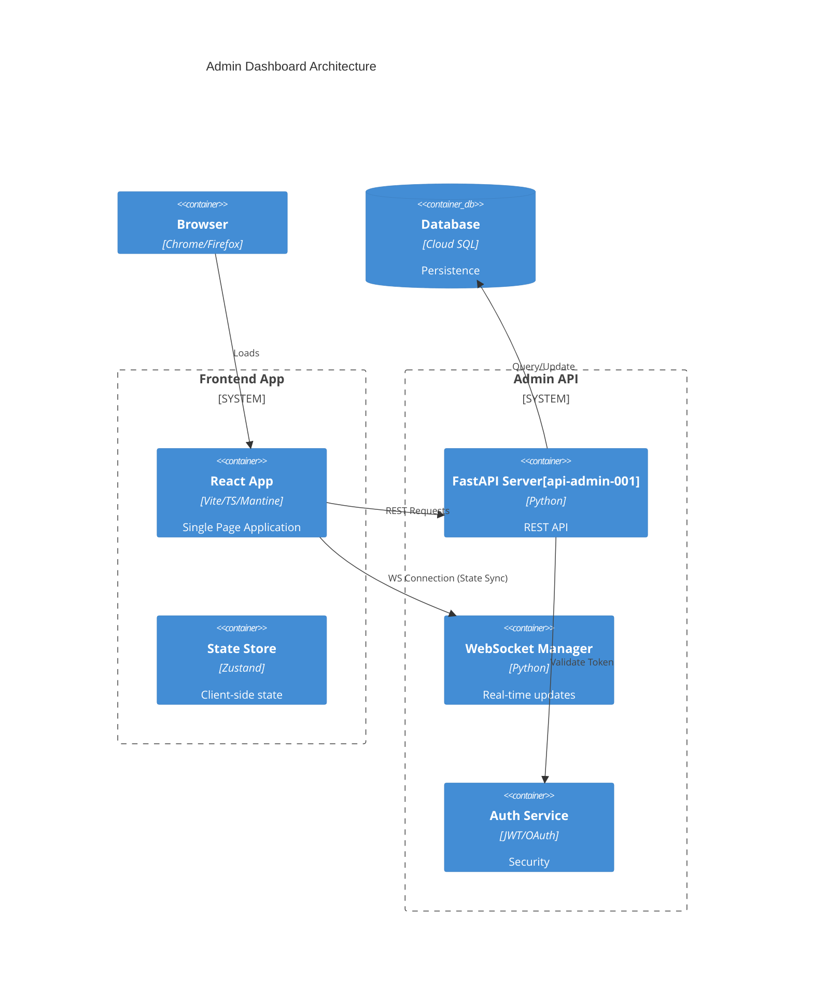

# Admin Dashboard Architecture

```mermaid
C4Container
    title Admin Dashboard Architecture

    Container(browser, "Browser", "Chrome/Firefox")
    
    System_Boundary(frontend, "Frontend App") {
        Container(react, "React App", "Vite/TS/Mantine", "Single Page Application")
        Container(store, "State Store", "Zustand", "Client-side state")
    }
    
    System_Boundary(backend, "Admin API") {
        Container(api, "FastAPI Server[api-admin-001]", "Python", "REST API")
        Container(socket, "WebSocket Manager", "Python", "Real-time updates")
        Container(auth, "Auth Service", "JWT/OAuth", "Security")
    }
    
    ContainerDb(db, "Database", "Cloud SQL", "Persistence")

    Rel(browser, react, "Loads")
    Rel(react, api, "REST Requests")
    Rel(react, socket, "WS Connection (State Sync)")
    Rel(api, db, "Query/Update")
    Rel(api, auth, "Validate Token")
```
