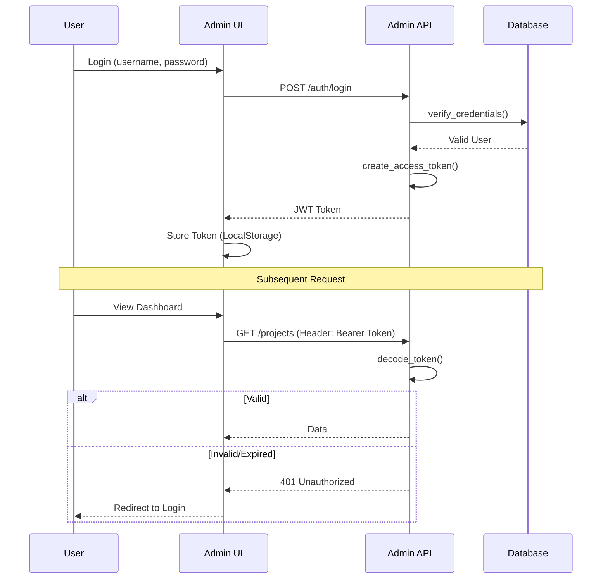

# Authentication Flow

```mermaid
sequenceDiagram
    participant User
    participant UI as Admin UI
    participant API as Admin API
    participant DB as Database

    User->>UI: Login (username, password)
    UI->>API: POST /auth/login
    
    API->>DB: verify_credentials()
    DB-->>API: Valid User
    
    API->>API: create_access_token()
    API-->>UI: JWT Token
    
    UI->>UI: Store Token (LocalStorage)
    
    Note over User, DB: Subsequent Request
    
    User->>UI: View Dashboard
    UI->>API: GET /projects (Header: Bearer Token)
    
    API->>API: decode_token()
    alt Valid
        API-->>UI: Data
    else Invalid/Expired
        API-->>UI: 401 Unauthorized
        UI-->>User: Redirect to Login
    end
```
