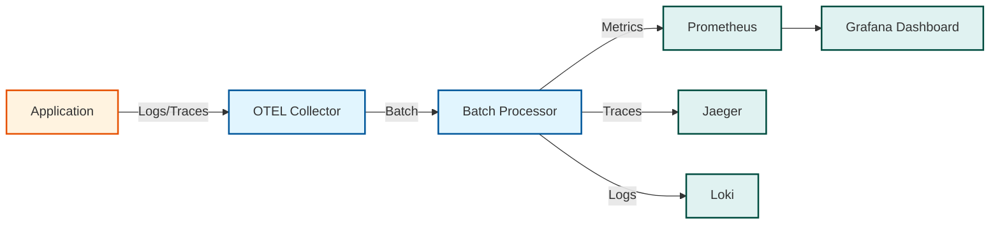

# Telemetry Pipeline

```mermaid
flowchart LR
    classDef source fill:#fff3e0,stroke:#e65100,stroke-width:2px;
    classDef pipe fill:#e1f5fe,stroke:#01579b,stroke-width:2px;
    classDef sink fill:#e0f2f1,stroke:#004d40,stroke-width:2px;

    App[Application]:::source --> |Logs/Traces| Collector[OTEL Collector]:::pipe
    
    Collector --> |Batch| Processor[Batch Processor]:::pipe
    
    Processor --> |Metrics| Prometheus[Prometheus]:::sink
    Processor --> |Traces| Jaeger[Jaeger]:::sink
    Processor --> |Logs| Loki[Loki]:::sink
    
    Prometheus --> Grafana[Grafana Dashboard]:::sink
```
