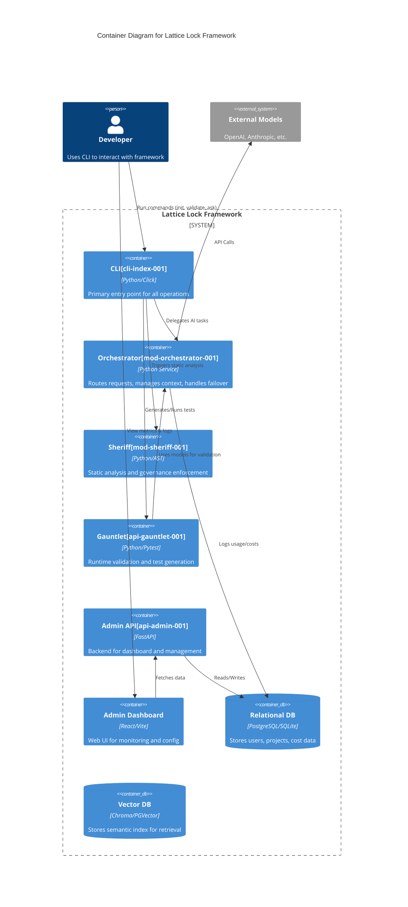

# Container Architecture Diagram

```mermaid
C4Container
    title Container Diagram for Lattice Lock Framework

    %% Standard Class Definitions (using mermaid styles for C4 is automatic, but we can override if needed)
    %% In C4 mermaid, styles are built-in.

    Person(dev, "Developer", "Uses CLI to interact with framework")
    
    System_Boundary(llf, "Lattice Lock Framework") {
        Container(cli, "CLI[cli-index-001]", "Python/Click", "Primary entry point for all operations")
        
        Container(orchestrator, "Orchestrator[mod-orchestrator-001]", "Python Service", "Routes requests, manages context, handles failover")
        Container(sheriff, "Sheriff[mod-sheriff-001]", "Python/AST", "Static analysis and governance enforcement")
        Container(gauntlet, "Gauntlet[api-gauntlet-001]", "Python/Pytest", "Runtime validation and test generation")
        Container(admin_api, "Admin API[api-admin-001]", "FastAPI", "Backend for dashboard and management")
        Container(dashboard, "Admin Dashboard", "React/Vite", "Web UI for monitoring and config")
        
        ContainerDb(db_sql, "Relational DB", "PostgreSQL/SQLite", "Stores users, projects, cost data")
        ContainerDb(db_vec, "Vector DB", "Chroma/PGVector", "Stores semantic index for retrieval")
    }
    
    System_Ext(llm, "External Models", "OpenAI, Anthropic, etc.")

    %% Relationships
    Rel(dev, cli, "Run commands (init, validate, ask)")
    Rel(dev, dashboard, "View metrics & logs")
    
    Rel(cli, orchestrator, "Delegates AI tasks")
    Rel(cli, sheriff, "Triggers static analysis")
    Rel(cli, gauntlet, "Generates/Runs tests")
    
    Rel(orchestrator, llm, "API Calls")
    Rel(orchestrator, db_sql, "Logs usage/costs")
    
    Rel(admin_api, db_sql, "Reads/Writes")
    Rel(dashboard, admin_api, "Fetches data")
    
    Rel(gauntlet, orchestrator, "Uses models for validation")
```
