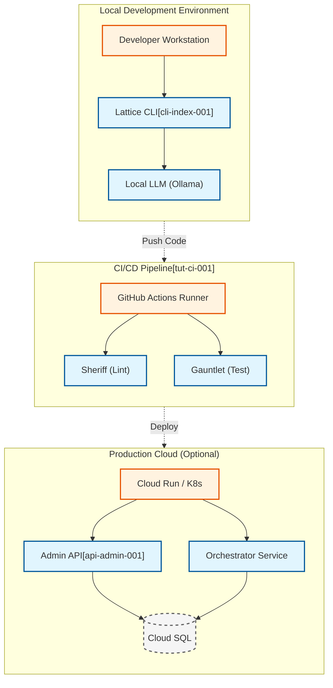

# Deployment Topology

```mermaid
flowchart TD
    %% Standard Class Definitions
    classDef core fill:#e1f5fe,stroke:#01579b,stroke-width:2px;
    classDef node fill:#fff3e0,stroke:#e65100,stroke-width:2px;
    classDef cloud fill:#f5f5f5,stroke:#616161,stroke-width:2px,stroke-dasharray: 5 5;

    subgraph Local_Dev["Local Development Environment"]
        direction TB
        DevMachine[Developer Workstation]:::node
        CLI["Lattice CLI[cli-index-001]"]:::core
        LocalModels["Local LLM (Ollama)"]:::core
        
        DevMachine --> CLI
        CLI --> LocalModels
    end

    subgraph CI_CD["CI/CD Pipeline[tut-ci-001]"]
        direction TB
        GithubActions[GitHub Actions Runner]:::node
        SheriffCI["Sheriff (Lint)"]:::core
        GauntletCI["Gauntlet (Test)"]:::core
        
        GithubActions --> SheriffCI
        GithubActions --> GauntletCI
    end

    subgraph Production["Production Cloud (Optional)"]
        direction TB
        CloudRun[Cloud Run / K8s]:::node
        AdminAPI["Admin API[api-admin-001]"]:::core
        OrchService["Orchestrator Service"]:::core
        CloudDB[(Cloud SQL)]:::cloud
        
        CloudRun --> AdminAPI
        CloudRun --> OrchService
        AdminAPI --> CloudDB
        OrchService --> CloudDB
    end

    %% Connections
    Local_Dev -.->|Push Code| CI_CD
    CI_CD -.->|Deploy| Production
```
