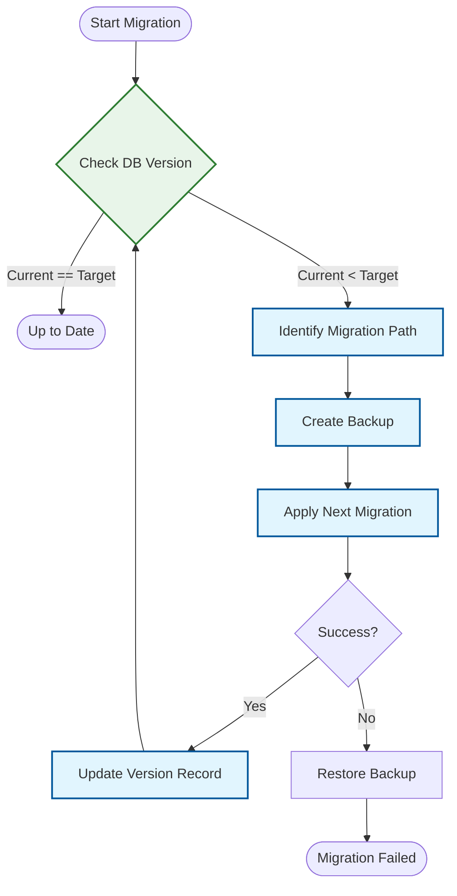

# Migration Strategy Flow

```mermaid
flowchart TD
    classDef check fill:#e8f5e9,stroke:#2e7d32,stroke-width:2px;
    classDef process fill:#e1f5fe,stroke:#01579b,stroke-width:2px;

    Start([Start Migration]) --> CheckVer{Check DB Version}:::check
    
    CheckVer --> |Current == Target| Done([Up to Date])
    CheckVer --> |Current < Target| Plan[Identify Migration Path]:::process
    
    Plan --> Backup[Create Backup]:::process
    
    Backup --> Apply[Apply Next Migration]:::process
    
    Apply --> Success{Success?}
    
    Success -- Yes --> UpdateVer[Update Version Record]:::process
    UpdateVer --> CheckVer
    
    Success -- No --> Rollback[Restore Backup]:::error
    Rollback --> Fail([Migration Failed])
```
