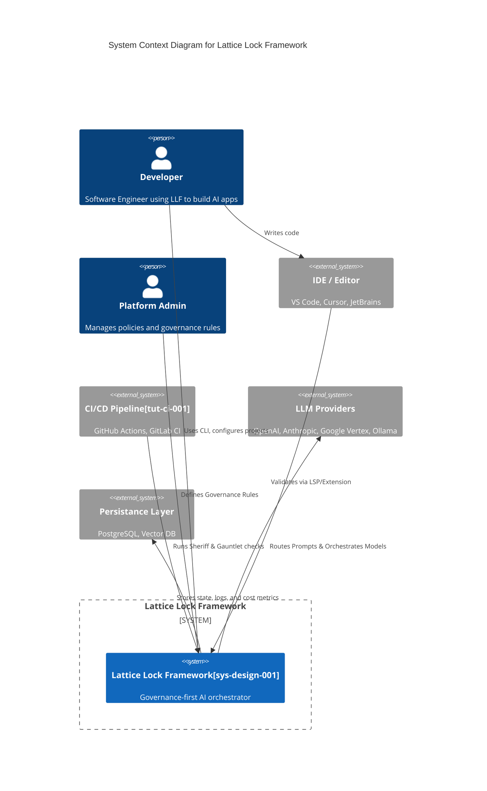

# System Context Diagram

```mermaid
C4Context
    title System Context Diagram for Lattice Lock Framework

    %% System Boundaries
    Person(user, "Developer", "Software Engineer using LLF to build AI apps")
    Person(admin, "Platform Admin", "Manages policies and governance rules")

    System_Boundary(llf_boundary, "Lattice Lock Framework") {
        System(llf, "Lattice Lock Framework[sys-design-001]", "Governance-first AI orchestrator")
    }

    System_Ext(ide, "IDE / Editor", "VS Code, Cursor, JetBrains")
    System_Ext(ci, "CI/CD Pipeline[tut-ci-001]", "GitHub Actions, GitLab CI")
    System_Ext(llm_providers, "LLM Providers", "OpenAI, Anthropic, Google Vertex, Ollama")
    System_Ext(db, "Persistance Layer", "PostgreSQL, Vector DB")

    %% Relationships
    Rel(user, llf, "Uses CLI, configures projects")
    Rel(user, ide, "Writes code")
    Rel(ide, llf, "Validates via LSP/Extension")
    Rel(admin, llf, "Defines Governance Rules")
    
    Rel(ci, llf, "Runs Sheriff & Gauntlet checks")
    
    Rel(llf, llm_providers, "Routes Prompts & Orchestrates Models")
    Rel(llf, db, "Stores state, logs, and cost metrics")

    UpdateLayoutConfig($c4ShapeInRow="3", $c4BoundaryInRow="1")
```
